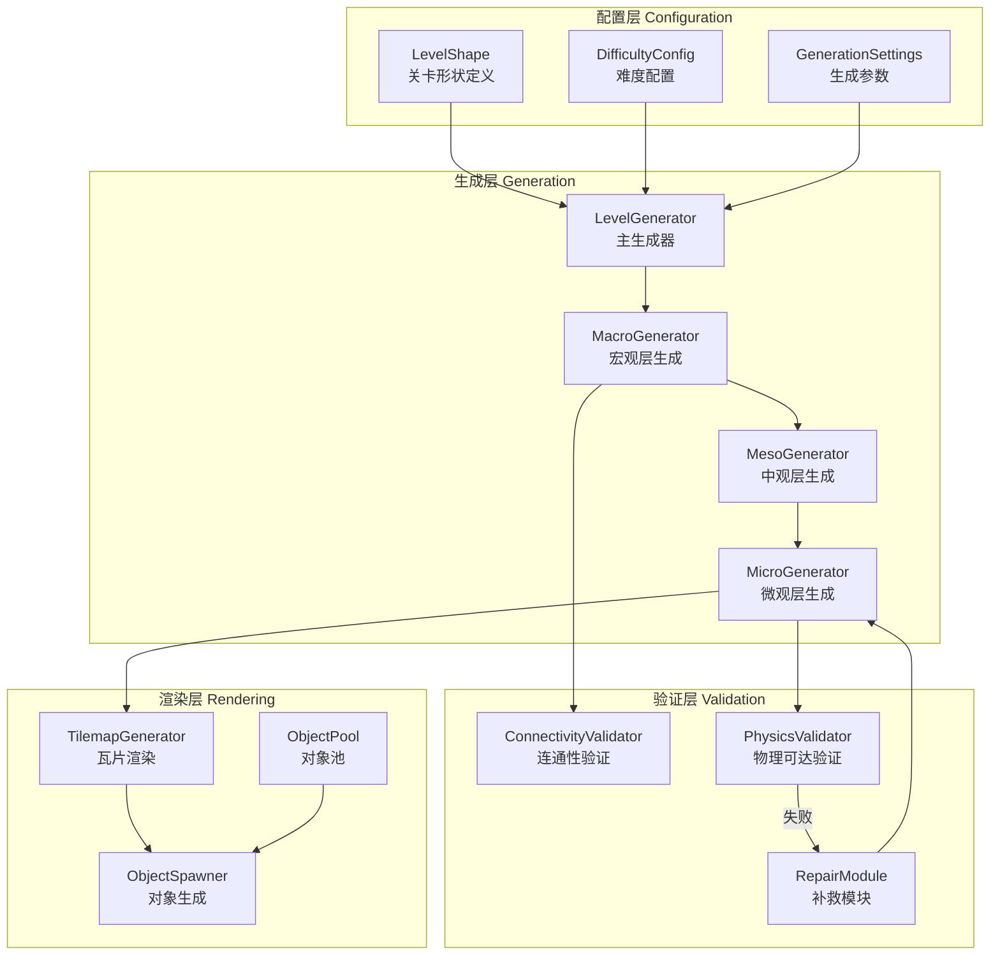
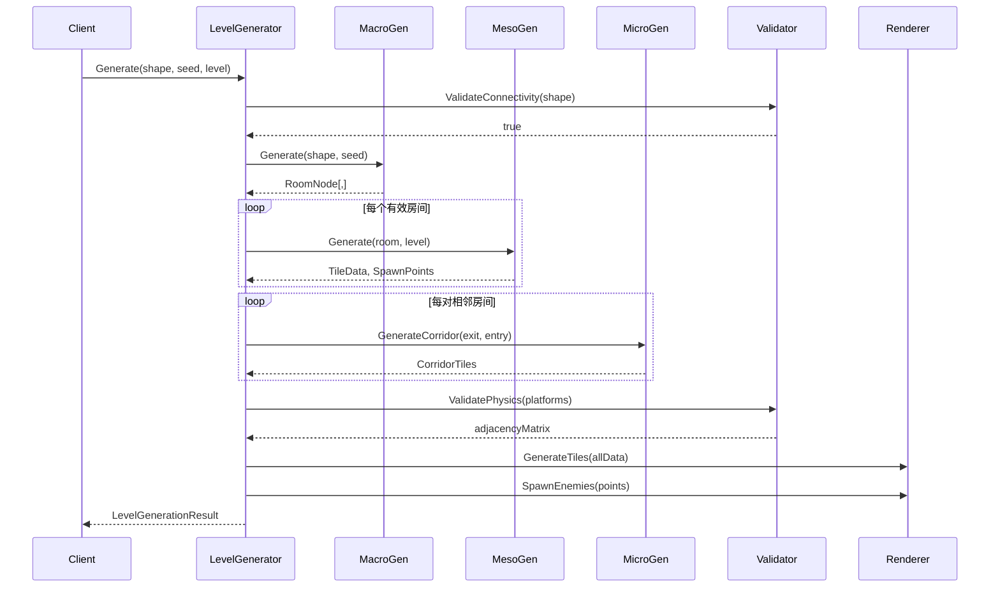

# DESIGN - 混合式程序化随机关卡系统 (Hybrid PCG)

## 一、整体架构图



---

## 二、分层设计

### 2.1 配置层

#### LevelShape - 关卡形状
```
职责: 定义4×4网格的占位情况
输入: 字符串模式 "0010,1111,0111,0000"
输出: 有效格子列表
依赖: 无
```

#### DifficultyConfig - 难度配置
```
职责: 管理难度参数
属性:
  - BaseDifficulty: 0.2
  - DifficultyIncrement: 0.1
  - MaxDifficulty: 1.0
  - BaseEnemyCount: 2
  - EnemyPerDifficultyStep: 1
  - MaxEnemiesPerRoom: 8
```

#### GenerationSettings - 生成参数
```
职责: 控制生成行为
属性:
  - CellWidth: 单元格像素宽度
  - CellHeight: 单元格像素高度
  - ShrinkRatio: 0.7 (活跃区域缩放)
  - CorridorWidth: 4-6
  - WFCMaxIterations: 500
```

### 2.2 生成层

#### MacroGenerator - 宏观层生成器
```
职责: 生成网格骨架和关键路径
输入: LevelShape, Seed
输出: RoomNode[,] grid
算法:
  1. 初始化网格矩阵
  2. 关键路径生成 (醉汉行走)
  3. Boss房间插入
  4. 侧室标记
  5. 深渊检测
```

#### MesoGenerator - 中观层生成器
```
职责: 填充房间内部结构
输入: RoomNode, DifficultyConfig
输出: MicroTileState[,] roomData
算法:
  1. 生成软边界ActiveZone
  2. WFC波函数坍缩填充
  3. 敌人生成点布置
```

#### MicroGenerator - 微观层生成器
```
职责: 生成房间间走廊
输入: RoomNode A, RoomNode B, BufferZone
输出: List<Vector2Int> corridorTiles
算法:
  1. Voronoi控制点撒布
  2. A*寻路
  3. 形态学膨胀
  4. 元胞自动机平滑
```

### 2.3 验证层

#### ConnectivityValidator - 连通性验证
```
职责: 验证关卡形状连通性
输入: LevelShape
输出: bool isConnected
算法: BFS广度优先搜索
```

#### PhysicsValidator - 物理可达验证
```
职责: 验证平台跳跃可达性
输入: List<PlatformSurface> platforms
输出: bool[,] adjacencyMatrix
算法: 抛物线轨迹检测 (Job+Burst)
```

#### RepairModule - 补救模块
```
职责: 修复不可达路径
输入: 断点位置, 目标位置
输出: 补救平台/传送门
策略: 动态插入移动平台
```

### 2.4 渲染层

#### TilemapGenerator - 瓦片渲染
```
职责: 批量生成Tilemap
输入: MicroTileState[,] data
输出: Tilemap填充
优化: SetTilesBlock批处理
```

#### ObjectSpawner - 对象生成
```
职责: 生成敌人和装饰物
输入: 生成点列表, 难度系数
输出: 实例化对象
依赖: ObjectPool
```

---

## 三、核心组件设计

### 3.1 RoomNode 完整定义

```csharp
[System.Serializable]
public class RoomNode
{
    // ========== 位置标识 ==========
    public Vector2Int GridCoordinates;
    
    // ========== 类型与状态 ==========
    public RoomType Type;
    public bool IsCriticalPath;
    public bool IsGenerated;
    
    // ========== 连通性 ==========
    /// <summary>
    /// 4-bit掩码: N=1, E=2, S=4, W=8
    /// </summary>
    public int ConnectionMask;
    
    // ========== 软边界 ==========
    public RectInt ActiveZone;
    
    // ========== 游戏性 ==========
    public float DifficultyRating;
    public int EnemyCount;
    public List<Vector2Int> EnemySpawnPoints;
    
    // ========== 生成数据 ==========
    public MicroTileState[,] TileData;
    public List<PlatformSurface> Platforms;
    
    // ========== 方法 ==========
    public bool HasConnection(Direction dir);
    public void AddConnection(Direction dir);
    public Vector2Int GetEntryPoint(Direction dir);
    public Vector2Int GetExitPoint(Direction dir);
}
```

### 3.2 LevelGenerator 主入口

```csharp
public class LevelGenerator : ILevelGenerator
{
    // ========== 依赖 ==========
    private readonly MacroGenerator _macroGen;
    private readonly MesoGenerator _mesoGen;
    private readonly MicroGenerator _microGen;
    private readonly ConnectivityValidator _connectValidator;
    private readonly PhysicsValidator _physicsValidator;
    
    // ========== 主方法 ==========
    public LevelGenerationResult Generate(
        LevelShape shape, 
        int seed, 
        int levelIndex)
    {
        // 1. 验证形状连通性
        if (!_connectValidator.Validate(shape))
            return LevelGenerationResult.Failed("Invalid shape");
        
        // 2. 宏观层生成
        var grid = _macroGen.Generate(shape, seed);
        
        // 3. 中观层生成 (每个房间)
        foreach (var room in grid.GetValidRooms())
        {
            _mesoGen.Generate(room, levelIndex);
        }
        
        // 4. 微观层生成 (走廊)
        GenerateCorridors(grid);
        
        // 5. 物理验证
        if (!ValidateAndRepair(grid))
            return LevelGenerationResult.Failed("Physics validation failed");
        
        return new LevelGenerationResult
        {
            Success = true,
            RoomGrid = grid,
            CriticalPath = ExtractCriticalPath(grid),
            BossRoomIndex = FindBossRoomIndex(grid)
        };
    }
}
```

---

## 四、接口契约定义

### 4.1 生成器接口

```csharp
public interface IMacroGenerator
{
    RoomNode[,] Generate(LevelShape shape, int seed);
}

public interface IMesoGenerator
{
    void Generate(RoomNode room, int levelIndex);
}

public interface IMicroGenerator
{
    List<Vector2Int> GenerateCorridor(
        Vector2Int exit, 
        Vector2Int entry, 
        RectInt buffer);
}
```

### 4.2 验证器接口

```csharp
public interface IConnectivityValidator
{
    bool Validate(LevelShape shape);
}

public interface IPhysicsValidator
{
    bool[,] ValidatePlatforms(List<PlatformSurface> platforms);
}
```

### 4.3 渲染器接口

```csharp
public interface ITilemapGenerator
{
    void Generate(MicroTileState[,] data, Vector2Int origin);
    void Clear();
}

public interface IObjectSpawner
{
    void SpawnEnemies(List<Vector2Int> points, float difficulty);
    void DespawnAll();
}
```

---

## 五、数据流向图



---

## 六、异常处理策略

### 6.1 生成失败处理

| 异常类型 | 处理策略 |
|----------|----------|
| 形状不连通 | 返回错误，要求重新配置 |
| 路径生成失败 | 重试3次，仍失败则使用备用形状 |
| WFC死锁 | 局部重置，超时使用默认填充 |
| 物理验证失败 | 插入补救平台 |

### 6.2 错误码定义

```csharp
public enum GenerationError
{
    None = 0,
    InvalidShape = 1,
    PathGenerationFailed = 2,
    WFCTimeout = 3,
    PhysicsValidationFailed = 4,
    RenderingFailed = 5
}
```

---

## 七、文档状态

- **创建时间**: 2026-01-15
- **状态**: 已完成
- **下一步**: 创建TASK原子任务文档
