# TASK - 混合式程序化随机关卡系统 (Hybrid PCG)

## 一、任务依赖图

```mermaid
graph TD
    subgraph "Phase 1: 数据结构"
        T1[1.1 RoomType枚举]
        T2[1.2 RoomNode类]
        T3[1.3 LevelShape类]
        T4[1.4 DifficultyConfig]
        T5[1.5 GenerationSettings]
    end
    
    subgraph "Phase 1.5: 灰盒原型"
        T1_5_1[1.5.1 四色调试瓦片创建]
        T1_5_2[1.5.2 单房间模板测试场景]
        T1_5_3[1.5.3 9种房间类型模板]
        T1_5_4[1.5.4 房间模板预览工具]
        T1_5_5[1.5.5 4x4网格汇总预览]
        T1_5_6[1.5.6 灰盒效果验证]
    end
    
    subgraph "Phase 2: 宏观层"
        T6[2.1 ConnectivityValidator]
        T7[2.2 CriticalPathGenerator]
        T8[2.3 BossRoomGenerator]
        T9[2.4 SideRoomMarker]
        T10[2.5 AbyssDetector]
        T11[2.6 MacroGenerator整合]
    end
    
    subgraph "Phase 3: 中观层"
        T12[3.1 SoftBoundaryGenerator]
        T13[3.2 WFCCell类]
        T14[3.3 SimplifiedWFC算法]
        T15[3.4 EnemySpawnPointPlacer]
        T16[3.5 MesoGenerator整合]
    end
    
    subgraph "Phase 4: 微观层"
        T17[4.1 VoronoiGraph类]
        T18[4.2 CorridorAStar]
        T19[4.3 MorphologyProcessor]
        T20[4.4 MicroGenerator整合]
    end
    
    subgraph "Phase 5: 验证系统"
        T21[5.1 PlatformSurface类]
        T22[5.2 PhysicsValidationJob]
        T23[5.3 RepairModule]
        T24[5.4 PhysicsValidator整合]
    end
    
    subgraph "Phase 6: 渲染层"
        T25[6.1 TilemapGenerator]
        T26[6.2 ObjectPool泛型类]
        T27[6.3 ObjectSpawner]
    end
    
    subgraph "Phase 7: 整合测试"
        T28[7.1 LevelGenerator主入口]
        T29[7.2 单元测试]
        T30[7.3 集成测试]
    end
    
    T1 --> T2
    T2 --> T3
    T3 --> T4
    T4 --> T5
    
    T5 --> T1_5_1
    T1_5_1 --> T1_5_2
    T1_5_2 --> T1_5_3
    T1_5_3 --> T1_5_4
    T1_5_4 --> T1_5_5
    T1_5_5 --> T1_5_6
    
    T1_5_6 --> T6
    T6 --> T7
    T7 --> T8
    T8 --> T9
    T9 --> T10
    T10 --> T11
    
    T11 --> T12
    T12 --> T13
    T13 --> T14
    T14 --> T15
    T15 --> T16
    
    T16 --> T17
    T17 --> T18
    T18 --> T19
    T19 --> T20
    
    T20 --> T21
    T21 --> T22
    T22 --> T23
    T23 --> T24
    
    T24 --> T25
    T25 --> T26
    T26 --> T27
    
    T27 --> T28
    T28 --> T29
    T29 --> T30
```

---

## 二、原子任务清单

### Phase 1: 数据结构 (预计2小时)

> **注意**: Phase 1完成后进入灰盒原型阶段，先验证视觉效果再继续后续开发

#### 任务 1.1: RoomType枚举
- **状态**: [ ] 待开始
- **输入契约**: 无
- **输出契约**: `RoomType.cs` 枚举文件
- **实现约束**: 
  - 包含: None, Start, Exit, LR, Drop, Landing, Side, Shop, Abyss, Boss
  - 添加XML文档注释
- **验收标准**: 编译通过，注释完整
- **预计时间**: 15分钟

#### 任务 1.2: RoomNode类
- **状态**: [ ] 待开始
- **前置依赖**: 1.1
- **输入契约**: RoomType枚举
- **输出契约**: `RoomNode.cs` 类文件
- **实现约束**:
  - 属性: GridCoordinates, Type, ConnectionMask, ActiveZone, DifficultyRating, IsCriticalPath, EnemySpawnPoints
  - 方法: HasConnection(), AddConnection(), GetEntryPoint(), GetExitPoint()
  - 使用[System.Serializable]
- **验收标准**: 编译通过，方法逻辑正确
- **预计时间**: 30分钟

#### 任务 1.3: LevelShape类
- **状态**: [ ] 待开始
- **前置依赖**: 无
- **输入契约**: 无
- **输出契约**: `LevelShape.cs` 类文件
- **实现约束**:
  - 4×4 OccupancyMask数组
  - FromString()静态工厂方法
  - GetValidCells()方法
  - IsValidCell()方法
  - LevelShapePresets静态类（预定义形状）
- **验收标准**: 能正确解析"0010,1111,0111,0000"格式
- **预计时间**: 30分钟

#### 任务 1.4: DifficultyConfig
- **状态**: [ ] 待开始
- **前置依赖**: 1.2
- **输入契约**: RoomType枚举
- **输出契约**: `DifficultyConfig.cs` ScriptableObject
- **实现约束**:
  - 继承ScriptableObject
  - CreateAssetMenu特性
  - CalculateLevelDifficulty()方法
  - CalculateEnemyCount()方法
- **验收标准**: 能在Unity中创建配置资产
- **预计时间**: 20分钟

#### 任务 1.5: GenerationSettings
- **状态**: [ ] 待开始
- **前置依赖**: 无
- **输入契约**: 无
- **输出契约**: `GenerationSettings.cs` ScriptableObject
- **实现约束**:
  - CellWidth, CellHeight
  - ShrinkRatio (0.7)
  - CorridorWidth (4-6)
  - WFCMaxIterations (500)
- **验收标准**: 能在Unity中创建配置资产
- **预计时间**: 15分钟

---

### Phase 1.5: 灰盒原型阶段 (预计3小时)

> **重要**: 使用简单四色瓦片搭建视觉原型，验证房间布局效果后再继续后续开发

#### 任务 1.5.1: 四色调试瓦片创建
- **状态**: [ ] 待开始
- **前置依赖**: 1.5
- **输入契约**: 无
- **输出契约**: 4个调试用瓦片资源
- **实现约束**:
  - 红色瓦片 (Red) - 表示地面/墙壁
  - 蓝色瓦片 (Blue) - 表示平台
  - 绿色瓦片 (Green) - 表示出入口/通道
  - 黄色瓦片 (Yellow) - 表示特殊区域/陷阱
  - 使用Unity创建简单的纯色Sprite
  - 创建对应的TileBase资源
- **验收标准**: 4个瓦片可在Tilemap中正常使用
- **预计时间**: 20分钟

#### 任务 1.5.2: 单房间模板测试场景
- **状态**: [ ] 待开始
- **前置依赖**: 1.5.1
- **输入契约**: 四色瓦片
- **输出契约**: `Scenes/GrayboxTest.unity` 测试场景
- **实现约束**:
  - 创建测试场景
  - 添加Grid和Tilemap组件
  - 配置正交相机
  - 添加简单的测试脚本入口
- **验收标准**: 场景可运行，Tilemap可编辑
- **预计时间**: 15分钟

#### 任务 1.5.3: 9种房间类型模板
- **状态**: [ ] 待开始
- **前置依赖**: 1.5.2, 1.1
- **输入契约**: RoomType枚举, 四色瓦片
- **输出契约**: `GrayboxRoomTemplates.cs` 模板生成器
- **实现约束**:
  - 为每种RoomType创建灰盒模板:
    - Start: 绿色入口标记
    - Exit: 绿色出口标记
    - LR: 左右两侧绿色通道
    - Drop: 底部绿色开口
    - Landing: 顶部绿色开口
    - Side: 单侧绿色通道
    - Shop: 黄色特殊区域
    - Abyss: 垂直贯通
    - Boss: 扩大区域+黄色标记
  - 内部使用红色地面+蓝色平台
  - 单房间尺寸: 32x32格 (可配置)
- **验收标准**: 9种模板可视化区分明显
- **预计时间**: 1小时

#### 任务 1.5.4: 房间模板预览工具
- **状态**: [ ] 待开始
- **前置依赖**: 1.5.3
- **输入契约**: GrayboxRoomTemplates
- **输出契约**: `GrayboxPreviewTool.cs` Editor工具
- **实现约束**:
  - 创建EditorWindow或Inspector扩展
  - 下拉选择房间类型
  - 实时预览单个房间模板
  - 支持调整房间尺寸参数
- **验收标准**: 可在Editor中快速切换预览不同房间类型
- **预计时间**: 30分钟

#### 任务 1.5.5: 4x4网格汇总预览
- **状态**: [ ] 待开始
- **前置依赖**: 1.5.4, 1.3
- **输入契约**: LevelShape, GrayboxRoomTemplates
- **输出契约**: `GrayboxGridPreview.cs` 网格预览器
- **实现约束**:
  - 输入LevelShape定义
  - 在4x4网格中排布房间模板
  - 显示房间间的连接关系
  - 用白线标记关键路径
  - 支持不规则形状预览
- **验收标准**: 能预览完整4x4灰盒关卡布局
- **预计时间**: 45分钟

#### 任务 1.5.6: 灰盒效果验证
- **状态**: [ ] 待开始
- **前置依赖**: 1.5.5
- **输入契约**: 完整灰盒预览系统
- **输出契约**: 验证报告/截图
- **实现约束**:
  - 测试多种LevelShape形状
  - 验证房间连接视觉效果
  - 确认尺寸比例合适
  - 记录需要调整的参数
  - **用户审核点**: 确认灰盒效果满意后继续
- **验收标准**: 用户确认灰盒视觉效果
- **预计时间**: 30分钟

---

### Phase 2: 宏观层 (预计3.5小时)

#### 任务 2.1: ConnectivityValidator
- **状态**: [ ] 待开始
- **前置依赖**: 1.3
- **输入契约**: LevelShape
- **输出契约**: `ConnectivityValidator.cs`
- **实现约束**:
  - BFS广度优先搜索
  - 验证所有有效格子相互可达
- **验收标准**: 单元测试覆盖连通/不连通用例
- **预计时间**: 30分钟

#### 任务 2.2: CriticalPathGenerator
- **状态**: [ ] 待开始
- **前置依赖**: 1.2, 1.3, 2.1
- **输入契约**: LevelShape, RoomNode[,], seed
- **输出契约**: `CriticalPathGenerator.cs`
- **实现约束**:
  - 醉汉行走变体算法
  - 边界约束检查
  - 防抖动逻辑
  - 加权随机方向选择
  - ConnectionMask自动更新
- **验收标准**: 100%生成有效路径（1000次测试）
- **预计时间**: 1小时

#### 任务 2.3: BossRoomGenerator
- **状态**: [ ] 待开始
- **前置依赖**: 2.2
- **输入契约**: RoomNode[,], criticalPath
- **输出契约**: `BossRoomGenerator.cs`
- **实现约束**:
  - Exit前一格设为Boss
  - ActiveZone扩大1.3倍
  - DifficultyRating设为1.0
- **验收标准**: Boss房间位置正确
- **预计时间**: 20分钟

#### 任务 2.4: SideRoomMarker
- **状态**: [ ] 待开始
- **前置依赖**: 2.3
- **输入契约**: RoomNode[,], LevelShape
- **输出契约**: `SideRoomMarker.cs`
- **实现约束**:
  - 标记非关键路径有效格子为Side
  - 生成树算法确保至少一个开口
- **验收标准**: 所有Side房间至少有一个连接
- **预计时间**: 30分钟

#### 任务 2.5: AbyssDetector
- **状态**: [ ] 待开始
- **前置依赖**: 2.4
- **输入契约**: RoomNode[,]
- **输出契约**: `AbyssDetector.cs`
- **实现约束**:
  - 检测连续3+垂直Side房间
  - 转换为Abyss类型
  - 更新ConnectionMask
- **验收标准**: 正确识别深渊区域
- **预计时间**: 20分钟

#### 任务 2.6: MacroGenerator整合
- **状态**: [ ] 待开始
- **前置依赖**: 2.1-2.5
- **输入契约**: LevelShape, seed
- **输出契约**: `MacroGenerator.cs`
- **实现约束**:
  - 整合所有宏观层组件
  - 实现IMacroGenerator接口
  - 统一的错误处理
- **验收标准**: 生成完整的RoomNode[,]矩阵
- **预计时间**: 30分钟

---

### Phase 3: 中观层 (预计1.5天)

#### 任务 3.1: SoftBoundaryGenerator
- **状态**: [ ] 待开始
- **前置依赖**: 1.2, 1.5
- **输入契约**: RoomNode, GenerationSettings
- **输出契约**: `SoftBoundaryGenerator.cs`
- **实现约束**:
  - 70%缩放计算
  - 随机偏移（在缓冲区内）
  - 返回RectInt ActiveZone
- **验收标准**: ActiveZone在Cell范围内
- **预计时间**: 20分钟

#### 任务 3.2: WFCCell类
- **状态**: [ ] 待开始
- **前置依赖**: 无
- **输入契约**: 无
- **输出契约**: `WFCCell.cs`, `MicroTileState.cs`
- **实现约束**:
  - MicroTileState枚举: Air, Ground, Platform, Spike, Water
  - PossibleStates HashSet
  - CollapsedState nullable
  - Entropy属性
- **验收标准**: 编译通过
- **预计时间**: 15分钟

#### 任务 3.3: SimplifiedWFC算法
- **状态**: [ ] 待开始
- **前置依赖**: 3.2, 1.2
- **输入契约**: RectInt ActiveZone, ConnectionMask, maxJumpHeight
- **输出契约**: `SimplifiedWFC.cs`
- **实现约束**:
  - 邻接规则表
  - 边界约束应用
  - 物理约束（跳跃高度）
  - 熵减坍缩
  - 约束传播
  - 冲突处理（局部重置）
  - 最大迭代500次
- **验收标准**: 生成有效TileData，无死锁
- **预计时间**: 2小时

#### 任务 3.4: EnemySpawnPointPlacer
- **状态**: [ ] 待开始
- **前置依赖**: 3.3, 1.4
- **输入契约**: MicroTileState[,], DifficultyConfig, levelIndex
- **输出契约**: `EnemySpawnPointPlacer.cs`
- **实现约束**:
  - 在Ground上方的Air格子生成
  - 数量由难度系数决定
  - Boss房间特殊处理
- **验收标准**: 生成点数量符合预期
- **预计时间**: 30分钟

#### 任务 3.5: MesoGenerator整合
- **状态**: [ ] 待开始
- **前置依赖**: 3.1-3.4
- **输入契约**: RoomNode, levelIndex
- **输出契约**: `MesoGenerator.cs`
- **实现约束**:
  - 整合软边界+WFC+敌人放置
  - 实现IMesoGenerator接口
- **验收标准**: 房间内部结构完整
- **预计时间**: 30分钟

---

### Phase 4: 微观层 (预计1天)

#### 任务 4.1: VoronoiGraph类
- **状态**: [ ] 待开始
- **前置依赖**: 无
- **输入契约**: List<Vector2> controlPoints
- **输出契约**: `VoronoiGraph.cs`
- **实现约束**:
  - 控制点撒布
  - Voronoi图构建（可使用简化算法）
  - 边缘提取为导航图
- **验收标准**: 生成有效的导航网络
- **预计时间**: 1小时

#### 任务 4.2: CorridorAStar
- **状态**: [ ] 待开始
- **前置依赖**: 4.1
- **输入契约**: VoronoiGraph, start, goal
- **输出契约**: `CorridorAStar.cs`
- **实现约束**:
  - 标准A*实现
  - 启发式函数带随机扰动
  - 返回路径边列表
- **验收标准**: 找到有效路径
- **预计时间**: 45分钟

#### 任务 4.3: MorphologyProcessor
- **状态**: [ ] 待开始
- **前置依赖**: 4.2
- **输入契约**: List<Vector2Int> pathTiles
- **输出契约**: `MorphologyProcessor.cs`
- **实现约束**:
  - 形态学膨胀（拓宽4-6格）
  - 元胞自动机平滑（3次迭代）
- **验收标准**: 走廊平滑无尖锐边缘
- **预计时间**: 45分钟

#### 任务 4.4: MicroGenerator整合
- **状态**: [ ] 待开始
- **前置依赖**: 4.1-4.3
- **输入契约**: exitPoint, entryPoint, bufferZone
- **输出契约**: `MicroGenerator.cs`
- **实现约束**:
  - 整合Voronoi+A*+形态学
  - 实现IMicroGenerator接口
- **验收标准**: 生成平滑走廊
- **预计时间**: 30分钟

---

### Phase 5: 验证系统 (预计1天)

#### 任务 5.1: PlatformSurface类
- **状态**: [ ] 待开始
- **前置依赖**: 无
- **输入契约**: 无
- **输出契约**: `PlatformSurface.cs`
- **实现约束**:
  - Position, Width属性
  - Center计算属性
  - LeftEdge, RightEdge属性
- **验收标准**: 编译通过
- **预计时间**: 10分钟

#### 任务 5.2: PhysicsValidationJob
- **状态**: [ ] 待开始
- **前置依赖**: 5.1
- **输入契约**: NativeArray<float2> platforms
- **输出契约**: `PhysicsValidationJob.cs`
- **实现约束**:
  - IJobParallelFor实现
  - [BurstCompile]特性
  - 抛物线轨迹检测
  - 多角度遍历(45°-85°)
- **验收标准**: Job正确执行，无内存泄漏
- **预计时间**: 1小时

#### 任务 5.3: RepairModule
- **状态**: [ ] 待开始
- **前置依赖**: 5.2
- **输入契约**: 断点位置, 目标位置
- **输出契约**: `RepairModule.cs`
- **实现约束**:
  - 动态插入移动平台
  - 或插入传送门
  - 最小化修改
- **验收标准**: 修复后物理验证通过
- **预计时间**: 45分钟

#### 任务 5.4: PhysicsValidator整合
- **状态**: [ ] 待开始
- **前置依赖**: 5.1-5.3
- **输入契约**: List<PlatformSurface>
- **输出契约**: `PhysicsValidator.cs`
- **实现约束**:
  - 整合Job验证+修复
  - 实现IPhysicsValidator接口
  - Native内存管理
- **验收标准**: 完整验证流程
- **预计时间**: 30分钟

---

### Phase 6: 渲染层 (预计0.5天)

#### 任务 6.1: TilemapGenerator
- **状态**: [ ] 待开始
- **前置依赖**: 3.2
- **输入契约**: MicroTileState[,], origin
- **输出契约**: `TilemapGenerator.cs`
- **实现约束**:
  - SetTilesBlock批处理
  - 二维转一维索引
  - 协程延迟刷新碰撞体
  - 引用项目现有瓦片
- **验收标准**: 正确渲染到Tilemap
- **预计时间**: 45分钟

#### 任务 6.2: ObjectPool泛型类
- **状态**: [ ] 待开始
- **前置依赖**: 无
- **输入契约**: 无
- **输出契约**: `ObjectPool.cs`
- **实现约束**:
  - 泛型实现 ObjectPool<T>
  - Lease/Return方法
  - ReturnAll方法
  - 自动扩容
- **验收标准**: 无GC分配
- **预计时间**: 30分钟

#### 任务 6.3: ObjectSpawner
- **状态**: [ ] 待开始
- **前置依赖**: 6.2
- **输入契约**: spawnPoints, difficulty
- **输出契约**: `ObjectSpawner.cs`
- **实现约束**:
  - 使用ObjectPool
  - 敌人/装饰物分类
  - 引用项目现有预制件
- **验收标准**: 正确生成对象
- **预计时间**: 30分钟

---

### Phase 7: 整合测试 (预计1天)

#### 任务 7.1: LevelGenerator主入口
- **状态**: [ ] 待开始
- **前置依赖**: 2.6, 3.5, 4.4, 5.4, 6.1, 6.3
- **输入契约**: LevelShape, seed, levelIndex
- **输出契约**: `LevelGenerator.cs`
- **实现约束**:
  - 实现ILevelGenerator接口
  - 整合所有层生成器
  - 统一错误处理
  - 返回LevelGenerationResult
- **验收标准**: 完整生成流程
- **预计时间**: 1小时

#### 任务 7.2: 单元测试
- **状态**: [ ] 待开始
- **前置依赖**: 7.1
- **输入契约**: 无
- **输出契约**: `Tests/` 测试文件
- **实现约束**:
  - 连通性验证测试
  - 关键路径测试
  - WFC测试
  - 物理验证测试
- **验收标准**: 核心算法100%覆盖
- **预计时间**: 1小时

#### 任务 7.3: 集成测试
- **状态**: [ ] 待开始
- **前置依赖**: 7.2
- **输入契约**: 无
- **输出契约**: 测试场景
- **实现约束**:
  - 1000次生成测试
  - 性能Profiler测试
  - 不同形状测试
- **验收标准**: 100%成功率，<100ms生成
- **预计时间**: 1小时

---

## 三、任务统计

| Phase | 任务数 | 预计时间 |
|-------|--------|----------|
| Phase 1: 数据结构 | 5 | 2小时 |
| **Phase 1.5: 灰盒原型** | **6** | **3小时** |
| Phase 2: 宏观层 | 6 | 3.5小时 |
| Phase 3: 中观层 | 5 | 4小时 |
| Phase 4: 微观层 | 4 | 3小时 |
| Phase 5: 验证系统 | 4 | 3小时 |
| Phase 6: 渲染层 | 3 | 1.5小时 |
| Phase 7: 整合测试 | 3 | 3小时 |
| **总计** | **36** | **23小时** |

> **灰盒阶段审核点**: Phase 1.5.6完成后需用户确认视觉效果，通过后再继续Phase 2

---

## 四、文档状态

- **创建时间**: 2026-01-15
- **状态**: 已完成
- **下一步**: 提交审批 (Approve阶段)
