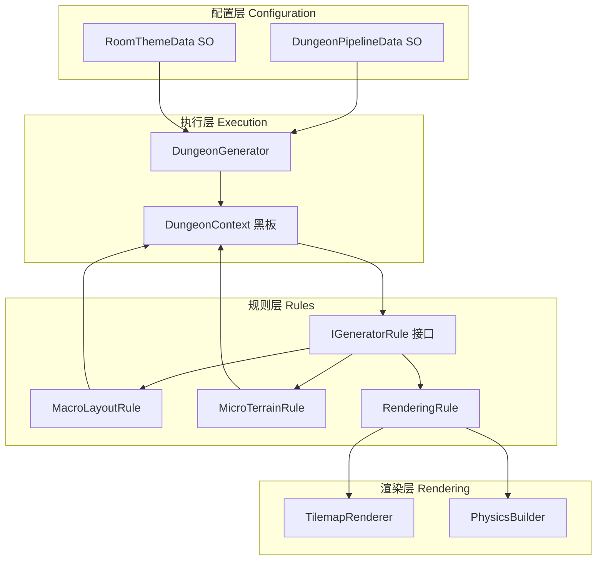
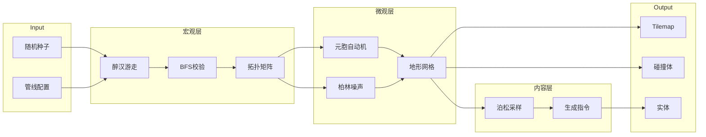
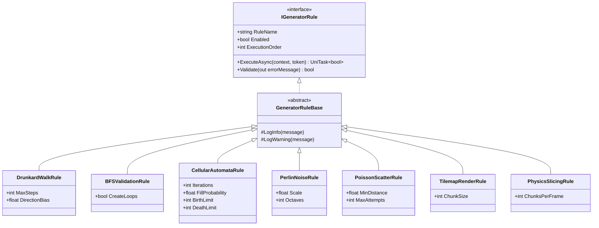
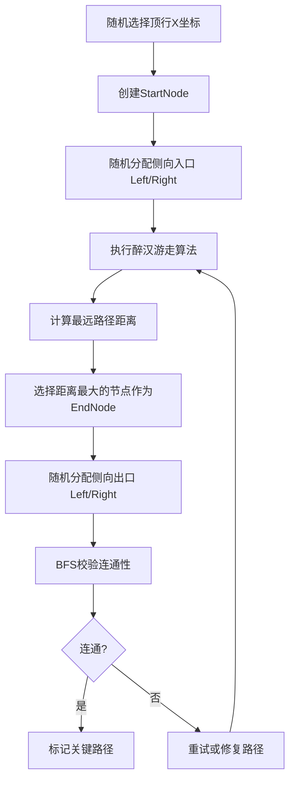
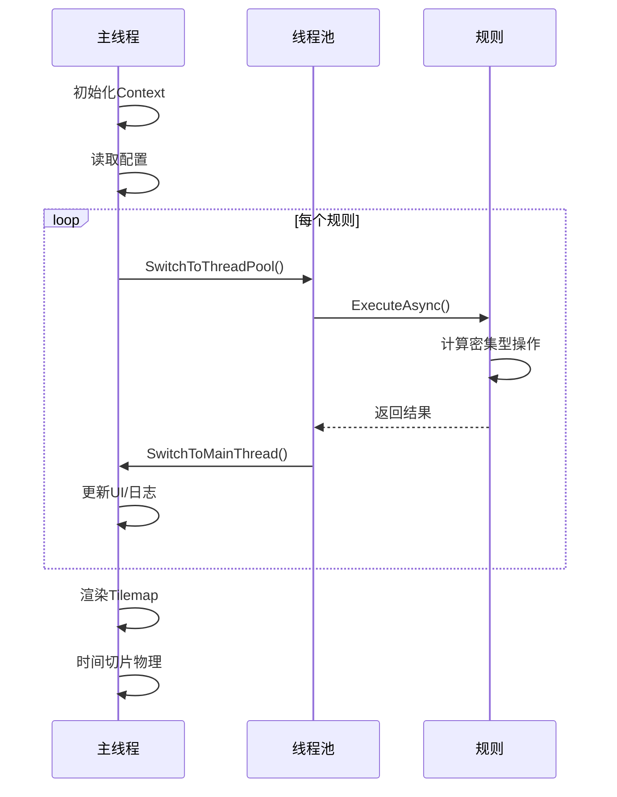

# V4 多房间PCG生成系统 - 架构设计文档 (DESIGN)

> **文档版本**: 1.0  
> **创建日期**: 2026-01-17  
> **状态**: 设计阶段

---

## 1. 系统架构总览

### 1.1 分层架构图



### 1.2 数据流图



---

## 2. 核心组件设计

### 2.1 IGeneratorRule 接口

```csharp
/// <summary>
/// 生成规则通用接口
/// 所有宏观/微观/渲染规则必须实现此接口
/// </summary>
public interface IGeneratorRule
{
    /// <summary>
    /// 规则显示名称（用于Inspector和日志）
    /// </summary>
    string RuleName { get; }
    
    /// <summary>
    /// 是否启用此规则
    /// </summary>
    bool Enabled { get; set; }
    
    /// <summary>
    /// 规则执行顺序（越小越先执行）
    /// </summary>
    int ExecutionOrder { get; }
    
    /// <summary>
    /// 异步执行生成逻辑
    /// </summary>
    /// <param name="context">共享的黑板数据</param>
    /// <param name="token">取消令牌</param>
    /// <returns>执行是否成功</returns>
    UniTask<bool> ExecuteAsync(DungeonContext context, CancellationToken token);
    
    /// <summary>
    /// 验证规则配置是否有效
    /// </summary>
    bool Validate(out string errorMessage);
}
```

### 2.2 DungeonContext 黑板数据

```csharp
/// <summary>
/// 地牢生成上下文（黑板模式）
/// 所有规则通过此对象共享数据
/// </summary>
public class DungeonContext : IDisposable
{
    #region 配置数据
    /// <summary>随机数生成器</summary>
    public System.Random RNG { get; private set; }
    
    /// <summary>取消令牌</summary>
    public CancellationToken Token { get; set; }
    
    /// <summary>网格尺寸（列数）</summary>
    public int GridColumns { get; set; }
    
    /// <summary>网格尺寸（行数）</summary>
    public int GridRows { get; set; }
    
    /// <summary>单个房间像素尺寸</summary>
    public Vector2Int RoomSize { get; set; }
    #endregion
    
    #region 宏观层数据
    /// <summary>房间节点列表</summary>
    public List<RoomNode> RoomNodes { get; set; }
    
    /// <summary>邻接矩阵 [fromIndex, toIndex] = 1表示连通</summary>
    public int[,] AdjacencyMatrix { get; set; }
    
    /// <summary>起始房间坐标</summary>
    public Vector2Int StartRoom { get; set; }
    
    /// <summary>终点房间坐标</summary>
    public Vector2Int EndRoom { get; set; }
    
    /// <summary>关键路径房间集合</summary>
    public HashSet<Vector2Int> CriticalPath { get; set; }
    #endregion
    
    #region 微观层数据
    /// <summary>
    /// 地形数据（一维扁平化存储）
    /// 索引公式: index = y * MapWidth + x
    /// </summary>
    public int[] TileData { get; set; }
    
    /// <summary>地图总宽度（像素）</summary>
    public int MapWidth { get; set; }
    
    /// <summary>地图总高度（像素）</summary>
    public int MapHeight { get; set; }
    
    /// <summary>
    /// 获取指定坐标的瓦片值
    /// </summary>
    public int GetTile(int x, int y)
    {
        if (x < 0 || x >= MapWidth || y < 0 || y >= MapHeight)
            return -1; // 边界外
        return TileData[y * MapWidth + x];
    }
    
    /// <summary>
    /// 设置指定坐标的瓦片值
    /// </summary>
    public void SetTile(int x, int y, int value)
    {
        if (x < 0 || x >= MapWidth || y < 0 || y >= MapHeight)
            return;
        TileData[y * MapWidth + x] = value;
    }
    #endregion
    
    #region 内容层数据
    /// <summary>待生成的实体指令列表</summary>
    public List<SpawnCommand> PendingSpawns { get; set; }
    #endregion
    
    #region 渲染层数据
    /// <summary>需要重新渲染的区块集合</summary>
    public HashSet<BoundsInt> DirtyChunks { get; set; }
    #endregion
    
    #region 生命周期
    public DungeonContext(int seed)
    {
        RNG = new System.Random(seed);
        RoomNodes = new List<RoomNode>();
        CriticalPath = new HashSet<Vector2Int>();
        PendingSpawns = new List<SpawnCommand>();
        DirtyChunks = new HashSet<BoundsInt>();
    }
    
    public void Dispose()
    {
        // 归还ArrayPool（如果使用）
        RoomNodes?.Clear();
        CriticalPath?.Clear();
        PendingSpawns?.Clear();
        DirtyChunks?.Clear();
        TileData = null;
    }
    #endregion
}
```

### 2.3 DungeonPipelineData (ScriptableObject)

```csharp
/// <summary>
/// 地牢生成管线配置
/// 使用SerializeReference支持多态规则列表
/// </summary>
[CreateAssetMenu(fileName = "DungeonPipeline", menuName = "PCG/Dungeon Pipeline")]
public class DungeonPipelineData : ScriptableObject
{
    [Title("基础配置")]
    [LabelText("网格列数")]
    [Range(2, 10)]
    public int GridColumns = 4;
    
    [LabelText("网格行数")]
    [Range(2, 10)]
    public int GridRows = 4;
    
    [LabelText("房间尺寸")]
    public Vector2Int RoomSize = new Vector2Int(64, 64);
    
    [Title("生成规则")]
    [LabelText("规则列表")]
    [SerializeReference]
    [ListDrawerSettings(ShowFoldout = true, DraggableItems = true)]
    public List<IGeneratorRule> Rules = new List<IGeneratorRule>();
    
    [Title("调试选项")]
    [LabelText("启用日志")]
    public bool EnableLogging = true;
    
    [LabelText("可视化调试")]
    public bool EnableVisualization = false;
    
    /// <summary>
    /// 验证所有规则配置
    /// </summary>
    public bool ValidateAll(out List<string> errors)
    {
        errors = new List<string>();
        foreach (var rule in Rules)
        {
            if (rule != null && !rule.Validate(out string msg))
            {
                errors.Add($"[{rule.RuleName}] {msg}");
            }
        }
        return errors.Count == 0;
    }
}
```

### 2.4 DungeonGenerator 执行器

```csharp
/// <summary>
/// 地牢生成器主控制器
/// 负责异步执行管线中的所有规则
/// </summary>
public class DungeonGenerator : MonoBehaviour
{
    [SerializeField]
    private DungeonPipelineData _pipeline;
    
    [SerializeField]
    private Tilemap[] _tilemapLayers;
    
    [SerializeField]
    private CompositeCollider2D _compositeCollider;
    
    private DungeonContext _context;
    private CancellationTokenSource _cts;
    
    /// <summary>
    /// 异步生成地牢
    /// </summary>
    /// <param name="seed">随机种子，-1表示使用系统时间</param>
    public async UniTask<bool> GenerateDungeonAsync(int seed = -1)
    {
        // 初始化
        _cts?.Cancel();
        _cts = new CancellationTokenSource();
        
        int actualSeed = seed == -1 ? Environment.TickCount : seed;
        _context = new DungeonContext(actualSeed);
        _context.Token = _cts.Token;
        _context.GridColumns = _pipeline.GridColumns;
        _context.GridRows = _pipeline.GridRows;
        _context.RoomSize = _pipeline.RoomSize;
        _context.MapWidth = _pipeline.GridColumns * _pipeline.RoomSize.x;
        _context.MapHeight = _pipeline.GridRows * _pipeline.RoomSize.y;
        _context.TileData = new int[_context.MapWidth * _context.MapHeight];
        
        if (_pipeline.EnableLogging)
            Debug.Log($"[DungeonGenerator] 开始生成，种子={actualSeed}");
        
        // 按顺序执行规则
        var sortedRules = _pipeline.Rules
            .Where(r => r != null && r.Enabled)
            .OrderBy(r => r.ExecutionOrder)
            .ToList();
        
        foreach (var rule in sortedRules)
        {
            if (_cts.Token.IsCancellationRequested)
            {
                Debug.LogWarning("[DungeonGenerator] 生成被取消");
                return false;
            }
            
            if (_pipeline.EnableLogging)
                Debug.Log($"[DungeonGenerator] 执行规则: {rule.RuleName}");
            
            // 切换到线程池执行计算密集型任务
            await UniTask.SwitchToThreadPool();
            
            bool success = await rule.ExecuteAsync(_context, _cts.Token);
            
            // 切回主线程
            await UniTask.SwitchToMainThread();
            
            if (!success)
            {
                Debug.LogError($"[DungeonGenerator] 规则执行失败: {rule.RuleName}");
                return false;
            }
        }
        
        if (_pipeline.EnableLogging)
            Debug.Log("[DungeonGenerator] 生成完成");
        
        return true;
    }
    
    /// <summary>
    /// 取消当前生成
    /// </summary>
    public void CancelGeneration()
    {
        _cts?.Cancel();
    }
    
    private void OnDestroy()
    {
        _cts?.Cancel();
        _cts?.Dispose();
        _context?.Dispose();
    }
}
```

---

## 3. 规则实现设计

### 3.1 规则类继承图



### 3.2 规则执行顺序

| Order | 规则 | 层级 | 描述 |
|-------|------|------|------|
| 100 | DrunkardWalkRule | 宏观 | 生成房间拓扑 |
| 200 | BFSValidationRule | 宏观 | 校验连通性 |
| 300 | CellularAutomataRule | 微观 | 生成洞穴地形 |
| 310 | PerlinNoiseRule | 微观 | 叠加噪声变化 |
| 400 | PoissonScatterRule | 内容 | 放置内容物 |
| 500 | TilemapRenderRule | 渲染 | 批量渲染瓦片 |
| 600 | PhysicsSlicingRule | 渲染 | 时间切片烘焙 |

---

## 4. 数据结构设计

### 4.1 RoomNode（已更新：支持出入口约束）

```csharp
/// <summary>
/// 房间节点数据
/// 包含拓扑信息、出入口约束和连接关系
/// </summary>
[Serializable]
public struct RoomNode
{
    /// <summary>网格坐标</summary>
    public Vector2Int GridPosition;
    
    /// <summary>房间类型（Normal/Start/End）</summary>
    public RoomType Type;
    
    /// <summary>关卡门类型（用于标记关卡入口/出口）</summary>
    public LevelDoorType DoorType;
    
    /// <summary>限定的门方向（仅限Left或Right，用于侧向出入口约束）</summary>
    public WallDirection RestrictedDoorSide;
    
    /// <summary>是否在关键路径上</summary>
    public bool IsCritical;
    
    /// <summary>世界坐标边界</summary>
    public BoundsInt WorldBounds;
    
    /// <summary>连接的邻居房间坐标列表</summary>
    public List<Vector2Int> ConnectedNeighbors;
    
    // 辅助方法
    public void SetAsStart(WallDirection doorSide);  // 设置为起始房间
    public void SetAsEnd(WallDirection doorSide);    // 设置为终点房间
    public void AddNeighbor(Vector2Int neighborPos); // 添加邻居连接
}
```

### 4.2 出入口约束枚举（新增）

```csharp
/// <summary>
/// 关卡门类型（区别于房间间连接的普通门）
/// </summary>
public enum LevelDoorType
{
    None = 0,           // 无特殊门
    LevelEntrance = 1,  // 关卡入口（玩家进入关卡的门）
    LevelExit = 2       // 关卡出口（玩家离开关卡的门）
}

/// <summary>
/// 墙壁方向（用于指定出入口位置）
/// </summary>
public enum WallDirection
{
    None = 0,
    Left = 1,    // 左侧
    Right = 2,   // 右侧
    Top = 3,     // 顶部
    Bottom = 4   // 底部
}
```

### 4.2 SpawnCommand

```csharp
/// <summary>
/// 实体生成指令
/// </summary>
[Serializable]
public struct SpawnCommand
{
    /// <summary>世界坐标位置</summary>
    public Vector3 Position;
    
    /// <summary>预制体引用</summary>
    public GameObject Prefab;
    
    /// <summary>生成延迟（秒）</summary>
    public float Delay;
    
    /// <summary>附加数据</summary>
    public string ExtraData;
}
```

### 4.3 TileTheme 枚举（已更新）

```csharp
/// <summary>
/// Tilemap层级枚举
/// </summary>
public enum TilemapLayer
{
    Background = 0,  // 背景层（使用Tileable普通瓦片平铺）
    Ground = 1,      // 地面层（使用Rule Tile，有碰撞）
    Platform = 2     // 平台层（使用Rule Tile，有碰撞）
}

/// <summary>
/// 瓦片颜色主题
/// </summary>
public enum TileTheme
{
    Empty = 0,   // 无瓦片
    Blue = 1,    // 蓝色主题
    Red = 2,     // 红色主题
    Yellow = 3   // 黄色主题
}
```

---

## 5. 出入口约束设计（新增）

### 5.1 约束规则

基于研究报告《房间出入口生成研究报告：V4版拓扑约束与定向引导逻辑》，定义以下约束：

| 约束项 | 规则 |
|--------|------|
| **起始房间位置** | 必须位于网格顶行（Y=0） |
| **起始房间X坐标** | 随机选择 [0, GridColumns-1] |
| **关卡入口方向** | 仅限 Left 或 Right（侧向约束） |
| **终点房间选择** | 使用最远路径距离算法确定 |
| **关卡出口方向** | 仅限 Left 或 Right（侧向约束） |

### 5.2 拓扑生成流程



### 5.3 微观实体放置

| 房间类型 | 生成物 | 位置 |
|----------|--------|------|
| Start | PlayerSpawnPoint | 房间中央 |
| Start | LevelEntrance门 | RestrictedDoorSide指定的墙壁 |
| End | LevelClearTrigger | 房间中央 |
| End | LevelExit门 | RestrictedDoorSide指定的墙壁 |

---

## 6. 异步执行流程

### 6.1 线程切换时序图



### 6.2 时间切片伪代码

```csharp
// PhysicsSlicingRule 核心逻辑
public async UniTask<bool> ExecuteAsync(DungeonContext context, CancellationToken token)
{
    var chunks = context.DirtyChunks.ToList();
    int processedPerFrame = 0;
    
    foreach (var chunk in chunks)
    {
        if (token.IsCancellationRequested) return false;
        
        // 更新该区块的碰撞体
        UpdateColliderForChunk(chunk);
        processedPerFrame++;
        
        // 达到每帧限制，等待下一帧
        if (processedPerFrame >= ChunksPerFrame)
        {
            await UniTask.Yield(PlayerLoopTiming.Update, token);
            processedPerFrame = 0;
        }
    }
    
    // 最终生成
    _compositeCollider.GenerateGeometry();
    return true;
}
```

---

## 7. 目录结构

```
Assets/1_Scripts/3_LevelGeneration/
├── LevelGenerationV3/              # 保留V3（只读参考）
│
└── LevelGenerationV4/              # 新版本
    ├── Core/
    │   ├── DungeonContext.cs
    │   ├── DungeonGenerator.cs
    │   └── DungeonPipelineData.cs
    │
    ├── Rules/
    │   ├── Abstractions/
    │   │   ├── IGeneratorRule.cs
    │   │   └── GeneratorRuleBase.cs
    │   ├── Macro/
    │   │   ├── DrunkardWalkRule.cs
    │   │   └── BFSValidationRule.cs
    │   ├── Micro/
    │   │   ├── CellularAutomataRule.cs
    │   │   └── PerlinNoiseRule.cs
    │   ├── Content/
    │   │   └── PoissonScatterRule.cs
    │   └── Rendering/
    │       ├── TilemapRenderRule.cs
    │       └── PhysicsSlicingRule.cs
    │
    ├── Data/
    │   ├── RoomNode.cs
    │   ├── RoomType.cs
    │   ├── SpawnCommand.cs
    │   └── TileId.cs
    │
    ├── Utilities/
    │   ├── ArrayPoolHelper.cs
    │   ├── SpatialHash.cs
    │   └── FastRandom.cs
    │
    └── Editor/
        └── DungeonPipelineEditor.cs
```

---

## 8. 扩展点设计

### 7.1 新增规则流程

1. 创建新类继承 `GeneratorRuleBase`
2. 实现 `ExecuteAsync` 方法
3. 在 Inspector 中将规则添加到 `DungeonPipelineData.Rules`
4. 调整 `ExecutionOrder` 确定执行顺序

### 7.2 预留优化接口

```csharp
/// <summary>
/// 支持Burst编译的规则接口（预留）
/// </summary>
public interface IBurstRule : IGeneratorRule
{
    /// <summary>
    /// 获取Burst兼容的Job结构体
    /// </summary>
    IJobParallelFor GetJob(DungeonContext context);
}
```

---

**设计文档结束 - 进入任务分解阶段**
