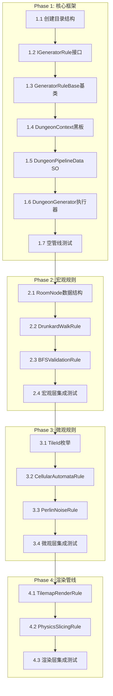

# V4 多房间PCG生成系统 - 任务分解文档 (TASK)

> **文档版本**: 1.0  
> **创建日期**: 2026-01-17  
> **状态**: 待审批

---

## 任务依赖关系图



---

## Phase 1: 核心框架 (预估 4h)

### Task 1.1 创建目录结构
| 属性 | 值 |
|------|-----|
| **ID** | 1.1 |
| **优先级** | P0 |
| **预估** | 10min |
| **状态** | [x] 已完成 |
| **依赖** | 无 |

**输入**: 无

**输出**: 
```
Assets/1_Scripts/3_LevelGeneration/LevelGenerationV4/
├── Core/
├── Rules/
│   ├── Abstractions/
│   ├── Macro/
│   ├── Micro/
│   ├── Content/
│   └── Rendering/
├── Data/
├── Utilities/
└── Editor/
```

**验收标准**:
- [ ] 目录结构与DESIGN文档一致
- [ ] 所有文件夹包含空的 `.gitkeep` 或 `README.md`

---

### Task 1.2 IGeneratorRule 接口
| 属性 | 值 |
|------|-----|
| **ID** | 1.2 |
| **优先级** | P0 |
| **预估** | 15min |
| **状态** | [x] 已完成 |
| **依赖** | 1.1 |

**输入**: DESIGN文档中的接口定义

**输出**: `Rules/Abstractions/IGeneratorRule.cs`

**代码规范**:
```csharp
// 必须包含的成员
string RuleName { get; }
bool Enabled { get; set; }
int ExecutionOrder { get; }
UniTask<bool> ExecuteAsync(DungeonContext context, CancellationToken token);
bool Validate(out string errorMessage);
```

**验收标准**:
- [ ] 编译通过
- [ ] 包含完整XML文档注释
- [ ] 使用UniTask命名空间

---

### Task 1.3 GeneratorRuleBase 基类
| 属性 | 值 |
|------|-----|
| **ID** | 1.3 |
| **优先级** | P0 |
| **预估** | 20min |
| **状态** | [x] 已完成 |
| **依赖** | 1.2 |

**输入**: IGeneratorRule接口

**输出**: `Rules/Abstractions/GeneratorRuleBase.cs`

**功能要求**:
- 实现 `IGeneratorRule` 的默认成员
- 提供 `LogInfo`, `LogWarning`, `LogError` 辅助方法
- 添加 `[Serializable]` 属性
- 添加 Odin Inspector 的 `[LabelText]`, `[ShowIf]` 等属性

**验收标准**:
- [ ] 编译通过
- [ ] 可被其他规则类继承
- [ ] Odin属性正确显示

---

### Task 1.4 DungeonContext 黑板
| 属性 | 值 |
|------|-----|
| **ID** | 1.4 |
| **优先级** | P0 |
| **预估** | 30min |
| **状态** | [x] 已完成 |
| **依赖** | 1.3 |

**输入**: DESIGN文档中的Context定义

**输出**: `Core/DungeonContext.cs`

**功能要求**:
- 宏观层数据字段 (RoomNodes, AdjacencyMatrix, etc.)
- 微观层数据字段 (TileData, MapWidth, MapHeight)
- GetTile/SetTile 辅助方法
- 实现 IDisposable

**验收标准**:
- [ ] 编译通过
- [ ] GetTile/SetTile 边界检查正确
- [ ] Dispose 清理所有集合

---

### Task 1.5 DungeonPipelineData SO
| 属性 | 值 |
|------|-----|
| **ID** | 1.5 |
| **优先级** | P0 |
| **预估** | 30min |
| **状态** | [x] 已完成 |
| **依赖** | 1.4 |

**输入**: DungeonContext, IGeneratorRule

**输出**: `Core/DungeonPipelineData.cs`

**功能要求**:
- `[CreateAssetMenu]` 属性
- `[SerializeReference]` 规则列表
- Odin Inspector 可视化配置
- `ValidateAll()` 方法

**验收标准**:
- [ ] 编译通过
- [ ] 可在Project窗口右键创建资产
- [ ] Inspector中可添加/删除/排序规则
- [ ] 多态规则正确序列化

---

### Task 1.6 DungeonGenerator 执行器
| 属性 | 值 |
|------|-----|
| **ID** | 1.6 |
| **优先级** | P0 |
| **预估** | 45min |
| **状态** | [x] 已完成 |
| **依赖** | 1.5 |

**输入**: DungeonPipelineData, DungeonContext

**输出**: `Core/DungeonGenerator.cs`

**功能要求**:
- `GenerateDungeonAsync(int seed)` 主方法
- `CancelGeneration()` 取消方法
- 规则按 ExecutionOrder 排序执行
- 线程池/主线程切换
- 日志输出

**验收标准**:
- [ ] 编译通过
- [ ] 空管线可正常执行
- [ ] 取消令牌正确传递
- [ ] 日志输出线程切换信息

---

### Task 1.7 空管线测试
| 属性 | 值 |
|------|-----|
| **ID** | 1.7 |
| **优先级** | P0 |
| **预估** | 20min |
| **状态** | [x] 已完成 |
| **依赖** | 1.6 |

**输入**: 完整的Core框架

**测试步骤**:
1. 创建测试场景 `V4_TestScene`
2. 创建空的 `DungeonPipelineData` 资产
3. 添加 `DungeonGenerator` 组件
4. 在 Inspector 中点击 "Generate" 按钮
5. 确认日志输出正确

**验收标准**:
- [ ] 无编译错误
- [ ] 无运行时异常
- [ ] 日志显示 "开始生成" 和 "生成完成"

---

## Phase 2: 宏观规则 (预估 6h)

### Task 2.1 RoomNode 数据结构（已完成 - 根据研究报告更新）
| 属性 | 值 |
|------|-----|
| **ID** | 2.1 |
| **优先级** | P0 |
| **预估** | 15min |
| **状态** | [x] 已完成 |
| **依赖** | 1.7 |

**输出**: `Data/RoomNode.cs`, `Data/RoomType.cs`

**结构定义（已更新）**:
```csharp
public struct RoomNode
{
    public Vector2Int GridPosition;
    public RoomType Type;              // Normal/Start/End
    public LevelDoorType DoorType;     // None/LevelEntrance/LevelExit
    public WallDirection RestrictedDoorSide; // Left/Right（侧向约束）
    public bool IsCritical;
    public BoundsInt WorldBounds;
    public List<Vector2Int> ConnectedNeighbors;
    
    // 辅助方法
    public void SetAsStart(WallDirection doorSide);
    public void SetAsEnd(WallDirection doorSide);
}

public enum RoomType { Empty, Normal, Start, End }
public enum LevelDoorType { None, LevelEntrance, LevelExit }
public enum WallDirection { None, Left, Right, Top, Bottom }
```

---

### Task 2.2 ConstrainedLayoutRule（醉汉游走+出入口约束）
| 属性 | 值 |
|------|-----|
| **ID** | 2.2 |
| **优先级** | P0 |
| **预估** | 3h |
| **状态** | [x] 已完成 |
| **依赖** | 2.1 |

**输出**: `Rules/Macro/ConstrainedLayoutRule.cs`

**核心逻辑**（根据研究报告）:
1. **起始房间**: 顶行随机X坐标 `(RNG.Next(0, GridColumns), 0)`
2. **侧向入口**: 随机分配 `Left` 或 `Right`
3. **醉汉游走**: 带向下/侧向权重的随机游走
4. **终点选择**: 计算最远路径距离，选择距离最大的节点
5. **侧向出口**: 随机分配 `Left` 或 `Right`

**算法参数**:
| 参数 | 类型 | 默认值 | 说明 |
|------|------|--------|------|
| MaxSteps | int | 10 | 最大游走步数 |
| DownwardBias | float | 0.4 | 向下方偏移权重 |
| SidewaysBias | float | 0.3 | 向侧方偏移权重 |
| MinRooms | int | 6 | 最少房间数 |

**验收标准**:
- [ ] 起始房间位于顶行
- [ ] 起始房间有侧向入口（Left/Right）
- [ ] 终点房间有侧向出口（Left/Right）
- [ ] 生成连通的房间拓扑
- [ ] 房间数量 >= MinRooms

---

### Task 2.3 BFSValidationRule
| 属性 | 值 |
|------|-----|
| **ID** | 2.3 |
| **优先级** | P0 |
| **预估** | 1.5h |
| **状态** | [x] 已完成 |
| **依赖** | 2.2 |

**输出**: `Rules/Macro/BFSValidationRule.cs`

**功能要求**:
- BFS验证起点到终点连通性
- 标记关键路径房间
- 可选：创建环路增加多样性

**验收标准**:
- [ ] 100%保证连通性
- [ ] CriticalPath 正确标记
- [ ] 不连通时返回 false

---

### Task 2.4 宏观层集成测试
| 属性 | 值 |
|------|-----|
| **ID** | 2.4 |
| **优先级** | P0 |
| **预估** | 1h |
| **状态** | [x] 已完成 |
| **依赖** | 2.3 |

**测试内容**:
1. 配置 DrunkardWalkRule + BFSValidationRule
2. 多种种子测试
3. Gizmos 可视化拓扑结构

**验收标准**:
- [ ] 10次随机种子全部通过
- [ ] Scene视图可见房间布局

---

## Phase 3: 微观规则 (预估 8h)

### Task 3.1 TileId 枚举
| 属性 | 值 |
|------|-----|
| **ID** | 3.1 |
| **优先级** | P0 |
| **预估** | 10min |
| **状态** | [x] 已完成 |
| **依赖** | 2.4 |

**输出**: `Data/TileId.cs`

---

### Task 3.2 CellularAutomataRule
| 属性 | 值 |
|------|-----|
| **ID** | 3.2 |
| **优先级** | P0 |
| **预估** | 3h |
| **状态** | [x] 已完成 |
| **依赖** | 3.1 |

**输出**: `Rules/Micro/CellularAutomataRule.cs`

**算法参数**:
| 参数 | 类型 | 默认值 | 说明 |
|------|------|--------|------|
| Iterations | int | 5 | 迭代次数 |
| FillProbability | float | 0.45 | 初始填充率 |
| BirthLimit | int | 4 | 出生阈值 |
| DeathLimit | int | 3 | 死亡阈值 |

**优化要求**:
- 使用一维数组存储
- 双缓冲避免额外分配
- 可选：位运算优化邻居计数

**验收标准**:
- [ ] 生成自然洞穴形态
- [ ] 无GC分配（Profiler验证）

---

### Task 3.3 PerlinNoiseRule
| 属性 | 值 |
|------|-----|
| **ID** | 3.3 |
| **优先级** | P1 |
| **预估** | 2h |
| **状态** | [⏭] 跳过 |
| **依赖** | 3.2 |

**输出**: `Rules/Micro/PerlinNoiseRule.cs`

**算法参数**:
| 参数 | 类型 | 默认值 | 说明 |
|------|------|--------|------|
| Scale | float | 0.1 | 噪声缩放 |
| Octaves | int | 3 | 叠加层数 |
| Threshold | float | 0.5 | 阈值 |

---

### Task 3.4 微观层集成测试
| 属性 | 值 |
|------|-----|
| **ID** | 3.4 |
| **优先级** | P0 |
| **预估** | 1h |
| **状态** | [x] 已完成 |
| **依赖** | 3.3 |

**测试内容**:
1. 完整管线：宏观 + 微观
2. 地形可视化（临时Gizmos）
3. Profiler 性能分析

**验收标准**:
- [ ] 地形连续无断裂
- [ ] 每个房间内部有洞穴结构
- [ ] 性能无明显瓶颈

---

## Phase 4: 渲染管线 (预估 4h)

### Task 4.1 TilemapRenderRule
| 属性 | 值 |
|------|-----|
| **ID** | 4.1 |
| **优先级** | P0 |
| **预估** | 2h |
| **状态** | [x] 已完成 |
| **依赖** | 3.4 |

**输出**: `Rules/Rendering/TilemapRenderRule.cs`

**功能要求**:
- 使用 `Tilemap.SetTilesBlock()` 批量设置
- 支持多层Tilemap
- 分块渲染避免单次操作过大

**验收标准**:
- [ ] Tilemap正确显示地形
- [ ] 无闪烁或撕裂
- [ ] 渲染耗时 < 100ms (100x100地图)

---

### Task 4.2 PhysicsSlicingRule
| 属性 | 值 |
|------|-----|
| **ID** | 4.2 |
| **优先级** | P0 |
| **预估** | 1.5h |
| **状态** | [x] 已完成 |
| **依赖** | 4.1 |

**输出**: `Rules/Rendering/PhysicsSlicingRule.cs`

**功能要求**:
- `CompositeCollider2D.generationType = Manual`
- 时间切片调用 `GenerateGeometry()`
- 可配置每帧处理区块数

**验收标准**:
- [ ] 碰撞体正确生成
- [ ] 生成期间帧率 > 30 FPS
- [ ] 无物理穿透

---

### Task 4.3 渲染层集成测试
| 属性 | 值 |
|------|-----|
| **ID** | 4.3 |
| **优先级** | P0 |
| **预估** | 30min |
| **状态** | [x] 已完成 |
| **依赖** | 4.2 |

**测试内容**:
1. 完整管线端到端测试
2. 玩家移动测试碰撞
3. 1000x1000 压力测试

**验收标准**:
- [ ] 完整流程无报错
- [ ] 玩家碰撞正常
- [ ] 大地图生成 < 5秒

---

## 任务状态汇总

| Phase | 任务数 | 完成 | 进度 |
|-------|--------|------|------|
| Phase 1 | 7 | 7 | 100% |
| Phase 2 | 4 | 4 | 100% |
| Phase 3 | 4 | 4 | 100% |
| Phase 4 | 3 | 3 | 100% |
| **总计** | **18** | **18** | **100%** |

> **注**: 
> - 所有核心任务已完成
> - 额外实现: EntranceExitRule, PathValidationRule, PlatformRule, PlatformDropthrough
> - Phase 3.3 PerlinNoiseRule 跳过（CA已满足需求）

---

## 里程碑检查点

| 检查点 | 任务范围 | 验收物 |
|--------|----------|--------|
| **CP1** | 1.1 - 1.7 | 空管线可运行 |
| **CP2** | 2.1 - 2.4 | 拓扑可视化 |
| **CP3** | 3.1 - 3.4 | 地形可视化 |
| **CP4** | 4.1 - 4.3 | 完整可玩 |

---

**任务分解完成 - 请审批后进入实施阶段**
