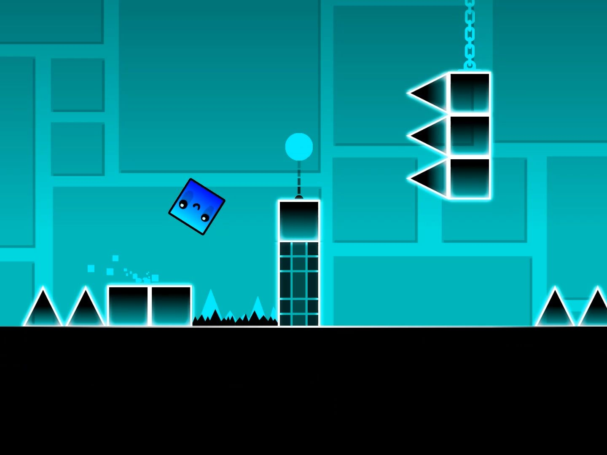
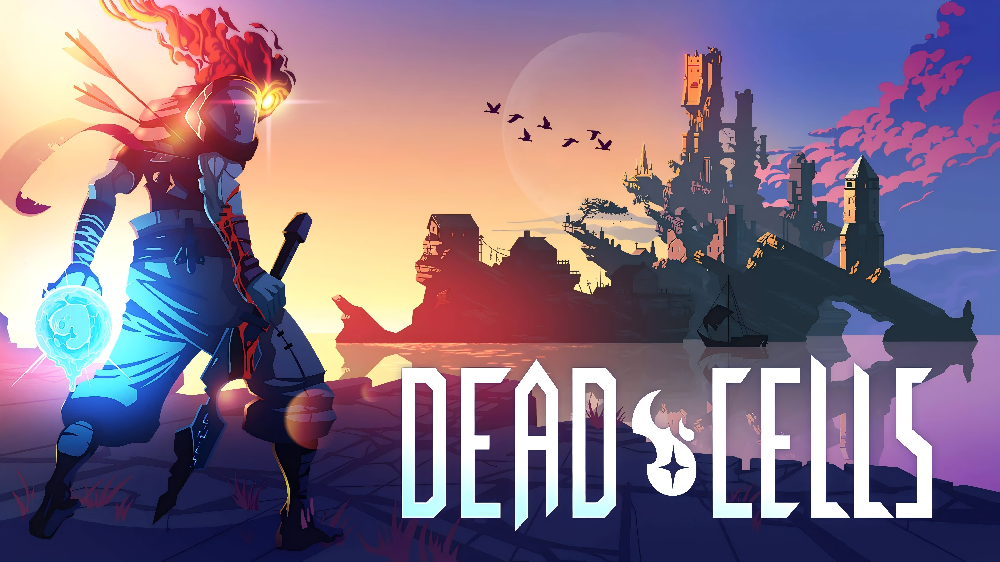
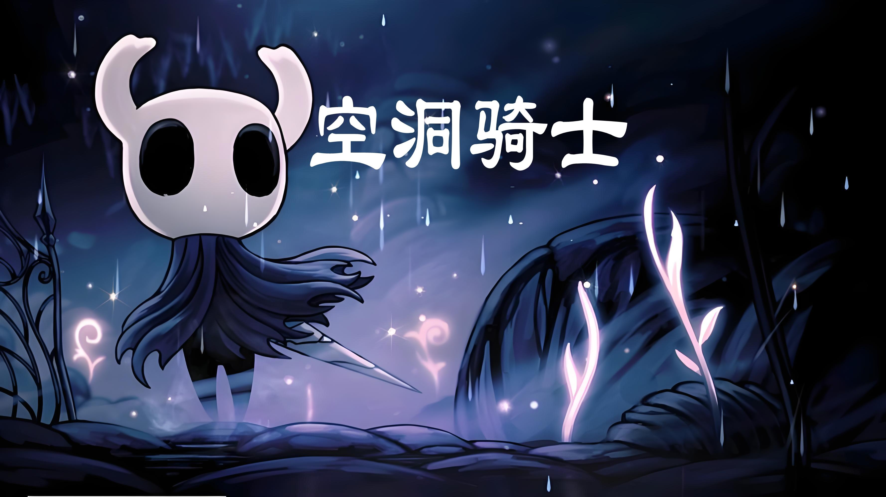
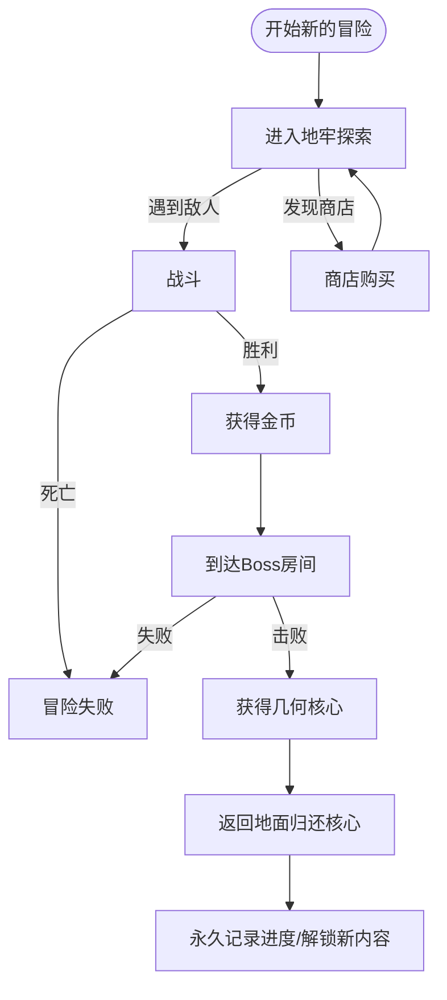
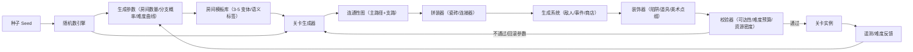
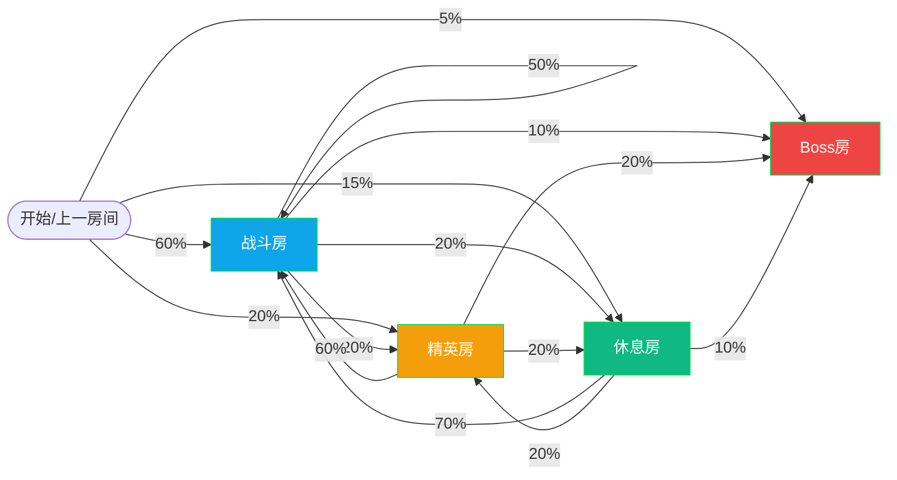
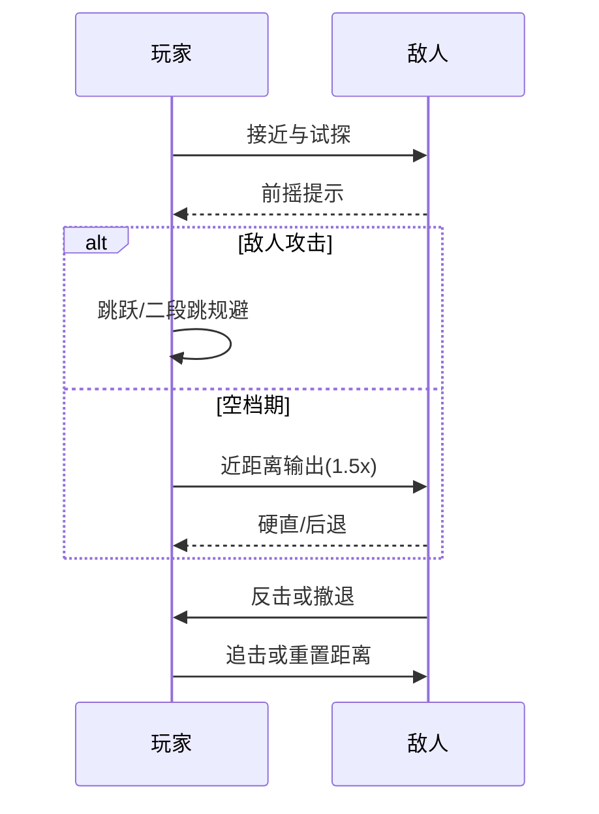
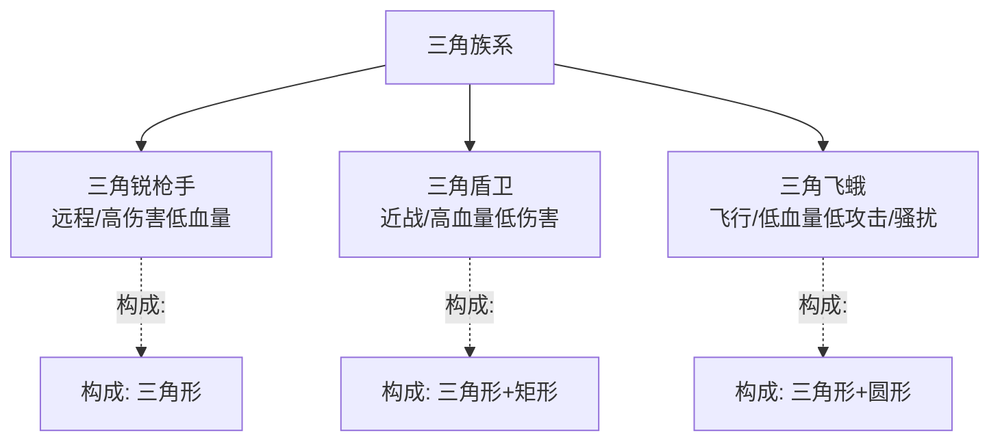
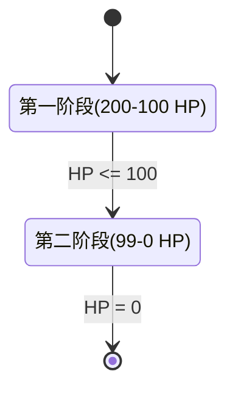

# CRYPTA GEOMETRICA

《CRYPTA GEOMETRICA》——几何地窖

## 游戏简介

《CRYPTA GEOMETRICA》是一款由单人独立开发的横板动作类 Roguelite 游戏。游戏采用极具辨识度的矢量几何线框美术风格，搭配冷峻科幻的视觉基调，构建出一个充满未知与危险的几何地下城世界。

局内体验聚焦于随机生成的地牢探索与战斗核心。你需要灵活运用跳跃等基础动作，在层叠交错的几何空间中穿梭，揭开隐藏于地牢深处的秘密。战斗中击败敌人将统一掉落圆形金币，金币仅用于购买物品与服务，不直接提升角色属性。你可以通过关卡中的商店或事件使用金币，构建当次探索的战斗节奏与资源策略。Roguelite 的核心规则贯穿始终：每次死亡都会重置本次探索进程，你需要重新出发。

局外叙事围绕"矩形勇者" 的使命展开。几何矩阵世界中，多个国度正遭受威胁，你作为矩形勇者加入讨伐队伍，目标直指三角形国度与失控的复合怪物。你将反复潜入复合怪物盘踞的地牢，抵御沿途三角生命体的阻击，逐步深入地牢腹地，最终消灭复合怪物，夺回被掠夺的核心几何件。每击败一个由多个几何体精密组合而成的强力 Boss，就能获得一件“几何核心”宝物；你需在战后将其带回地面并归还给对应的几何矩阵国度，用于推动世界秩序的重建。

## 灵感来源

### 1.美术风格：《几何冲刺》（Geometry Dash）

借鉴《几何冲刺》极简纯粹的几何体构成逻辑，角色与怪物均以 1-3 个基础几何体为核心搭建，Boss 则通过多个不同几何体的组合拼接，呈现出复杂且富有压迫感的视觉形象。在此基础上，融入科幻线框光影效果，搭配高对比度的霓虹色彩与冷峻的暗色调背景，强化几何地下城的神秘与科幻氛围，既保持了极简风格的辨识度，又增添了独有的沉浸感。

### 2.关卡设计：《死亡细胞》×《洞穴冒险》（Spelunky）

核心继承《死亡细胞》"局内随机生成+局外永久解锁" 的双轨循环机制，保证每一次冒险的新鲜感，同时让长期探索拥有明确成长反馈。关卡生成采用 "随机游走算法规划主路径" 的宏观框架，确保地牢整体结构的连贯性与探索逻辑；在此基础上，嵌套《洞穴冒险》式的房间种子库设计，每个基础房间仅设置 3-5 个变体形态，既保留了银河恶魔城式的空间探索感，又有效控制了单人开发的美术制作复杂度，实现 "低成本高多样性" 的关卡体验。

### 3.操作与战斗：《空洞骑士》

参考《空洞骑士》经典横板战斗动作系统，构建"接近-输出-撤离/防御-追击" 的简洁战斗循环。战斗核心强调 "风险-回报" 与 "读招预判"：敌人的攻击动作带有明确前摇提示，需要你精准把握闪避时机；近距离输出能获得更高伤害收益，但也面临更大风险，鼓励玩家在谨慎判断与果断操作之间寻找平衡。同时优化基础操作手感，跳跃支持二段跳调整落点，让动作衔接更流畅，战斗体验更具爽感。

## 故事背景

在浩瀚的几何矩阵世界中，矩形、三角形、圆形三大几何生命体族群各自建立国度，形成了稳定的生态平衡。矩形国度崇尚稳固与秩序，是世界秩序的维护者；三角形国度追求力量与扩张，野心暗藏；圆形国度擅长平衡与秘能，守护着世界的能量核心。

平静被三角形君王的野心打破。他妄图融合其他几何生命体的核心力量，组建一支无敌的复合体军队，进而征服整个几何矩阵。然而实验彻底失控，能量反噬导致圆形君王被转化为狂暴的复合几何体怪物，失去理智后大肆破坏几何矩阵，所到之处秩序崩塌。三角形国度趁机发难，将复合怪物与被掠夺的多个几何国度核心几何件一同囚禁于自身领土的深层地牢，企图借复合怪物的力量威慑各方，逐步实现征服计划。

核心几何件是每个几何国度的能量源泉，失去它的国度面临衰亡危机。为了阻止三角形国度的阴谋、消灭失控的复合怪物、夺回核心几何件、重建世界平衡，多个几何国度联合派出勇者小队。你作为矩形国度最优秀的勇者，肩负着关键使命，踏入了这座危机四伏的几何地牢，开启了一场注定反复却必须坚持的讨伐之旅。
| 矩形国度 | 三角形国度 | 圆形国度 |
|:--------:|:----------:|:--------:|
|  |  |  |

## 游戏玩法

### 核心循环：探索 → 战斗 → 收集 → 归还

每一次冒险都遵循明确的循环流程。你从地面进入地牢，逐层深入，在随机生成的房间中与敌人交战，收集掉落物资，最终击败 Boss 并获得几何核心。战胜后，你需要将核心带回地面，归还给对应的几何矩阵国度，完成一个完整的"讨伐周期"。

**游戏循环流程图（Mermaid）**

### 关卡探索机制

**随机生成的地牢结构**

地牢采用"随机游走算法"规划主路径，确保每次冒险的地牢整体结构都保持连贯与逻辑性。在此基础上，每个基础房间设置 3-5 个变体形态，通过房间种子库的组合拼接，实现"低成本高多样性"的关卡体验。这意味着你可能在第二次冒险中遇到熟悉的房间布局，但其内部敌人配置、陷阱位置、宝箱分布都会有所不同。

**关卡生成数据流与模块关系（Mermaid）**

**空间探索与秘密发现**

地牢中隐藏着多个分支路线与隐秘房间。通过仔细观察环境、尝试不同的跳跃路线，你可以发现隐藏的宝箱、商店或事件房间。这些秘密区域往往提供额外的金币、稀有商品或关键信息，鼓励玩家进行充分的探索。

### 房间类型设计

- **战斗房（Combat）**

  - 功能：基础战斗与资源获取
  - 布局：2-3 层平台，左右入口；不依赖冲刺，仅跳跃/二段跳可通行
  - 敌人：2-4 个，以三角锐枪手、三角飞蛾为主；困难时加入 1 个三角盾卫
  - 奖励：10-25 金币；小型恢复药剂（30 HP）低概率

- **精英房（Elite）**

  - 功能：中短时高压挑战，提供更高掉落
  - 布局：中央大平台 + 四角窄台；无可卡死区域
  - 敌人：1 盾卫 + 2 锐枪手 或 1 盾卫 + 3 飞蛾
  - 奖励：25-50 金币；中型恢复药剂（60 HP）较高概率

- **休息房（Camp）**

  - 功能：恢复与节奏缓冲（安全区）
  - 交互：花费 20 金币恢复 50 HP；一次性

- **Boss 房（Boss）**

  - 功能：两阶段 Boss 战
  - 布局：开阔场地，简洁掩体，保证读招与走位空间
  - 说明：战胜后获得“几何核心”，需要带回并归还

  **关卡进程中的房型占比/转移关系（Mermaid）**

### 战斗系统

**战斗循环的四个阶段**

1. **接近**：观察敌人的站位与攻击前摇，灵活使用跳跃接近目标。

2. **输出**：在敌人的攻击间隙进行近距离输出。近距离攻击伤害更高，但风险也更大——你需要精准把握闪避时机，在伤害与安全之间找到平衡。

3. **撤离/防御**：敌人发动攻击时，通过跳跃或防御动作规避伤害。二段跳可帮助你调整落点，在空中改变方向以躲避追击。

4. **追击**：敌人被击中后会有短暂的硬直或退后，此时是继续输出或重新调整位置的最佳时机。

**战斗交互时序图（Mermaid）**

**敌人的攻击预判**

每个敌人的攻击都带有明确的前摇提示——无论是蓄力的光效、身体的转向，还是特定的动作姿态。学会识别这些信号，精准预判敌人的攻击时机，是掌握战斗节奏的关键。

### 资源管理：金币与购买系统

**金币掉落与用途**

击败敌人后，敌人统一掉落圆形金币。金币是你在地牢中的主要资源，用于在商店或事件中购买物品与服务。金币**不直接提升角色属性**，而是通过购买来间接增强战斗能力。

**商店与事件**

地牢中散布着多个商店与事件房间。在商店中，你可以使用金币购买：

- **一次性消耗品**：恢复生命值的药剂、临时增益的强化药水
- **临时增益道具**：在本次冒险中提供特殊能力的遗物（如增加伤害、提升防御、获得特殊技能）
- **信息与提示**：购买地图信息、敌人弱点提示或隐藏房间位置

事件房间则提供随机的选择场景：你可能遇到 NPC 交易、赌博机会、或需要支付金币才能通过的收费通道。

**金币的战略价值**

由于金币仅在当次冒险中有效，你需要在探索过程中做出战略决策：是否立即购买恢复药剂以保持血量，还是存储金币以在 Boss 战前购买强化道具？这种资源管理的紧张感强化了每一次决策的重要性。

### Roguelite 的核心规则：死亡与重置

**死亡的代价**

当你的生命值降至零时，本次冒险宣告失败。你将失去所有当次获得的金币、临时道具与增益效果，被传送回地面。这意味着你需要从零开始，重新进入地牢进行下一次讨伐。

**永久进度 vs 临时收益**

虽然每次死亡都会重置你的临时资源，但你的**永久进度**不会丧失。每当你成功击败一个 Boss 并带回几何核心时，该核心会被永久记录在你的收集列表中。随着核心的积累，你会逐步解锁新的地牢区域、新的敌人类型、或新的商店商品。这种"局内重置 + 局外永久解锁"的双轨机制，保证了每一次冒险都有新鲜感，同时让长期探索拥有明确的成长反馈。

### Boss 战与几何核心

**Boss 的设计理念**

每个 Boss 都由多个不同的几何体精密组合而成，呈现出复杂且富有压迫感的视觉形象。Boss 的攻击模式更加复杂多变，需要你综合运用所有学到的战斗技巧：精准预判、灵活走位、果断输出。

**几何核心的获取与归还**

击败 Boss 后，你将获得一件"几何核心"宝物。这件宝物是该 Boss 所属国度的能量源泉，对应的国度正因失去它而面临衰亡危机。你的使命是将核心安全带回地面，并在讨伐队伍的接应下，将其归还给对应的几何矩阵国度。

**核心的非永久性**

需要注意的是，几何核心**不是永久强化物品**。它们的价值在于推动世界秩序的重建，而非直接增强你的战斗力。每个核心都代表着一个国度的希望，也代表着你作为矩形勇者所肩负的使命。

### 长期目标与世界秩序重建

**讨伐周期的意义**

每完成一个讨伐周期（进入地牢 → 击败 Boss → 归还核心），你都在推动几何矩阵世界的秩序重建。随着越来越多的核心被归还，各个几何国度逐步恢复元气，三角形国度的阴谋也会逐步被揭露与瓦解。

**反复冒险的动力**

虽然每次死亡都会重置进程，但这种"注定反复却必须坚持"的设定赋予了游戏独特的叙事张力。你不是在追求一次性的胜利，而是在进行一场持久的、充满未知的讨伐之旅。每一次失败都是学习，每一次成功都是向最终目标迈进的一步。

### 操作手感与爽感设计

**基础动作的优化**

- **跳跃**：支持二段跳，允许你在空中调整落点。二段跳的高度与方向都可控，为躲避与进攻提供了更多的操作空间。
- **攻击**：近距离攻击具有明确的打击感与反馈，敌人被击中时会有明显的硬直或击退效果。

**连贯的动作衔接**

所有基础动作都经过优化，确保衔接流畅。你可以在跳跃中攻击、在攻击后立即跳跃，形成连贯的动作链。这种流畅的操作体验强化了战斗的爽感，让玩家在每一次操作中都能感受到角色的反应。

### 美术风格与沉浸感

**矢量几何线框美学**

游戏采用极简纯粹的几何体构成逻辑。角色与普通敌人均以 1-3 个基础几何体为核心搭建，而 Boss 则通过多个不同几何体的组合拼接，呈现出复杂且富有压迫感的视觉形象。这种设计既保持了极简风格的辨识度，又通过几何体的组合创造了丰富的视觉变化。

**科幻线框光影效果**

在极简几何体的基础上，游戏融入了科幻线框光影效果。搭配高对比度的霓虹色彩与冷峻的暗色调背景，强化了几何地下城的神秘与科幻氛围，为玩家营造出一个既陌生又引人入胜的游戏世界。

---

## 角色设计

### 矩形勇者 (Rectangle Hero)

矩形国度的精英战士，以深蓝色矩形几何体构成的人形角色，头部为正方形配有发光的青色矩形眼睛，身体由多个矩形组件拼接而成，手持青色高亮的矩形长剑。设计强调"稳固与秩序"的矩形国度特质，动作流畅敏捷，攻击时武器会留下青色矩形轨迹特效，支持二段跳且跳跃时脚下喷射矩形粒子，体现几何美学与科幻感的结合。

### 三角锐枪手 (Triangle Sharpshooter)

三角形国度的远程攻击单位，由暗红色倒三角形构成，中心嵌有橙色三角核心作为独眼，身体呈细长锥形悬浮移动，手持极细的红色针状长枪。攻击时枪尖汇聚橙色能量发射三角形弹幕或进行超远距离突刺，设计体现"尖锐与进攻性"，低血量高伤害的玻璃大炮定位为玩家制造远程威胁。

### 三角盾卫 (Triangle Shieldbearer)

三角形国度的重装防御单位，头部为暗红色倒三角，身体由深蓝色菱形构成，手持巨大的矩形盾牌（中心标有橙色三角标志）和重剑。移动缓慢但防御力强，正面攻击会被盾牌完全格挡，设计融合了三角形的进攻性与矩形的防御性，象征三角国度对其他几何体力量的掠夺与利用。

### 三角飞蛾 (Triangle Moth)

三角形国度的骚扰型飞行单位，红色倒三角核心被绿色圆环包裹，两侧有不规则三角形翅膀，体型小巧快速灵活在空中做 8 字形飞行。攻击方式为俯冲撞击或撒下绿色三角弹幕，设计体现"混乱与毒性"，低威胁但高烦人度迫使玩家分散注意力增加战斗复杂度。

### 复合守卫者 (Composite Guardian)

三角形国度失控实验的产物，由矩形、三角形、圆形三大几何体强制融合而成的巨型 Boss，深蓝色矩形躯干堆叠成塔形，顶部是金黄色复杂几何王冠，胸口嵌有巨大的绿色圆形能量核心，肩部装备红色三角肩甲。设计象征"秩序的崩坏与力量的失控"，视觉上呈现机械缝合怪的压迫感，战斗分两阶段：第一阶段稳定进攻使用棱锥穿刺（单体高伤）和能量爆炸（AOE），第二阶段进入狂暴核心变红移动加速技能频率翻倍，Boss 设计强调"读招预判"与"风险回报"的核心战斗理念。

---

## 数值设计

### 角色基础属性

|     属性     |  数值  |              说明              |
| :----------: | :----: | :----------------------------: |
|    生命值    | 100 HP |    初始血量，死亡时游戏结束    |
|    攻击力    | 10 DPS |     每次近距离攻击造成伤害     |
|    防御力    |   0    | 无基础防御，依靠躲避与临时增益 |
|   移动速度   | 6 m/s  |          正常移动速度          |
|  一段跳高度  | 2.5 米 |        第一次跳跃的高度        |
|  二段跳高度  |  4 米  |        第二次跳跃的高度        |
| 攻击动作时间 | 0.4 秒 |     从按下到伤害判定的时间     |
|   攻击冷却   | 0.6 秒 |       两次攻击之间的间隔       |

**角色特性**

|   特性   |   效果   |                       说明                       |
| :------: | :------: | :----------------------------------------------: |
| 矩形勇者 | 基础属性 |                玩家扮演的主角身份                |
|  二段跳  | 空中调整 |    支持在空中进行第二次跳跃，可调整落点和方向    |
| 近战专精 | 伤害加成 | 近距离（0-1 米）攻击伤害提升 50%，远距离伤害降低 |
| 躲避反应 | 被动能力 |    玩家可通过精准操作躲避敌人攻击，无基础防御    |

**生存与恢复**

|     机制     |   数值    |                说明                |
| :----------: | :-------: | :--------------------------------: |
|  初始生命值  |  100 HP   |         每次冒险的起始血量         |
|  生命值上限  |  100 HP   |     无法通过装备或增益提升上限     |
|   自然恢复   |    无     | 不存在自然恢复机制，需通过药剂恢复 |
| 恢复药剂效果 | 30-100 HP |          根据药剂等级不同          |
|   死亡判定   |   0 HP    |  血量降至 0 时立即死亡，冒险结束   |

**伤害计算**

|     因素     |  倍数  |        说明        |
| :----------: | :----: | :----------------: |
|   基础伤害   | 10 DPS |  玩家的基础攻击力  |
|  近距离加成  |  1.5x  | 0-1 米范围内的攻击 |
|  中距离伤害  |  1.0x  | 1-2 米范围内的攻击 |
|  远距离减伤  |  0.5x  |   2 米以上的攻击   |
| 伤害强化药水 |  1.5x  |    临时增益效果    |
|   临界命中   |  1.2x  |  精准击中敌人弱点  |

**冒险循环机制**

|    阶段    |       说明       |            影响            |
| :--------: | :--------------: | :------------------------: |
|  进入地牢  |   开始新的冒险   | 金币重置为 0，临时增益清空 |
| 探索与战斗 | 击败敌人获得金币 |      积累资源用于购买      |
|  商店购买  |   使用金币强化   |     获得临时增益或恢复     |
| 击败 Boss  |   获得几何核心   |    冒险成功，需返回地面    |
|  死亡失败  |    血量降至 0    | 失去所有临时资源，重新开始 |
|  归还核心  |     返回地面     |  永久记录进度，解锁新内容  |

### 敌人设计

#### 三角形敌人族系

**敌人族系结构图（Mermaid）**

**1. 三角锐枪手（远程敌人）**

|   属性   |    数值    |             说明             |
| :------: | :--------: | :--------------------------: |
|   构成   |  纯三角形  |      尖锐的三角形几何体      |
|   血量   |   15 HP    |       低血量，易被击杀       |
|  攻击力  |   18 DPS   |     高伤害，远程投射攻击     |
| 攻击范围 |    8 米    |         远程攻击距离         |
| 攻击冷却 |   1.5 秒   |        较长的冷却时间        |
| 移动速度 |   4 m/s    |  低移动速度，倾向于保持距离  |
| 攻击前摇 |   0.8 秒   |   明显的蓄力动作，便于预判   |
|   难度   |     ★★     |           中等难度           |
| 掉落金币 | 12-18 金币 |       根据击杀方式浮动       |
|   特性   |  远程威胁  | 会在玩家靠近时后退，保持距离 |

**2. 三角盾卫（近战敌人）**

|   属性   |     数值      |              说明              |
| :------: | :-----------: | :----------------------------: |
|   构成   | 三角形 + 矩形 | 三角形作头部，矩形作躯体与盾牌 |
|   血量   |     45 HP     |        高血量，耐久性强        |
|  攻击力  |     8 DPS     |        低伤害，缓慢推进        |
| 攻击范围 |    1.5 米     |         近距离接触攻击         |
| 攻击冷却 |    2.0 秒     |      较长的冷却，节奏缓慢      |
| 移动速度 |    3.5 m/s    |         较低的移动速度         |
| 攻击前摇 |    1.2 秒     |      缓慢的蓄力，易于躲避      |
|  防御力  |     3 点      |      矩形盾牌提供基础防御      |
|   难度   |      ★★       |            中等难度            |
| 掉落金币 |  15-22 金币   |        高血量敌人的奖励        |
|   特性   |   坚定推进    |   直线冲向玩家，难以改变方向   |

**3. 三角飞蛾（飞行骚扰敌人）**

|   属性   |     数值      |                        说明                        |
| :------: | :-----------: | :------------------------------------------------: |
|   构成   | 三角形 + 圆形 |             圆形作为头部，三角形作翅膀             |
|   血量   |     8 HP      |                 极低血量，一击即杀                 |
|  攻击力  |     4 DPS     |                 极低伤害，主要骚扰                 |
| 攻击范围 |    0.8 米     |                   近距离接触伤害                   |
| 攻击冷却 |    0.6 秒     |                   快速的攻击频率                   |
| 移动速度 |     7 m/s     |                高移动速度，灵活飞行                |
| 飞行高度 |    2-5 米     |              在空中飞行，难以直接攻击              |
| 攻击前摇 |    0.2 秒     |                几乎无前摇，难以预判                |
|   难度   |       ★       |                    低难度但烦人                    |
| 掉落金币 |   5-8 金币    |                     低价值敌人                     |
|   特性   |   骚扰轰炸    | 快速绕圈飞行，频繁发动小伤害攻击；会在玩家头顶盘旋 |

#### 敌人配置建议

**房间组合示例**

- **简单房间**：2-3 个三角锐枪手
- **标准房间**：1 个三角盾卫 + 2 个三角锐枪手
- **困难房间**：1 个三角盾卫 + 1 个三角锐枪手 + 3-4 个三角飞蛾
- **精英房间**：2 个三角盾卫 + 2 个三角锐枪手 + 2 个三角飞蛾

**战斗策略提示**

- **对抗三角锐枪手**：快速接近并击杀，利用二段跳躲避远程攻击
- **对抗三角盾卫**：绕过其盾牌进行侧面或背面攻击，利用其低移动速度
- **对抗三角飞蛾**：使用二段跳在空中追击，或等待其降低高度时进行攻击

### Boss 设计

#### 复合守卫者（Composite Guardian）

**基础属性**

|    属性    |         数值         |                说明                |
| :--------: | :------------------: | :--------------------------------: |
|    名称    |      复合守卫者      |       三角形国度的守卫 Boss        |
|    构成    | 矩形 + 三角形 + 圆形 | 矩形躯体、三角形尖端、圆形能量核心 |
|   总血量   |        200 HP        |             分两个阶段             |
| 基础攻击力 |        12 DPS        |            单体攻击伤害            |
|    难度    |         ★★★★         |            高难度 Boss             |
|    掉落    |       几何核心       |          战胜后获得的宝物          |
|  掉落金币  |      50-80 金币      |         Boss 战的高额奖励          |

**外观设计**

- **躯体**：由 3 个大矩形堆叠组成，形成稳定的塔形身体
- **头部**：一个尖锐的三角形，指向天空，代表进攻性
- **能量核心**：中央有一个发光的圆形，随着血量变化而脉动

**战斗阶段**

|   阶段   |  血量范围  |   特点   |                 技能使用                 |
| :------: | :--------: | :------: | :--------------------------------------: |
| 第一阶段 | 200-100 HP | 稳定进攻 |        单体攻击为主，偶尔使用 AOE        |
| 第二阶段 |  99-0 HP   | 加速进攻 | 交替使用两种技能，频率加快，单体伤害翻倍 |

**Boss 两阶段状态图（Mermaid）**

---

**技能 1：棱锥穿刺（单体攻击）**

|   属性   |         数值         |           说明           |
| :------: | :------------------: | :----------------------: |
| 技能名称 |       棱锥穿刺       | 三角形尖端发动的锐利攻击 |
|   伤害   |        25 DPS        |       单次伤害较高       |
| 攻击范围 |         2 米         |      近距离单体攻击      |
| 攻击前摇 |        1.2 秒        |      充足的预判时间      |
| 冷却时间 |        2.0 秒        |        较长的冷却        |
| 目标选择 |      最近的玩家      |  优先攻击距离最近的目标  |
|   特效   |    三角形尖端发光    |       视觉提示明显       |
| 躲避方式 | 二段跳躲避或侧向移动 |       需要精准预判       |

**技能 2：能量爆炸（AOE 技能）**

|   属性   |           数值           |            说明             |
| :------: | :----------------------: | :-------------------------: |
| 技能名称 |         能量爆炸         | 圆形能量核心释放的范围攻击  |
|   伤害   |          15 DPS          |   范围伤害较低但覆盖面广    |
| 爆炸范围 |         6 米半径         |  以 Boss 为中心的圆形范围   |
| 攻击前摇 |          1.5 秒          | Boss 中央圆形开始膨胀并发光 |
| 冷却时间 |          3.0 秒          |       较长的冷却时间        |
| 爆炸次数 |           1 次           |    单次爆炸，无持续伤害     |
|   特效   |       圆形扩张爆炸       |        视觉冲击力强         |
| 躲避方式 | 快速远离 Boss 或跳跃躲避 |        需要提前移动         |

---

**战斗流程与技能使用规律**

**第一阶段（200-100 HP）**

- 技能使用顺序：棱锥穿刺 → 棱锥穿刺 → 能量爆炸 → 重复
- 移动特性：缓慢向玩家推进
- 攻击频率：中等（每 5 秒一个完整循环）
- 难度：相对温和，玩家有充分反应时间

**第二阶段（99-0 HP）**

- 技能使用顺序：棱锥穿刺 → 能量爆炸 → 棱锥穿刺 → 能量爆炸 → 重复
- 移动特性：加速移动，频繁改变位置
- 攻击频率：快速（每 3.5 秒一个完整循环）
- 棱锥穿刺伤害：翻倍至 50 DPS
- 难度：高难度，考验玩家的反应速度与躲避技巧
- 视觉反馈：圆形能量核心闪烁加快，整个 Boss 发出刺眼的光芒

**人物角色的概要描述**

### 1. 矩形勇者 (Rectangle Hero - Player)

矩形国度的精英战士，深蓝色矩形构成的Q版人形，正方形头部配青色矩形眼睛，手持青色矩形长剑。动作敏捷流畅，攻击留下青色轨迹，二段跳时脚下喷射矩形粒子，体现稳固秩序与几何科幻美学。

### 2. 三角锐枪手 (Triangle Sharpshooter)

远程攻击单位，暗红色倒三角形构成，中心橙色三角核心如独眼，细长锥形身体悬浮移动，手持红色针状长枪。枪尖蓄力发射三角弹幕或超远突刺，尖锐进攻，低血高伤的玻璃大炮。

### 3. 三角盾卫 (Triangle Shieldbearer)

重装防御单位，暗红倒三角头部，深蓝菱形身体，手持巨大矩形盾牌（橙色三角标志）和重剑。移动缓慢防御强，正面格挡完全免伤，融合三角进攻性与矩形防御性，象征力量掠夺。

### 4. 三角飞蛾 (Triangle Moth)

骚扰型飞行单位，红色倒三角核心被绿色圆环包裹，两侧不规则三角翅膀，小巧灵活做8字飞行。俯冲撞击或撒绿色三角弹幕，低威胁高烦人，迫使玩家分散注意力。

### 5. 复合守卫者 (Composite Guardian - Boss)

失控实验产物，矩形、三角、圆形三大几何体强制融合的巨型Boss，深蓝矩形躯干堆叠成塔，金黄几何王冠，胸口绿色圆形能量核心，红色三角肩甲。机械缝合怪压迫感强，两阶段战斗：一阶段稳定进攻用棱锥穿刺和能量爆炸，二阶段狂暴核心变红加速翻倍，强调读招预判与风险回报。
