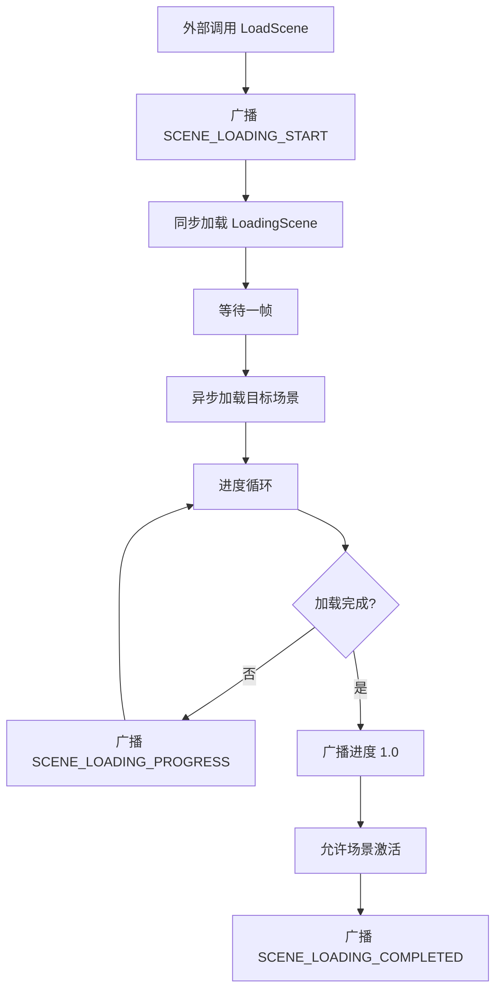

# 异步场景加载系统完整文档

## 1. 系统概述

### 1.1 核心机制
本系统基于 **MessageManager (发布-订阅模式)** 实现了一个解耦的、基于中间场景过渡的异步加载系统。

**加载模式：** "三明治"加载模式
```
当前场景 → LoadingScene → 目标场景
```

**通信方式：**
- `AsyncSceneManager` 作为核心驱动，通过广播全局消息更新进度
- `LoadingPanel` 作为被动监听者接收消息并更新UI

### 1.2 系统特性

- ✅ **解耦设计** - 管理器与UI完全解耦，通过消息系统通信
- ✅ **平滑进度** - 支持最小加载时间和强制加载时间，防止闪烁
- ✅ **永久消息** - 加载消息标记为永久，防止场景切换时被清理
- ✅ **单例模式** - 全局唯一实例，DontDestroyOnLoad常驻
- ✅ **动画支持** - LoadingPanel支持行走动画和位置移动
- ✅ **直接加载** - 支持跳过中间场景的直接加载模式

---

## 2. 模块架构设计

### 2.1 核心组件

| 组件名称 | 类型 | 职责 | 生命周期 |
|---------|------|------|---------|
| `AsyncSceneManager` | Manager (Singleton) | 协调场景切换、驱动AsyncOperation、计算平滑进度 | DontDestroyOnLoad (常驻) |
| `LoadingPanel` | UI View | 监听进度消息并刷新UI（进度文本、小人动画） | 仅存在于LoadingScene |
| `MessageType` | Enum | 定义加载流程中的通信协议 | 全局 |

### 2.2 消息协议定义

系统使用以下三个消息类型进行通信：

#### 2.2.1 加载开始信号
- **标识符：** `SCENE_LOADING_START`
- **参数：** `string` (目标场景名称)
- **用途：** 通知系统即将开始切换，用于重置状态或淡出音乐
- **标记：** 永久消息（不会被场景切换清理）

#### 2.2.2 进度更新信号
- **标识符：** `SCENE_LOADING_PROGRESS`
- **参数：** `float` (归一化进度 0.0 ~ 1.0)
- **用途：** 驱动进度条UI，管理器负责将Unity的底层进度(0~0.9)映射为UI进度(0~1.0)
- **标记：** 永久消息（不会被场景切换清理）
- **频率：** 每帧广播一次

#### 2.2.3 加载完成信号
- **标识符：** `SCENE_LOADING_COMPLETED`
- **参数：** `string` (已加载场景名称)
- **用途：** 通知逻辑层场景已就绪，可用于触发淡入动画或玩家输入解禁
- **标记：** 永久消息（不会被场景切换清理）

---

## 3. AsyncSceneManager 详细实现

### 3.1 配置参数

```csharp
[Header("加载场景名称")]
[SerializeField] private string loadingSceneName = "LoadingScene";

[Header("最小加载时间(秒) - 防止进度条闪烁")]
[SerializeField] private float minLoadTime = 1.0f;

[Header("强制加载时间(秒) - 0表示使用实际加载时间，大于0表示强制等待指定时间")]
[SerializeField] private float forceLoadTime = 0f;

[Header("进度平滑速度")]
[SerializeField] private float progressSmoothSpeed = 2.0f;
```

**参数说明：**
- `loadingSceneName` - 中间加载场景名称
- `minLoadTime` - 最小加载时间，防止加载过快导致闪烁
- `forceLoadTime` - 强制加载时间（0=使用实际时间，>0=强制等待指定时间）
- `progressSmoothSpeed` - 进度平滑速度（仅在非强制模式下生效）

### 3.2 公共API

#### 3.2.1 LoadScene(string sceneName)
标准加载方法，通过中间场景过渡。

```csharp
// 使用示例
AsyncSceneManager.Instance.LoadScene("GameScene");
```

**流程：**
1. 广播 `SCENE_LOADING_START`
2. 同步加载 `LoadingScene`
3. 等待一帧（确保UI初始化）
4. 异步加载目标场景
5. 循环广播 `SCENE_LOADING_PROGRESS`
6. 完成后广播 `SCENE_LOADING_COMPLETED`

#### 3.2.2 LoadSceneDirect(string sceneName)
直接加载方法，不经过中间场景。

```csharp
// 使用示例
AsyncSceneManager.Instance.LoadSceneDirect("MainMenu");
```

**适用场景：**
- 从启动场景进入主菜单
- 快速切换小场景
- 不需要加载动画的场景

#### 3.2.3 配置方法

```csharp
// 设置加载场景名称
SetLoadingSceneName(string name);

// 设置最小加载时间
SetMinLoadTime(float time);

// 设置强制加载时间
SetForceLoadTime(float time);
```

### 3.3 加载流程详解

#### 3.3.1 标准加载流程



#### 3.3.2 进度计算逻辑

**非强制模式（forceLoadTime = 0）：**
```csharp
// 平滑进度
displayProgress = Mathf.MoveTowards(displayProgress, realProgress, 
                                   progressSmoothSpeed * Time.deltaTime);
```

**强制模式（forceLoadTime > 0）：**
```csharp
float timeProgress = Mathf.Clamp01(elapsedTime / forceLoadTime);

if (realProgress >= 0.99f) {
    // 实际加载已完成，使用时间进度
    displayProgress = timeProgress;
} else {
    // 实际加载未完成，进度不能超过90%
    displayProgress = Mathf.Min(timeProgress * 0.9f, realProgress);
}
```

#### 3.3.3 完成判定条件

```csharp
bool loadingComplete = asyncOp.progress >= 0.9f;  // Unity加载完成
bool timeComplete = elapsedTime >= targetLoadTime; // 时间达标
bool progressComplete = displayProgress >= 0.99f;  // 进度达标

if (loadingComplete && timeComplete && progressComplete) {
    // 允许场景激活
}
```

### 3.4 永久消息机制

在 `Awake()` 中标记加载消息为永久消息：

```csharp
MessageManager.MarkAsPermanent(MessageType.SCENE_LOADING_START);
MessageManager.MarkAsPermanent(MessageType.SCENE_LOADING_PROGRESS);
MessageManager.MarkAsPermanent(MessageType.SCENE_LOADING_COMPLETED);
```

**作用：**
- 防止 `MessageManagerHelper` 在场景切换时清理这些消息
- 确保 `LoadingPanel` 能正常接收进度更新
- 避免 "移除监听失败" 警告

---

## 4. LoadingPanel 详细实现

### 4.1 UI组件配置

```csharp
[Header("UI组件引用")]
[SerializeField] private TextMeshProUGUI progressText;  // 进度文本
[SerializeField] private TextMeshProUGUI tipText;       // 提示文本

[Header("行走小人动画")]
[SerializeField] private RectTransform characterContainer;  // 小人容器
[SerializeField] private Animator characterAnimator;        // 小人动画控制器
[SerializeField] private string walkAnimationName = "Walk"; // 行走动画状态名

[Header("移动范围设置")]
[SerializeField] private float startPosX = -800f;  // 起始X坐标
[SerializeField] private float endPosX = 800f;     // 结束X坐标
[SerializeField] private float characterY = -200f; // 小人Y坐标
```

### 4.2 生命周期管理

#### 4.2.1 OnEnable - 注册监听

```csharp
private void OnEnable()
{
    // 注册消息监听
    MessageManager.AddListener<float>(MessageType.SCENE_LOADING_PROGRESS, OnLoadingProgress);
    MessageManager.AddListener<string>(MessageType.SCENE_LOADING_COMPLETED, OnLoadingCompleted);

    // 初始化UI
    InitializeUI();
}
```

**关键点：**
- 必须指定泛型参数 `<float>` 和 `<string>` 以匹配广播签名
- 在 `OnEnable` 中注册，确保场景加载后立即监听

#### 4.2.2 OnDisable - 移除监听

```csharp
private void OnDisable()
{
    // 移除消息监听（必须！防止空引用）
    MessageManager.RemoveListener<float>(MessageType.SCENE_LOADING_PROGRESS, OnLoadingProgress);
    MessageManager.RemoveListener<string>(MessageType.SCENE_LOADING_COMPLETED, OnLoadingCompleted);
}
```

**关键点：**
- 必须移除监听，防止场景销毁后的空引用异常
- 即使有永久消息机制，也要主动清理

### 4.3 UI更新逻辑

#### 4.3.1 进度更新

```csharp
private void OnLoadingProgress(float progress)
{
    // 直接更新位置，确保实际加载时也能正常工作
    UpdateCharacterPosition(progress);
}

private void UpdateCharacterPosition(float progress)
{
    // 计算目标X坐标
    float targetPosX = Mathf.Lerp(startPosX, endPosX, progress);

    // 移动小人
    if (characterContainer != null)
    {
        characterContainer.anchoredPosition = new Vector2(targetPosX, characterY);
    }

    // 更新进度文本
    if (progressText != null)
    {
        progressText.text = $"{Mathf.RoundToInt(progress * 100)}%";
    }
}
```

#### 4.3.2 初始化UI

```csharp
private void InitializeUI()
{
    // 设置小人初始位置（屏幕左侧）
    characterContainer.anchoredPosition = new Vector2(startPosX, characterY);

    // 播放行走动画
    characterAnimator.Play(walkAnimationName, 0, 0f);

    // 重置进度文本
    progressText.text = "0%";

    // 显示随机提示
    ShowRandomTip();
}
```

### 4.4 加载提示系统

```csharp
[Header("显示设置")]
[SerializeField] private string[] loadingTips = new string[]
{
    "Loading game resources...",
    "Initializing scene...",
    "Loading character data...",
    // ... 更多提示
};

private void ShowRandomTip()
{
    if (tipText != null && loadingTips != null && loadingTips.Length > 0)
    {
        int index = Random.Range(0, loadingTips.Length);
        tipText.text = loadingTips[index];
    }
}
```

---

## 5. 集成与配置

### 5.1 场景配置

#### 5.1.1 Build Settings
必须将以下场景添加到 Build Settings：
1. 启动场景（包含AsyncSceneManager）
2. LoadingScene
3. 所有目标场景

#### 5.1.2 LoadingScene 设置
1. 创建 Canvas
2. 添加进度文本（TextMeshProUGUI）
3. 添加提示文本（TextMeshProUGUI）
4. 添加小人容器（RectTransform）
5. 添加小人动画（Animator）
6. 挂载 `LoadingPanel` 脚本并配置引用

### 5.2 AsyncSceneManager 初始化

**方法一：预制体方式**
1. 创建空GameObject，命名为 `[AsyncSceneManager]`
2. 添加 `AsyncSceneManager` 组件
3. 配置参数
4. 保存为预制体
5. 在启动场景中实例化

**方法二：代码创建**
```csharp
// 首次访问时自动创建
AsyncSceneManager.Instance.LoadScene("GameScene");
```

### 5.3 MessageType 扩展

确保 `MessageType.cs` 包含以下定义：

```csharp
public enum MessageType
{
    // ... 其他消息类型

    // 场景加载消息
    SCENE_LOADING_START,
    SCENE_LOADING_PROGRESS,
    SCENE_LOADING_COMPLETED,
}
```

---

## 6. 使用指南

### 6.1 基础使用

#### 6.1.1 标准场景切换

```csharp
// 在任何脚本中调用
AsyncSceneManager.Instance.LoadScene("GameScene");
```

#### 6.1.2 直接场景切换

```csharp
// 跳过LoadingScene
AsyncSceneManager.Instance.LoadSceneDirect("MainMenu");
```

#### 6.1.3 配置加载时间

```csharp
// 设置最小加载时间为2秒
AsyncSceneManager.Instance.SetMinLoadTime(2.0f);

// 设置强制加载时间为5秒
AsyncSceneManager.Instance.SetForceLoadTime(5.0f);

// 恢复使用实际加载时间
AsyncSceneManager.Instance.SetForceLoadTime(0f);
```

### 6.2 监听加载事件

如果其他系统需要监听加载事件：

```csharp
private void OnEnable()
{
    MessageManager.AddListener<string>(MessageType.SCENE_LOADING_START, OnLoadingStart);
    MessageManager.AddListener<float>(MessageType.SCENE_LOADING_PROGRESS, OnLoadingProgress);
    MessageManager.AddListener<string>(MessageType.SCENE_LOADING_COMPLETED, OnLoadingCompleted);
}

private void OnDisable()
{
    MessageManager.RemoveListener<string>(MessageType.SCENE_LOADING_START, OnLoadingStart);
    MessageManager.RemoveListener<float>(MessageType.SCENE_LOADING_PROGRESS, OnLoadingProgress);
    MessageManager.RemoveListener<string>(MessageType.SCENE_LOADING_COMPLETED, OnLoadingCompleted);
}

private void OnLoadingStart(string sceneName)
{
    Debug.Log($"开始加载场景: {sceneName}");
    // 淡出音乐、禁用输入等
}

private void OnLoadingProgress(float progress)
{
    // 自定义进度处理
}

private void OnLoadingCompleted(string sceneName)
{
    Debug.Log($"场景加载完成: {sceneName}");
    // 淡入音乐、启用输入等
}
```

### 6.3 调试技巧

#### 6.3.1 使用消息监控器

打开消息监控器：`Crypta Geometrica: RE > Message Monitor`

**观察要点：**
- `SCENE_LOADING_PROGRESS` 是否连续触发
- 进度值是否从 0.0 平滑增长到 1.0
- 是否有 "移除监听失败" 警告

**分组模式：**
- 默认分组模式会折叠大量的 `SCENE_LOADING_PROGRESS` 消息
- 点击箭头展开查看详细进度值
- 切换到列表模式查看所有消息

#### 6.3.2 日志输出

系统会输出以下日志：

```
[AsyncSceneManager] 开始加载: GameScene
[AsyncSceneManager] 加载完成: GameScene
[LoadingPanel] 场景加载完成: GameScene
```

#### 6.3.3 常见问题排查

**问题1：进度一直是0%**
- 检查 `LoadingPanel` 是否正确注册监听
- 检查消息类型是否标记为永久消息
- 使用消息监控器查看是否收到 `SCENE_LOADING_PROGRESS`

**问题2：小人不移动**
- 检查 `characterContainer` 是否正确赋值
- 检查 `startPosX` 和 `endPosX` 设置
- 确认 `OnLoadingProgress` 被调用

**问题3：动画不播放**
- 检查 `characterAnimator` 是否赋值
- 检查 `AnimatorController` 是否正确设置
- 检查动画状态名称是否匹配

---

## 7. 最佳实践

### 7.1 性能优化

1. **最小加载时间设置**
   - 快速场景：0.5 - 1.0秒
   - 中型场景：1.0 - 2.0秒
   - 大型场景：2.0 - 3.0秒

2. **强制加载时间使用**
   - 仅用于测试或特殊需求
   - 生产环境建议使用实际加载时间

3. **进度平滑速度**
   - 推荐值：2.0 - 5.0
   - 过小会导致进度跳跃
   - 过大会导致延迟感

### 7.2 UI设计建议

1. **进度文本**
   - 使用百分比显示（0% - 100%）
   - 字体大小适中，易于阅读
   - 位置固定，不随小人移动

2. **加载提示**
   - 提供多样化的提示文本
   - 随机显示，增加趣味性
   - 提示内容与游戏主题相关

3. **动画效果**
   - 行走动画循环播放
   - 小人从左到右移动
   - 移动速度与进度同步

### 7.3 错误处理

1. **重复加载保护**
   ```csharp
   if (isLoading)
   {
       Debug.LogWarning($"正在加载中，忽略请求: {sceneName}");
       return;
   }
   ```

2. **场景不存在处理**
   - Unity会自动抛出异常
   - 确保场景已添加到Build Settings

3. **监听器清理**
   - 始终在 `OnDisable` 中移除监听
   - 使用永久消息机制作为双重保险

---

## 8. 扩展功能

### 8.1 添加淡入淡出效果

```csharp
private void OnLoadingStart(string sceneName)
{
    // 淡出当前场景
    FadeOut();
}

private void OnLoadingCompleted(string sceneName)
{
    // 淡入新场景
    FadeIn();
}
```

### 8.2 添加音效

```csharp
private void OnLoadingStart(string sceneName)
{
    AudioManager.PlaySound("loading_start");
}

private void OnLoadingCompleted(string sceneName)
{
    AudioManager.PlaySound("loading_complete");
}
```

### 8.3 添加加载进度回调

```csharp
public class AsyncSceneManager : MonoBehaviour
{
    public event System.Action<float> OnProgressChanged;
    public event System.Action<string> OnLoadingComplete;

    private void BroadcastProgress(float progress)
    {
        MessageManager.Broadcast<float>(MessageType.SCENE_LOADING_PROGRESS, progress);
        OnProgressChanged?.Invoke(progress);
    }
}
```

---

## 9. 技术要点总结

### 9.1 关键设计决策

1. **永久消息机制**
   - 解决场景切换时监听器被清理的问题
   - 确保加载进度消息能正常传递

2. **三明治加载模式**
   - 提供流畅的过渡体验
   - 解耦加载逻辑和UI表现

3. **进度计算策略**
   - 支持实际时间和强制时间两种模式
   - 提供平滑进度，防止闪烁

### 9.2 架构优势

- ✅ **高度解耦** - 管理器与UI通过消息系统通信
- ✅ **易于扩展** - 可轻松添加新的加载效果
- ✅ **类型安全** - 使用泛型确保参数类型匹配
- ✅ **调试友好** - 集成消息监控器，实时查看加载状态
- ✅ **性能优化** - 支持最小加载时间和强制加载时间

### 9.3 注意事项

1. **泛型类型匹配**
   - 广播和监听必须使用相同的泛型参数
   - `Broadcast<float>` 对应 `AddListener<float>`

2. **监听器清理**
   - 必须在 `OnDisable` 中移除监听
   - 防止空引用异常

3. **场景配置**
   - 所有场景必须添加到Build Settings
   - LoadingScene必须正确配置UI组件

4. **单例生命周期**
   - AsyncSceneManager使用DontDestroyOnLoad
   - 确保全局唯一实例

---

## 10. 版本记录

| 版本 | 日期 | 说明 |
|------|------|------|
| 1.0 | 2026-01-14 | 初始版本，实现基础加载功能 |
| 1.1 | 2026-01-14 | 添加强制加载时间功能 |
| 1.2 | 2026-01-14 | 修复进度更新问题，添加永久消息机制 |
| 1.3 | 2026-01-14 | 简化LoadingPanel，移除测试功能 |
| 2.0 | 2026-01-14 | 完整文档重写，包含所有功能和实现细节 |
