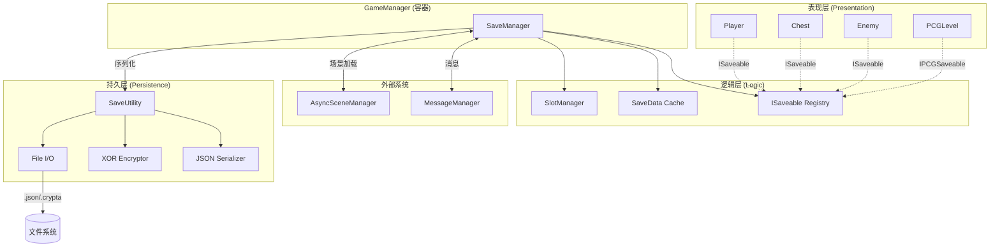
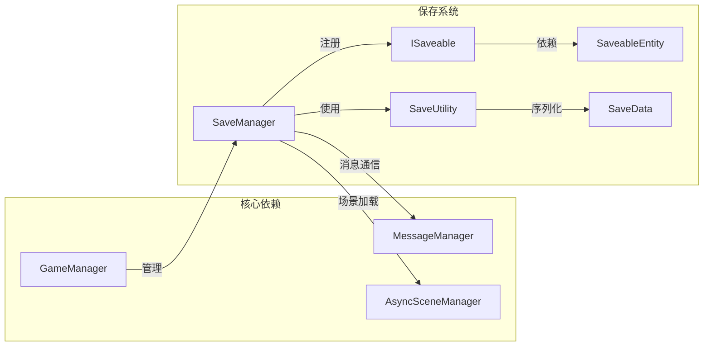
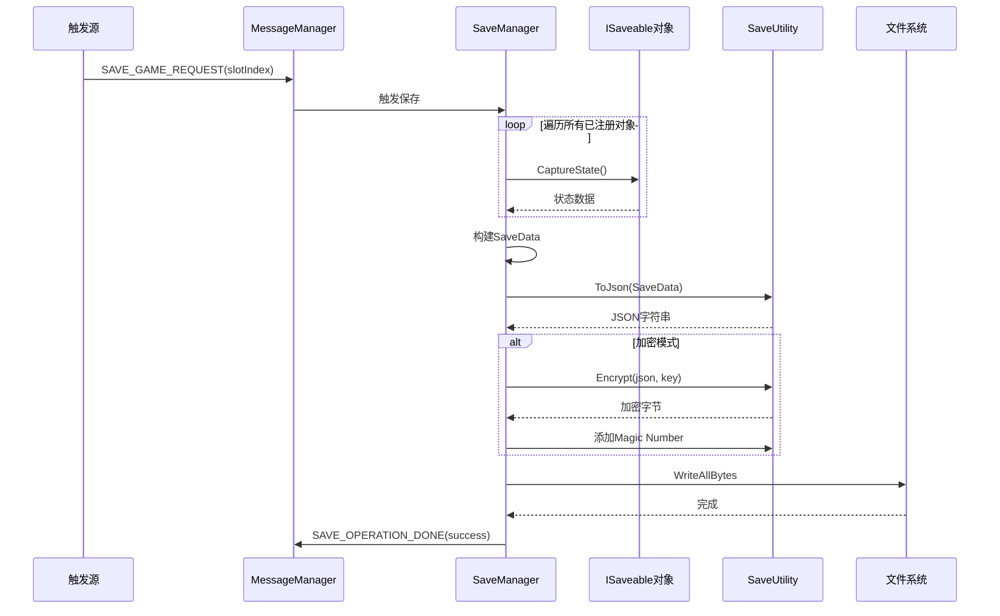
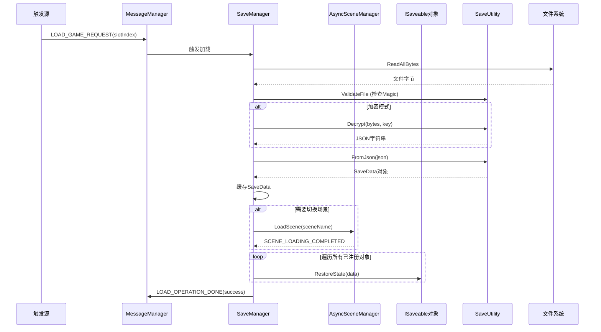

# DESIGN - Crypta Save System (专属加密存档系统)

> **文档状态**: 架构设计
> **版本**: v1.0

---

## 1. 整体架构图



---

## 2. 分层设计

### 2.1 表现层 (Presentation Layer)

游戏对象通过实现 `ISaveable` 或 `IPCGSaveable` 接口与保存系统交互。

```csharp
// 示例：宝箱对象
public class Chest : MonoBehaviour, ISaveable
{
    private SaveableEntity saveableEntity;
    
    public string SaveID => saveableEntity.ID;
    
    public object CaptureState()
    {
        return new ChestSaveData { isOpened = this.isOpened };
    }
    
    public void RestoreState(object state)
    {
        var data = (ChestSaveData)state;
        this.isOpened = data.isOpened;
    }
}
```

### 2.2 逻辑层 (Logic Layer)

**SaveManager** 作为核心协调者：
- 管理 ISaveable 对象的注册表
- 维护运行时数据缓存
- 响应消息系统的保存/加载请求
- 协调场景加载流程

### 2.3 持久层 (Persistence Layer)

**SaveUtility** 作为纯静态工具类：
- JSON 序列化/反序列化
- XOR 加密/解密
- 文件读写操作

---

## 3. 核心组件详细设计

### 3.1 接口定义

```csharp
/// <summary>
/// 可保存对象接口
/// </summary>
public interface ISaveable
{
    /// <summary>唯一标识符</summary>
    string SaveID { get; }
    
    /// <summary>捕获当前状态</summary>
    object CaptureState();
    
    /// <summary>恢复状态</summary>
    void RestoreState(object state);
}

/// <summary>
/// PCG 可保存接口 (扩展)
/// </summary>
public interface IPCGSaveable
{
    /// <summary>主种子</summary>
    int MasterSeed { get; }
    
    /// <summary>捕获 PCG 状态</summary>
    PCGSaveData CapturePCGState();
    
    /// <summary>恢复 PCG 状态</summary>
    void RestorePCGState(PCGSaveData state);
}
```

### 3.2 数据结构

```csharp
/// <summary>
/// 存档数据 - 完整结构
/// </summary>
[Serializable]
public class SaveData
{
    public SaveHeader header;
    public GlobalSaveData globalData;
    public PCGSaveData pcgData;
    public Dictionary<string, string> entityData;
    public List<DynamicObjectData> dynamicObjects;
}

/// <summary>
/// 存档头信息 - 用于快速预览
/// </summary>
[Serializable]
public class SaveHeader
{
    public string version;
    public string timestamp;
    public float playTime;
    public string sceneName;
    public int slotIndex;
}

/// <summary>
/// 全局游戏数据
/// </summary>
[Serializable]
public class GlobalSaveData
{
    public int difficulty;
    public int currentLevel;
    public int playerGold;
    // 可扩展...
}

/// <summary>
/// PCG 程序化生成数据
/// </summary>
[Serializable]
public class PCGSaveData
{
    public int masterSeed;
    public List<int> levelSeeds;
    public Dictionary<string, string> metadata;
}

/// <summary>
/// 动态生成物体数据
/// </summary>
[Serializable]
public class DynamicObjectData
{
    public string prefabPath;
    public string runtimeId;
    public string serializedState;
}
```

### 3.3 SaveableEntity 组件

```csharp
/// <summary>
/// 可保存实体组件 - 提供唯一 GUID
/// </summary>
public class SaveableEntity : MonoBehaviour
{
    [SerializeField, HideInInspector]
    private string uniqueId;
    
    public string ID => uniqueId;
    
#if UNITY_EDITOR
    /// <summary>编辑器模式下生成 GUID</summary>
    private void OnValidate()
    {
        if (string.IsNullOrEmpty(uniqueId))
        {
            uniqueId = System.Guid.NewGuid().ToString();
            UnityEditor.EditorUtility.SetDirty(this);
        }
    }
#endif
}
```

### 3.4 SaveManager 类

```csharp
/// <summary>
/// 存档管理器 - 核心逻辑层
/// </summary>
public class SaveManager : MonoBehaviour, IGameModule
{
    // 配置
    [SerializeField] private bool useEncryption = false;
    [SerializeField] private int maxSlots = 4;
    
    // 状态
    private List<ISaveable> saveables = new List<ISaveable>();
    private SaveData currentSaveData;
    private int currentSlotIndex = -1;
    
    // IGameModule 实现
    public void OnInit();
    public void OnUpdate(float deltaTime);
    public void OnDispose();
    
    // 公共 API
    public void RegisterSaveable(ISaveable saveable);
    public void UnregisterSaveable(ISaveable saveable);
    public void SaveGame(int slotIndex);
    public void LoadGame(int slotIndex);
    public SaveHeader GetSlotHeader(int slotIndex);
    public bool HasSaveData(int slotIndex);
    public void DeleteSave(int slotIndex);
    
    // 内部方法
    private SaveData CollectSaveData();
    private void DistributeSaveData(SaveData data);
    private void OnSceneLoadCompleted(string sceneName);
}
```

### 3.5 SaveUtility 工具类

```csharp
/// <summary>
/// 存档工具类 - 持久层
/// </summary>
public static class SaveUtility
{
    // 常量
    public const string MAGIC_NUMBER = "CG2026";
    public const string SAVE_VERSION = "1.0.0";
    
    // 序列化
    public static string ToJson(SaveData data);
    public static SaveData FromJson(string json);
    
    // 加密
    public static byte[] Encrypt(string json, byte[] key);
    public static string Decrypt(byte[] data, byte[] key);
    
    // 文件操作
    public static void SaveToFile(string path, SaveData data, bool encrypt);
    public static SaveData LoadFromFile(string path, bool encrypted);
    public static SaveHeader LoadHeaderOnly(string path, bool encrypted);
    
    // 校验
    public static bool ValidateFile(string path);
    
    // 路径
    public static string GetSavePath(int slotIndex, bool encrypted);
    public static string GetSaveDirectory();
}
```

---

## 4. 模块依赖关系图



---

## 5. 数据流向图

### 5.1 保存流程



### 5.2 加载流程



---

## 6. 异常处理策略

### 6.1 文件损坏
- 检测 Magic Number 不匹配
- 返回明确错误信息
- 不尝试恢复损坏数据

### 6.2 版本不兼容
- 比较 SaveVersion
- 提供向后兼容解析器
- 记录警告但尝试加载

### 6.3 对象缺失
- SaveID 在场景中找不到对应对象
- 跳过该数据，记录警告
- 不中断整体加载流程

### 6.4 加密失败
- 密钥错误或数据被篡改
- 返回解密失败错误
- 建议用户重新开始游戏

---

## 7. 文件结构

```
Assets/1_Scripts/0_SaveSystem/
├── Core/
│   ├── SaveManager.cs          # 核心管理器
│   ├── SaveUtility.cs          # 工具类
│   └── SaveableEntity.cs       # GUID组件
├── Data/
│   ├── SaveData.cs             # 数据结构
│   ├── SaveHeader.cs           # 头信息
│   ├── GlobalSaveData.cs       # 全局数据
│   ├── PCGSaveData.cs          # PCG数据
│   └── DynamicObjectData.cs    # 动态物体
├── Interfaces/
│   ├── ISaveable.cs            # 基础接口
│   └── IPCGSaveable.cs         # PCG扩展接口
└── SaveSystem_API.md           # API文档
```

---

## 8. 设计原则

### 8.1 遵循的原则
- **单一职责**: SaveManager 负责协调，SaveUtility 负责IO
- **开闭原则**: 通过接口扩展，不修改核心代码
- **依赖倒置**: 依赖抽象接口而非具体实现
- **与现有架构一致**: 遵循 IGameModule 模式

### 8.2 避免过度设计
- 不实现存档压缩（当前数据量不大）
- 不实现增量保存（全量保存足够快）
- 不实现云同步（单机游戏不需要）

---

## 9. 设计可行性验证

| 验证项 | 状态 | 说明 |
|--------|------|------|
| 与 GameManager 集成 | ✅ | 实现 IGameModule 接口 |
| 与 MessageManager 集成 | ✅ | 使用现有消息机制 |
| 与 AsyncSceneManager 集成 | ✅ | 监听场景加载完成事件 |
| PCG 扩展性 | ✅ | 预留 IPCGSaveable 接口 |
| 性能要求 | ✅ | 异步保存，避免卡顿 |

---

**下一步**: 进入 Atomize 阶段，创建 TASK 文档拆分子任务
