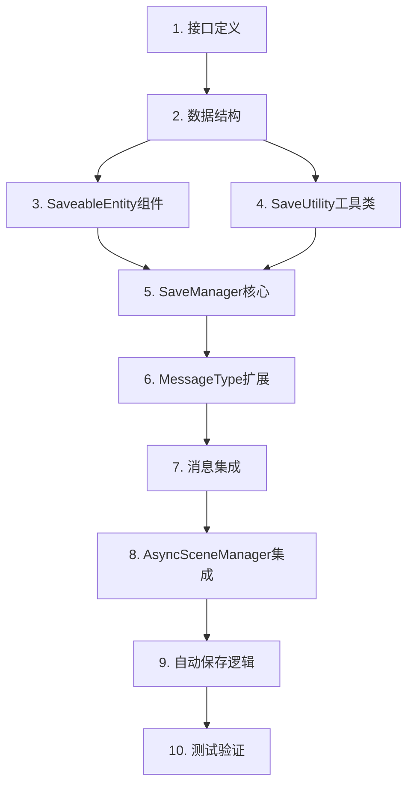

# TASK - Crypta Save System (专属加密存档系统)

> **文档状态**: 任务拆分
> **版本**: v1.0

---

## 任务依赖图



---

## 子任务清单

### Task 1: 接口定义
**状态**: [ ] 待开始

**输入契约**:
- 无前置依赖

**输出契约**:
- `ISaveable.cs` - 基础可保存接口
- `IPCGSaveable.cs` - PCG扩展接口

**实现约束**:
- 文件位置: `Assets/1_Scripts/0_SaveSystem/Interfaces/`
- 遵循现有代码注释规范

**验收标准**:
- [ ] ISaveable 包含 SaveID, CaptureState(), RestoreState()
- [ ] IPCGSaveable 包含 MasterSeed, CapturePCGState(), RestorePCGState()
- [ ] 完整 XML 文档注释

---

### Task 2: 数据结构
**状态**: [ ] 待开始

**输入契约**:
- Task 1 完成

**输出契约**:
- `SaveData.cs` - 完整存档数据
- `SaveHeader.cs` - 头信息
- `GlobalSaveData.cs` - 全局数据
- `PCGSaveData.cs` - PCG数据
- `DynamicObjectData.cs` - 动态物体数据

**实现约束**:
- 文件位置: `Assets/1_Scripts/0_SaveSystem/Data/`
- 所有类标记 `[Serializable]`
- 使用 `Dictionary<string, string>` 存储实体数据

**验收标准**:
- [ ] 所有数据类可被 JsonUtility 序列化
- [ ] SaveHeader 可独立读取
- [ ] 完整 XML 文档注释

---

### Task 3: SaveableEntity 组件
**状态**: [ ] 待开始

**输入契约**:
- Task 1 完成 (ISaveable 接口)

**输出契约**:
- `SaveableEntity.cs` - GUID 组件

**实现约束**:
- 文件位置: `Assets/1_Scripts/0_SaveSystem/Core/`
- 编辑器模式下自动生成 GUID
- 使用 `[SerializeField, HideInInspector]` 存储 ID

**验收标准**:
- [ ] 编辑器下添加组件自动生成唯一 ID
- [ ] ID 在 Play 模式下保持不变
- [ ] 支持预制体实例化

---

### Task 4: SaveUtility 工具类
**状态**: [ ] 待开始

**输入契约**:
- Task 2 完成 (数据结构)

**输出契约**:
- `SaveUtility.cs` - 静态工具类

**实现约束**:
- 文件位置: `Assets/1_Scripts/0_SaveSystem/Core/`
- 纯静态类，无状态
- XOR 加密密钥硬编码 + 混淆
- Magic Number: "CG2026"

**验收标准**:
- [ ] ToJson / FromJson 正常工作
- [ ] Encrypt / Decrypt 正常工作
- [ ] SaveToFile / LoadFromFile 正常工作
- [ ] ValidateFile 能检测损坏文件
- [ ] GetSavePath 返回正确路径

---

### Task 5: SaveManager 核心
**状态**: [ ] 待开始

**输入契约**:
- Task 1-4 全部完成

**输出契约**:
- `SaveManager.cs` - 核心管理器

**实现约束**:
- 文件位置: `Assets/1_Scripts/0_SaveSystem/Core/`
- 实现 `IGameModule` 接口
- 支持 4 个存档槽位 (3正式 + 1测试)
- 包含 ISaveable 注册表

**验收标准**:
- [ ] 实现 OnInit, OnUpdate, OnDispose
- [ ] RegisterSaveable / UnregisterSaveable 正常工作
- [ ] SaveGame / LoadGame 正常工作
- [ ] GetSlotHeader / HasSaveData / DeleteSave 正常工作

---

### Task 6: MessageType 扩展
**状态**: [ ] 待开始

**输入契约**:
- 无前置依赖

**输出契约**:
- 修改 `MessageType.cs`

**实现约束**:
- 新增消息类型到现有枚举

**验收标准**:
- [ ] SAVE_GAME_REQUEST 已添加
- [ ] LOAD_GAME_REQUEST 已添加
- [ ] SAVE_OPERATION_DONE 已添加
- [ ] LOAD_OPERATION_DONE 已添加
- [ ] AUTO_SAVE_TRIGGERED 已添加

---

### Task 7: 消息集成
**状态**: [ ] 待开始

**输入契约**:
- Task 5 完成 (SaveManager)
- Task 6 完成 (MessageType)

**输出契约**:
- SaveManager 消息监听和广播集成

**实现约束**:
- 在 OnInit 中注册消息监听
- 在 OnDispose 中取消注册
- 保存/加载相关消息标记为永久消息

**验收标准**:
- [ ] 监听 SAVE_GAME_REQUEST 触发保存
- [ ] 监听 LOAD_GAME_REQUEST 触发加载
- [ ] 完成后广播 SAVE_OPERATION_DONE / LOAD_OPERATION_DONE

---

### Task 8: AsyncSceneManager 集成
**状态**: [ ] 待开始

**输入契约**:
- Task 7 完成

**输出契约**:
- SaveManager 与场景加载集成

**实现约束**:
- 监听 SCENE_LOADING_COMPLETED
- 场景加载完成后恢复数据

**验收标准**:
- [ ] 加载存档时正确跳转场景
- [ ] 场景加载完成后自动恢复实体数据
- [ ] 跨场景数据正确传递

---

### Task 9: 自动保存逻辑
**状态**: [ ] 待开始

**输入契约**:
- Task 8 完成

**输出契约**:
- 自动保存功能集成

**实现约束**:
- 进入关卡时自动保存
- 通关时自动保存
- 监听相关游戏事件

**验收标准**:
- [ ] 监听关卡进入事件触发自动保存
- [ ] 监听通关事件触发自动保存
- [ ] 广播 AUTO_SAVE_TRIGGERED 消息

---

### Task 10: 测试验证
**状态**: [ ] 待开始

**输入契约**:
- Task 1-9 全部完成

**输出契约**:
- 完整功能测试通过
- API 文档

**实现约束**:
- 创建测试场景或测试脚本
- 编写 API 使用文档

**验收标准**:
- [ ] JSON 模式保存/加载正常
- [ ] Crypta 模式保存/加载正常
- [ ] 4 个存档槽位均可用
- [ ] 损坏文件能正确检测
- [ ] 场景切换后数据正确恢复
- [ ] 自动保存按预期触发

---

## 复杂度评估

| Task | 复杂度 | 预估时间 | 风险 |
|------|--------|----------|------|
| 1 | 低 | 10 min | 无 |
| 2 | 低 | 15 min | 无 |
| 3 | 中 | 20 min | 编辑器脚本 |
| 4 | 中 | 30 min | 加密逻辑 |
| 5 | 高 | 45 min | 核心逻辑 |
| 6 | 低 | 5 min | 无 |
| 7 | 中 | 20 min | 消息绑定 |
| 8 | 中 | 25 min | 场景协调 |
| 9 | 低 | 15 min | 事件触发 |
| 10 | 中 | 30 min | 集成测试 |

**总预估**: 约 3.5 小时

---

## 执行顺序

```
并行组A: Task 1 (接口) + Task 6 (MessageType)
    ↓
并行组B: Task 2 (数据) + Task 3 (Entity)
    ↓
Task 4 (SaveUtility)
    ↓
Task 5 (SaveManager)
    ↓
Task 7 (消息集成)
    ↓
Task 8 (场景集成)
    ↓
Task 9 (自动保存)
    ↓
Task 10 (测试)
```

---

**下一步**: 进入 Approve 阶段，等待用户审核后开始实现
