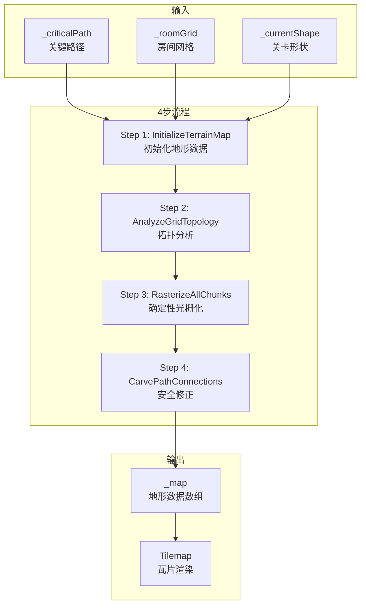

# 基于拓扑原语的多地形分块生成系统

## 一、系统概述

本文档描述了 `GrayboxLevelGenerator` 中新实现的基于拓扑原语的多地形分块生成系统（Topology-Based Terrain Generation System）。该系统替代了原有的高斯堆积造山法和细胞自动机平滑算法，提供了更加结构化、可控、确定性的地形生成方案。

### 1.1 设计目标

- **消除中心空洞问题**：原有系统使用全局噪声导致房间中心经常出现空洞
- **确保路径连通性**：基于关键路径的拓扑分析，保证玩家通道畅通
- **结构化地形**：每个Chunk根据其拓扑角色生成特定形状的地形
- **确定性生成**：使用数学函数而非随机噪声，便于调试和复现

### 1.2 核心概念

| 概念 | 说明 |
|------|------|
| **Chunk** | 4x4网格中的单个单元格，对应一个房间区域 |
| **TerrainArchetype** | 地形原语类型，定义Chunk的地形形状 |
| **拓扑分析** | 分析每个Chunk与相邻Chunk的连接关系 |
| **确定性光栅化** | 使用数学函数填充Chunk的像素数据 |

---

## 二、系统架构



---

## 三、TerrainArchetype 枚举

### 3.1 完整枚举定义

```csharp
public enum TerrainArchetype
{
    Solid,           // 实心岩石（非路径区域）
    Open,            // 完全空旷（高空区域）
    Corridor,        // 水平直通隧道
    Shaft,           // 垂直竖井
    Corner_BL,       // 拐角：左通 & 下通
    Corner_TL,       // 拐角：左通 & 上通
    Corner_BR,       // 拐角：右通 & 下通
    Corner_TR,       // 拐角：右通 & 上通
    Stairs_Pos,      // 正向阶梯 (/)
    Stairs_Neg,      // 负向阶梯 (\)
    Mountain_Base,   // 山体基座 (金字塔底)
    Mountain_Peak,   // 山峰 (金字塔尖)
    Platforms_Sparse,// 稀疏平台 (跳跳乐)
    T_Junction_LRD,  // T型交叉 - 左右下
    T_Junction_LRU,  // T型交叉 - 左右上
    Cross_Junction,  // 十字交叉
    Landing_Zone     // 着陆区（带平台的垂直入口）
}
```

### 3.2 视觉示意

```
Corridor:           Shaft:              Corner_TR:
┌────────────┐      ┌────────────┐      ┌────────────┐
│████████████│      │███      ███│      │███      ███│
│            │      │███      ███│      │███         │
│            │      │███      ███│      │            │
│████████████│      │███      ███│      │████████████│
└────────────┘      └────────────┘      └────────────┘

Landing_Zone:       Mountain_Base:      Platforms_Sparse:
┌────────────┐      ┌────────────┐      ┌────────────┐
│            │      │     ██     │      │██        ██│
│  ████████  │      │    ████    │      │  ████      │
│            │      │   ██████   │      │      ████  │
│████████████│      │████████████│      │██  ████  ██│
└────────────┘      └────────────┘      └────────────┘
```

---

## 四、核心算法

### 4.1 拓扑分析算法 (DetermineArchetype)

```
输入: gridPos (网格坐标)
输出: TerrainArchetype

1. 检查是否在关键路径上
   if !isOnPath:
       return DetermineOffPathArchetype(gridPos)

2. 获取房间连接方向
   hasNorth = room.HasConnection(North)
   hasSouth = room.HasConnection(South)
   hasEast = room.HasConnection(East)
   hasWest = room.HasConnection(West)

3. 计算连接数量
   horizontalCount = hasEast + hasWest
   verticalCount = hasNorth + hasSouth
   totalConnections = horizontalCount + verticalCount

4. 根据连接模式分配原语类型
   if totalConnections == 4: return Cross_Junction
   if totalConnections == 3: return T_Junction_*
   if horizontalCount == 2 && verticalCount == 0: return Corridor
   if verticalCount == 2 && horizontalCount == 0: return Shaft
   if verticalCount >= 1 && horizontalCount >= 1: return Corner_* / Landing_Zone
   default: return Corridor
```

### 4.2 非路径区域分析 (DetermineOffPathArchetype)

```
输入: gridPos (网格坐标)
输出: TerrainArchetype

1. 计算路径Y范围
   minPathY = min(pathNode.y for pathNode in _criticalPath)
   maxPathY = max(pathNode.y for pathNode in _criticalPath)

2. 根据相对位置决定类型
   if gy < minPathY: return Open (路径上方 = 天空)
   if gy > maxPathY: return Mountain_Base (路径下方 = 地基)
   
3. 如果与路径同层
   if hasAdjacentPath:
       return random(Platforms_Sparse, Mountain_Base)
   else:
       return Mountain_Base
```

### 4.3 确定性光栅化 (FillChunk)

每种 TerrainArchetype 使用特定的数学函数填充：

| 类型 | 填充规则 |
|------|----------|
| **Solid** | 全部填充为墙壁 (value=1) |
| **Open** | 全部清空 (value=0) |
| **Corridor** | `isWall = (dy < floorHeight) || (dy >= RoomHeight - ceilingHeight)` |
| **Shaft** | `isWall = (dx < wallWidth) || (dx >= RoomWidth - wallWidth)` |
| **Mountain_Base** | `isWall = dy < (RoomHeight - abs(dx - centerX))` |
| **Stairs_Pos** | `isWall = dy < (dx * RoomHeight / RoomWidth)` |

### 4.4 安全修正算法 (CarvePathConnections)

```
carveWidth = 4  // 确保玩家(1.5格)可通过

for each pathNode in _criticalPath:
    1. 清除房间中心区域
       CarveRect(centerX - carveWidth, centerY - carveWidth, 
                 carveWidth * 2, carveWidth * 2)
    
    2. 处理每个方向的连接
       if hasConnection(East):
           CarveRect(exitX, centerY - carveWidth/2, carveWidth*2, carveWidth)
       // ... 其他方向类似
```

---

## 五、数据结构

### 5.1 新增字段

```csharp
// 关键路径节点列表
private List<Vector2Int> _criticalPath = new List<Vector2Int>();

// 地形数据数组：1=墙壁, 0=空气
private int[,] _map;

// 每个网格单元的地形原语类型
private TerrainArchetype[,] _archetypeGrid;
```

### 5.2 计算属性

```csharp
private int TotalWidth => LevelShape.GridWidth * RoomWidth;   // 总宽度
private int TotalHeight => LevelShape.GridHeight * RoomHeight; // 总高度
```

---

## 六、生成流程

### 6.1 DrawCaveFill() 主流程

```csharp
private void DrawCaveFill()
{
    // Step 1: 初始化地形数据
    InitializeTerrainMap();
    
    // Step 2: 分析网格拓扑并分配原语类型
    AnalyzeGridTopology();
    
    // Step 3: 确定性光栅化 - 填充每个Chunk
    RasterizeAllChunks();
    
    // Step 4: 安全修正 - 确保路径连通性
    CarvePathConnections();
    
    // Step 5: 将地形数据渲染到Tilemap
    RenderTerrainToTilemap();
    
    // Step 6: 将表层地板替换为白色瓦片
    ApplySurfaceTiles();
}
```

### 6.2 方法调用关系

```
DrawCaveFill()
├── InitializeTerrainMap()
├── AnalyzeGridTopology()
│   └── DetermineArchetype()
│       └── DetermineOffPathArchetype()
├── RasterizeAllChunks()
│   └── FillChunk()
│       ├── FillChunkRect()
│       ├── FillChunkCorridor()
│       ├── FillChunkShaft()
│       ├── FillChunkCorner()
│       ├── FillChunkStairs()
│       ├── FillChunkMountainBase()
│       ├── FillChunkMountainPeak()
│       ├── FillChunkPlatformsSparse()
│       ├── FillChunkTJunction()
│       ├── FillChunkCrossJunction()
│       └── FillChunkLandingZone()
├── CarvePathConnections()
│   └── CarveRect()
├── RenderTerrainToTilemap()
└── ApplySurfaceTiles()
```

---

## 七、参数配置

### 7.1 光栅化参数

| 参数 | 默认值 | 说明 |
|------|--------|------|
| `floorHeight` | 4 | 地板厚度（瓦片数） |
| `ceilingHeight` | 4 | 天花板厚度（瓦片数） |
| `wallWidth` | 3 | 墙壁宽度（瓦片数） |
| `passageWidth` | 6 | 通道宽度（瓦片数） |

### 7.2 安全修正参数

| 参数 | 默认值 | 说明 |
|------|--------|------|
| `carveWidth` | 4 | 雕刻宽度，确保玩家可通过 |

---

## 八、与旧系统对比

| 特性 | 旧系统（高斯堆积造山法） | 新系统（拓扑原语） |
|------|--------------------------|---------------------|
| 生成方式 | 概率场 + 细胞自动机 | 确定性数学函数 |
| 可控性 | 低，结果难以预测 | 高，结果可预测 |
| 连通性 | 需要后处理修复 | 内置拓扑保证 |
| 中心空洞 | 常见问题 | 不存在 |
| 性能 | O(w×h×iterations) | O(w×h) |
| 调试难度 | 高 | 低 |

---

## 九、扩展指南

### 9.1 添加新的 TerrainArchetype

1. 在 `TerrainArchetype` 枚举中添加新类型
2. 在 `FillChunk()` 的 switch 语句中添加新 case
3. 实现对应的 `FillChunk[NewType]()` 方法
4. 在 `DetermineArchetype()` 中添加分配逻辑

### 9.2 调整地形形状

修改对应的 `FillChunk*()` 方法中的数学公式。

---

## 十、文档状态

- **创建时间**: 2026-01-17
- **版本**: v1.0
- **状态**: 已完成
- **作者**: CRYPTA GEOMETRICA RE Team
