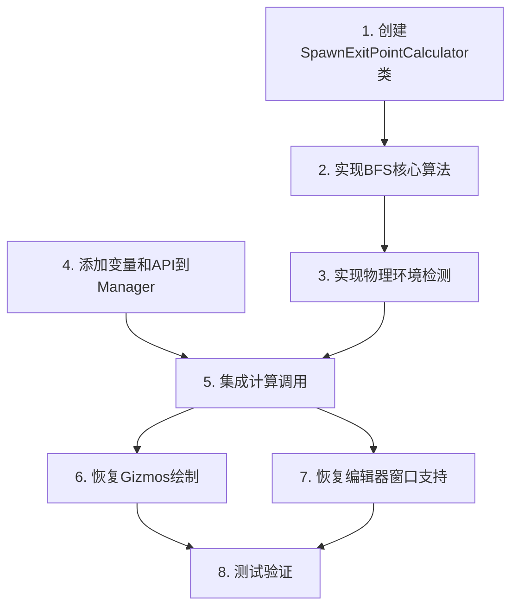

# 出生点与通关点重构设计方案

## 方案概述

采用 **BFS（广度优先搜索）逆向扩散算法** 计算距离参考门最远的有效位置。

### 方案优势
- ✅ 计算的是实际行走步数距离，而非直线距离
- ✅ 确保目标点是物理可达的
- ✅ 能适应洞穴生成的复杂地形

---

## 架构可行性分析

### 现有资源 ✅
| 资源 | 来源 | 用途 |
|------|------|------|
| `GetExitPositions()[0]` | MultiGridLevelManager | 起点网格的参考点（出口） |
| `GetEntrancePositions()[Last]` | MultiGridLevelManager | 终点网格的参考点（入口） |
| `GetGridBounds()` | MultiGridLevelManager | 限制BFS搜索范围 |
| `TilemapLayers.GroundLayer` | GrayboxLevelGenerator | 墙壁/地形检测 |
| `TilemapLayers.PlatformLayer` | GrayboxLevelGenerator | 平台检测 |

### 数据流
```
MultiGridLevelManager
    │
    ├── LevelGenerator.TilemapLayers.GroundLayer (Tilemap)
    ├── LevelGenerator.TilemapLayers.PlatformLayer (Tilemap)
    ├── _placedGridBounds (List<Rect>)
    ├── _entrancePositions (List<Vector3>)
    └── _exitPositions (List<Vector3>)
```

---

## 详细设计

### 新增类: `SpawnExitPointCalculator`

**文件位置**: `Assets/1_Scripts/3_LevelGeneration/Graybox/SpawnExitPointCalculator.cs`

```csharp
namespace CryptaGeometrica.LevelGeneration.Graybox
{
    /// <summary>
    /// 基于BFS的出生点/通关点计算器
    /// 寻找距离参考门最远的有效可站立位置
    /// </summary>
    public class SpawnExitPointCalculator
    {
        // 主要公共方法
        public Vector3 CalculateFarthestPoint(
            Vector3 referencePoint,      // 参考门位置
            Rect searchBounds,           // 搜索边界
            Tilemap groundLayer,         // 地面层
            Tilemap platformLayer        // 平台层
        );
    }
}
```

### 算法流程

```
┌─────────────────────────────────────────────────────────────┐
│                    BFS距离场计算流程                         │
├─────────────────────────────────────────────────────────────┤
│                                                             │
│  1. 初始化                                                  │
│     ├── Queue<Vector3Int> searchQueue                       │
│     ├── Dictionary<Vector3Int, int> distanceMap             │
│     └── 将参考点(门)加入队列，距离=0                          │
│                                                             │
│  2. BFS洪水填充                                              │
│     while (队列不为空)                                       │
│     {                                                       │
│         当前坐标 = 队列.Dequeue()                            │
│         for (四个方向: 上下左右)                              │
│         {                                                   │
│             邻居坐标 = 当前坐标 + 方向                        │
│             if (IsValidTile(邻居坐标))                       │
│             {                                               │
│                 distanceMap[邻居] = distanceMap[当前] + 1    │
│                 队列.Enqueue(邻居)                           │
│             }                                               │
│         }                                                   │
│     }                                                       │
│                                                             │
│  3. 筛选候选点                                               │
│     ├── 按距离降序排序                                       │
│     ├── 取前10个候选                                         │
│     └── 进行物理环境检测                                     │
│                                                             │
│  4. 物理环境验证                                             │
│     for (候选点 in 候选列表)                                 │
│     {                                                       │
│         if (脚下有地面 && 头顶无障碍 && 周围有空间)           │
│             return 候选点;                                   │
│     }                                                       │
│     return 降级方案(房间中心);                               │
│                                                             │
└─────────────────────────────────────────────────────────────┘
```

### 有效性验证规则

```csharp
bool IsValidTile(Vector3Int pos, Rect bounds, Tilemap ground)
{
    // 1. 边界检查 - 必须在当前网格Rect内
    if (!bounds.Contains(new Vector2(pos.x, pos.y)))
        return false;
    
    // 2. 已访问检查
    if (distanceMap.ContainsKey(pos))
        return false;
    
    // 3. 墙壁检查 - GroundLayer有瓦片=墙壁/地面，不可通过
    if (ground.GetTile(pos) != null)
        return false;
    
    return true; // 是空气，可通过
}
```

### 物理环境检测规则

```csharp
bool IsStandablePosition(Vector3Int pos, Tilemap ground, Tilemap platform)
{
    // 1. 脚下检测 - (x, y-1) 必须有地面或平台
    Vector3Int below = new Vector3Int(pos.x, pos.y - 1, 0);
    bool hasFloor = ground.GetTile(below) != null || platform.GetTile(below) != null;
    if (!hasFloor) return false;
    
    // 2. 头顶检测 - (x, y+1) 必须为空
    Vector3Int above = new Vector3Int(pos.x, pos.y + 1, 0);
    bool headClear = ground.GetTile(above) == null;
    if (!headClear) return false;
    
    // 3. 宽度检测 - 左右至少1格空间（防止卡在狭窄死胡同）
    Vector3Int left = new Vector3Int(pos.x - 1, pos.y, 0);
    Vector3Int right = new Vector3Int(pos.x + 1, pos.y, 0);
    bool hasWidth = (ground.GetTile(left) == null) || (ground.GetTile(right) == null);
    
    return hasFloor && headClear && hasWidth;
}
```

---

## MultiGridLevelManager 集成

### 新增私有变量
```csharp
private Vector3 _playerSpawnPoint;
private Vector3 _levelExitPoint;
private bool _hasSpawnPoint = false;
private bool _hasExitPoint = false;
```

### 新增公共API
```csharp
public Vector3 GetPlayerSpawnPoint();
public Vector3 GetLevelExitPoint();
public bool HasSpawnPoint { get; }
public bool HasExitPoint { get; }
```

### 调用时机
在 `GenerateMultiGridLevel()` 方法的 **所有网格生成完成后**，调用计算：

```csharp
// 在所有网格生成完毕后
CalculateSpawnAndExitPoints();
```

```csharp
private void CalculateSpawnAndExitPoints()
{
    var calculator = new SpawnExitPointCalculator();
    var ground = LevelGenerator.TilemapLayers.GroundLayer;
    var platform = LevelGenerator.TilemapLayers.PlatformLayer;
    var bounds = GetGridBounds();
    
    // 计算出生点（第一个网格，参考出口）
    if (_exitPositions.Count > 0 && bounds.Count > 0)
    {
        Vector3 exitRef = _exitPositions[0];
        Rect startBounds = bounds[0];
        _playerSpawnPoint = calculator.CalculateFarthestPoint(exitRef, startBounds, ground, platform);
        _hasSpawnPoint = true;
    }
    
    // 计算通关点（最后一个网格，参考入口）
    int lastIndex = _entrancePositions.Count - 1;
    if (lastIndex >= 0 && bounds.Count > lastIndex)
    {
        Vector3 entranceRef = _entrancePositions[lastIndex];
        Rect endBounds = bounds[lastIndex];
        _levelExitPoint = calculator.CalculateFarthestPoint(entranceRef, endBounds, ground, platform);
        _hasExitPoint = true;
    }
}
```

---

## 编辑器支持

### Gizmos绘制
在 `OnDrawGizmos()` 中恢复出生点/通关点的可视化：
- 出生点: 蓝色圆形标记
- 通关点: 金色圆形标记

### MultiGridMapEditorWindow
恢复编辑器窗口中的显示：
- 信息面板显示坐标
- 图例说明
- 预览区域绘制标记

---

## 任务拆分

| 序号 | 任务 | 依赖 | 预计复杂度 |
|------|------|------|-----------|
| 1 | 创建 `SpawnExitPointCalculator.cs` | 无 | 中 |
| 2 | 实现 BFS 核心算法 | 1 | 中 |
| 3 | 实现物理环境检测 | 2 | 低 |
| 4 | 在 MultiGridLevelManager 中添加变量和API | 无 | 低 |
| 5 | 集成计算调用 | 1,2,3,4 | 低 |
| 6 | 恢复 Gizmos 绘制 | 4 | 低 |
| 7 | 恢复编辑器窗口支持 | 4 | 低 |
| 8 | 测试验证 | 全部 | 中 |

---

## 依赖关系图



---

## 风险与缓解

| 风险 | 缓解措施 |
|------|----------|
| BFS性能问题 | 限制搜索范围在单个网格Rect内 |
| 找不到有效位置 | 降级方案：返回房间中心位置 |
| 狭窄死胡同 | 宽度检测：要求左右有空间 |

---

## 验收标准

1. 出生点位于第一个网格内，距离该网格出口最远
2. 通关点位于最后一个网格内，距离该网格入口最远
3. 两个点都是物理可站立的（脚下有地面，头顶无障碍）
4. 编辑器中能正确显示标记
5. Scene视图Gizmos正确绘制
