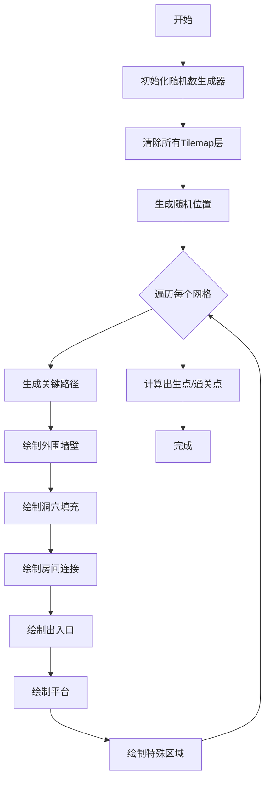

# 多网格关卡生成系统 - 开发桥接文档

## 一、文档目的

本文档旨在帮助开发者快速理解和使用多网格关卡生成系统，提供从理论到实践的完整桥接，包括快速上手指南、常见问题解决方案和最佳实践。

---

## 二、快速上手

### 2.1 5分钟快速开始

#### 步骤1: 创建场景结构
```
Hierarchy:
├── Grid
│   ├── GroundLayer (Tilemap)
│   ├── PlatformLayer (Tilemap)
│   └── WallLayer (Tilemap)
└── LevelManager (GameObject)
    ├── MultiGridLevelManager (Component)
    └── GrayboxLevelGenerator (Component)
```

#### 步骤2: 配置Tilemap层
```csharp
// 在Inspector中配置GrayboxLevelGenerator
TilemapLayers:
  - GroundLayer: 拖入GroundLayer Tilemap
  - PlatformLayer: 拖入PlatformLayer Tilemap
  - WallLayer: 拖入WallLayer Tilemap
```

#### 步骤3: 配置瓦片集
```csharp
// 创建瓦片资源
Assets/0_Tiles/
├── BlackTile.asset (墙壁)
├── GrayTile.asset (填充)
├── WhiteTile.asset (表层)
├── PinkTile.asset (平台)
├── GreenTile.asset (入口)
└── RedTile.asset (出口)

// 在Inspector中配置TileSet
TileSet:
  - BlackTile: 拖入BlackTile
  - GrayTile: 拖入GrayTile
  - WhiteTile: 拖入WhiteTile
  - PinkTile: 拖入PinkTile
  - GreenTile: 拖入GreenTile
  - RedTile: 拖入RedTile
```

#### 步骤4: 配置MultiGridLevelManager
```csharp
// 在Inspector中配置
LevelGenerator: 拖入GrayboxLevelGenerator组件
GridCount: 4
LayoutAreaWidth: 200
LayoutAreaHeight: 200
MinGridSpacing: 16
BaseSeed: 0 (0表示随机)
```

#### 步骤5: 生成关卡
```csharp
// 点击Inspector中的"生成多网格关卡"按钮
// 或在代码中调用
MultiGridLevelManager manager = GetComponent<MultiGridLevelManager>();
manager.GenerateMultiGridLevel();
```

### 2.2 验证生成结果

#### 检查清单
- [ ] 场景中出现多个4×4网格
- [ ] 每个网格有黑色外围墙壁
- [ ] 网格内有灰色洞穴填充
- [ ] 有粉色平台连接高低差
- [ ] 第一个网格有红色出口标记
- [ ] 最后一个网格有绿色入口标记
- [ ] Console无错误日志

---

## 三、核心概念理解

### 3.1 坐标系统

#### Unity Tilemap坐标
```
Y轴向上为正
  ↑
  |  (0,2) (1,2) (2,2)
  |  (0,1) (1,1) (2,1)
  |  (0,0) (1,0) (2,0)
  └──────────────────→ X轴向右为正
```

#### 房间网格坐标
```
GridY=0 (顶排)
  ↓
  [0,0] [1,0] [2,0] [3,0]
  [0,1] [1,1] [2,1] [3,1]
  [0,2] [1,2] [2,2] [3,2]
  [0,3] [1,3] [2,3] [3,3]
                          ↓
                    GridY=3 (底排)
```

#### 世界坐标转换
```csharp
// 房间网格坐标 → 世界坐标
int worldX = gridX * RoomWidth;
int worldY = (LevelShape.GridHeight - 1 - gridY) * RoomHeight;

// 世界坐标 → 房间网格坐标
int gridX = worldX / RoomWidth;
int gridY = LevelShape.GridHeight - 1 - worldY / RoomHeight;
```

### 3.2 生成流程



### 3.3 数据流

```
用户输入参数
    ↓
MultiGridLevelManager
    ↓
生成随机位置 → _gridPositions
    ↓
遍历每个网格
    ↓
GenerateGridContent
    ↓
GrayboxLevelGenerator算法
    ↓
Tilemap层绘制
    ↓
SpawnExitPointCalculator
    ↓
出生点/通关点 → _playerSpawnPoint, _levelExitPoint
```

---

## 四、常见问题解决

### 4.1 生成失败问题

#### 问题1: "Tilemap层未正确配置"
**原因**: TilemapLayers为null或未配置完整

**解决方案**:
```csharp
// 检查GrayboxLevelGenerator的TilemapLayers配置
public GrayboxTilemapLayers TilemapLayers;

// 确保TilemapLayers包含:
- GroundLayer (必需)
- PlatformLayer (必需)
- WallLayer (可选)
- FillLayer (可选)
```

#### 问题2: "无法在指定区域内放置所有网格"
**原因**: 布局区域太小或网格数量太多

**解决方案**:
```csharp
// 方案1: 增加布局区域
LayoutAreaWidth = 300;  // 从200增加到300
LayoutAreaHeight = 300;

// 方案2: 减少网格数量
GridCount = 3;  // 从4减少到3

// 方案3: 减小网格间距
MinGridSpacing = 12;  // 从16减少到12
```

#### 问题3: "BFS未找到任何有效位置"
**原因**: 搜索边界错误或地形过于复杂

**解决方案**:
```csharp
// 检查searchBounds是否正确
Rect bounds = _placedGridBounds[gridIndex];
Debug.Log($"搜索边界: {bounds}");

// 增加候选点数量
const int CandidateCount = 20;  // 从10增加到20

// 放宽可站立性检测
// 修改IsStandablePosition()中的约束条件
```

### 4.2 平台问题

#### 问题1: 平台无法到达
**原因**: 垂锚连接未生效或禁飞区过大

**解决方案**:
```csharp
// 方案1: 检查安全高度
StaircaseSafeHeight = 4;  // 确保与玩家跳跃力匹配

// 方案2: 减小禁飞区
int noFlyRadius = 8;  // 从10减少到8

// 方案3: 增加迭代次数
int maxIterations = 15;  // 从10增加到15

// 方案4: 启用调试日志
Debug.Log($"[垂锚连接] 迭代{iteration}: 在({anchorX},{anchorY})生成中继平台");
```

#### 问题2: 平台过多
**原因**: 垂锚连接过于激进

**解决方案**:
```csharp
// 方案1: 增加安全高度
StaircaseSafeHeight = 5;  // 从4增加到5

// 方案2: 启用水平可达性检查
bool hasHorizontalPath = CheckHorizontalPath(cluster, ...);
if (hasHorizontalPath) continue;  // 跳过有水平路径的平台

// 方案3: 增加禁飞区
int noFlyRadius = 12;  // 从10增加到12
```

### 4.3 出生点问题

#### 问题1: 出生点在墙里
**原因**: 可站立性检测失败

**解决方案**:
```csharp
// 增强可站立性检测
private bool IsStandablePosition(Vector3Int pos, ...)
{
    // 1. 脚下检测
    Vector3Int below = new Vector3Int(pos.x, pos.y - 1, 0);
    bool hasFloor = groundLayer.GetTile(below) != null || 
                   platformLayer.GetTile(below) != null;
    if (!hasFloor) return false;
    
    // 2. 当前位置检测
    if (groundLayer.GetTile(pos) != null) return false;
    
    // 3. 跳跃净空检测（头顶3格）
    for (int dy = 1; dy <= 3; dy++)
    {
        Vector3Int checkPos = new Vector3Int(pos.x, pos.y + dy, 0);
        if (groundLayer.GetTile(checkPos) != null) return false;
    }
    
    return true;
}
```

#### 问题2: 出生点太近
**原因**: BFS距离场计算错误

**解决方案**:
```csharp
// 检查BFS起点
Vector3Int actualStart = FindNearestAirPosition(startPos, bounds, groundLayer);
Debug.Log($"BFS起点: {actualStart}");

// 增加候选点数量
const int CandidateCount = 20;

// 检查距离场
foreach (var kvp in distanceMap)
{
    Debug.Log($"位置: {kvp.Key}, 距离: {kvp.Value}");
}
```

### 4.4 性能问题

#### 问题1: 生成时间过长
**原因**: 算法复杂度过高或迭代次数过多

**解决方案**:
```csharp
// 方案1: 减少平滑迭代次数
SmoothIterations = 2;  // 从3减少到2

// 方案2: 减少垂锚连接迭代次数
int maxIterations = 5;  // 从10减少到5

// 方案3: 使用性能分析器
Profiler.BeginSample("GenerateMultiGridLevel");
GenerateMultiGridLevel();
Profiler.EndSample();

// 方案4: 异步生成
IEnumerator GenerateAsync()
{
    for (int i = 0; i < GridCount; i++)
    {
        GenerateSingleGrid(i);
        yield return null;  // 分帧执行
    }
}
```

#### 问题2: 运行时卡顿
**原因**: GC分配或Tilemap刷新过于频繁

**解决方案**:
```csharp
// 方案1: 批量设置瓦片
List<Vector3Int> positions = new List<Vector3Int>();
List<TileBase> tiles = new List<TileBase>();

// 收集所有瓦片
for (int y = 0; y < height; y++)
{
    for (int x = 0; x < width; x++)
    {
        positions.Add(new Vector3Int(x, y, 0));
        tiles.Add(myTile);
    }
}

// 批量设置
tilemap.SetTiles(positions.ToArray(), tiles.ToArray());

// 方案2: 延迟刷新
tilemap.RefreshAllTiles();  // 只在最后调用一次

// 方案3: 对象池
private static readonly List<Vector3Int> _positionPool = new List<Vector3Int>();
```

---

## 五、最佳实践

### 5.1 参数调优指南

#### 基础参数推荐值
```csharp
// 多网格布局
GridCount = 4;                    // 4个网格平衡性能和内容
LayoutAreaWidth = 200;            // 足够容纳4个网格
LayoutAreaHeight = 200;
MinGridSpacing = 16;              // 网格间留有走廊空间
PositionRandomOffset = 16;        // 适度随机化

// 单网格生成
RoomWidth = 16;                   // 标准房间尺寸
RoomHeight = 16;
WallThickness = 2;                // 足够厚度防止穿墙
FillDensity = 0.50f;              // 平衡填充和空间
SmoothIterations = 3;             // 足够平滑

// 平台系统
MaxPlatformHeightDiff = 4;        // 匹配玩家跳跃力
MinPlatformGap = 3;               // 防止平台过密
StaircaseSafeHeight = 4;          // 安全跳跃高度
StaircasePlatformWidth = 4;       // 足够宽度
```

#### 性能优化参数
```csharp
// 减少计算量
SmoothIterations = 2;             // 从3减少到2
MaxIterations = 5;                // 垂锚连接迭代次数

// 减少网格数量
GridCount = 3;                    // 从4减少到3

// 简化地形
FillDensity = 0.45f;              // 减少填充密度
```

#### 视觉效果参数
```csharp
// 增加地形复杂度
FillDensity = 0.55f;              // 增加填充密度
SmoothIterations = 4;             // 增加平滑度

// 增加平台密度
MinPlatformGap = 2;               // 减小间距

// 增加网格数量
GridCount = 6;                    // 更多内容
```

### 5.2 代码组织建议

#### 文件结构
```
1_Scripts/3_LevelGeneration/Graybox/
├── MultiGridLevelManager.cs      // 多网格管理器
├── GrayboxLevelGenerator.cs      // 单网格生成器
├── SpawnExitPointCalculator.cs   // 出生点计算器
├── Data/
│   ├── RoomNode.cs               // 房间节点数据
│   ├── LevelShape.cs             // 关卡形状数据
│   └── Direction.cs              // 方向枚举
├── Algorithms/
│   ├── DrunkardWalk.cs           // 醉汉游走算法
│   ├── CellularAutomata.cs      // 细胞自动机算法
│   └── VerticalAnchoring.cs     // 垂锚连接算法
└── Config/
    ├── GrayboxTilemapLayers.cs   // Tilemap层配置
    ├── GrayboxTileSet.cs         // 瓦片集配置
    └── RoomTheme.cs              // 主题配置
```

#### 命名规范
```csharp
// 公共方法: PascalCase
public void GenerateMultiGridLevel() { }

// 私有方法: PascalCase
private void GenerateCriticalPath() { }

// 公共属性: PascalCase
public int GridCount { get; set; }

// 私有字段: _camelCase
private System.Random _rng;

// 常量: PascalCase
private const int CandidateCount = 10;

// 局部变量: camelCase
int worldX = gx * RoomWidth;
```

### 5.3 调试技巧

#### 启用详细日志
```csharp
// 在关键位置添加日志
Debug.Log($"[多网格] 开始生成 {GridCount} 个网格");
Debug.Log($"[网格{i}] 位置: ({x}, {y}), 种子: {seed}");
Debug.Log($"[关键路径] 路径长度: {path.Count}");
Debug.Log($"[洞穴填充] 填充密度: {FillDensity}");
Debug.Log($"[垂锚连接] 生成 {totalAnchorsPlaced} 个中继平台");
Debug.Log($"[出生点] 位置: {spawnPoint}, 距离: {distance}");
```

#### 使用Gizmos可视化
```csharp
private void OnDrawGizmos()
{
    if (!Application.isPlaying) return;
    
    // 绘制网格边界
    Gizmos.color = Color.green;
    foreach (var bounds in _placedGridBounds)
    {
        Gizmos.DrawWireCube(bounds.center, bounds.size);
    }
    
    // 绘制出入口
    Gizmos.color = Color.blue;
    foreach (var entrance in _entrancePositions)
    {
        Gizmos.DrawWireSphere(entrance, 2f);
    }
    
    // 绘制出生点
    Gizmos.color = Color.cyan;
    Gizmos.DrawWireSphere(_playerSpawnPoint, 3f);
}
```

#### 使用断点调试
```csharp
// 在关键位置设置断点
private void GenerateCriticalPath()
{
    // 断点1: 检查起点
    int startX = _rng.Next(LevelShape.GridWidth);
    // 在这里设置断点，检查startX的值
    
    // 断点2: 检查路径
    List<Vector2Int> path = new List<Vector2Int>();
    // 在这里设置断点，检查path的内容
    
    // 断点3: 检查连接
    Direction dir = GetDirection(current, next);
    // 在这里设置断点，检查dir的值
}
```

---

## 六、扩展开发指南

### 6.1 添加新房间类型

#### 步骤1: 扩展RoomType枚举
```csharp
public enum RoomType
{
    Side,
    Start,
    Exit,
    Boss,
    Shop,
    LR,
    Drop,
    Landing,
    Treasure,  // 新增：宝藏房间
    Secret     // 新增：秘密房间
}
```

#### 步骤2: 修改生成逻辑
```csharp
private void GenerateCriticalPath()
{
    // ... 现有代码 ...
    
    // 添加宝藏房间生成逻辑
    if (path.Count >= 5)
    {
        var treasureCell = path[path.Count / 2];
        _roomGrid[treasureCell.x, treasureCell.y].Type = RoomType.Treasure;
    }
}
```

#### 步骤3: 添加特殊绘制逻辑
```csharp
private void DrawSpecialAreas()
{
    // ... 现有代码 ...
    
    if (room.Type == RoomType.Treasure)
    {
        // 宝藏房间：中央放置宝箱平台
        int treasureX = worldX + RoomWidth / 2 - 2;
        int treasureY = worldY + RoomHeight / 2;
        
        FillRect(TilemapLayers.PlatformLayer, TileSet.GoldTile,
            treasureX, treasureY, 4, 1);
    }
}
```

### 6.2 添加新地形算法

#### 示例：添加Perlin噪声地形
```csharp
private void GeneratePerlinNoiseTerrain(int offsetX, int offsetY, int width, int height)
{
    float scale = 0.1f;
    float threshold = 0.5f;
    
    for (int y = 0; y < height; y++)
    {
        for (int x = 0; x < width; x++)
        {
            float noiseValue = Mathf.PerlinNoise(
                (offsetX + x) * scale,
                (offsetY + y) * scale
            );
            
            if (noiseValue > threshold)
            {
                TilemapLayers.GroundLayer.SetTile(
                    new Vector3Int(offsetX + x, offsetY + y, 0),
                    TileSet.GrayTile
                );
            }
        }
    }
}
```

### 6.3 添加新主题系统

#### 步骤1: 创建主题数据
```csharp
[CreateAssetMenu(fileName = "NewTheme", menuName = "Level/Theme")]
public class LevelTheme : ScriptableObject
{
    public string ThemeName;
    public Color PrimaryColor;
    public Color SecondaryColor;
    public RuleTile GroundRuleTile;
    public RuleTile PlatformRuleTile;
    public TileBase[] DecorationTiles;
}
```

#### 步骤2: 应用主题
```csharp
private void ApplyTheme(LevelTheme theme)
{
    // 替换地面瓦片
    if (theme.GroundRuleTile != null)
    {
        ReplaceAllTiles(TilemapLayers.GroundLayer, theme.GroundRuleTile);
    }
    
    // 替换平台瓦片
    if (theme.PlatformRuleTile != null)
    {
        ReplaceAllTiles(TilemapLayers.PlatformLayer, theme.PlatformRuleTile);
    }
    
    // 添加装饰瓦片
    AddDecorations(theme.DecorationTiles);
}
```

---

## 七、测试指南

### 7.1 单元测试

#### 测试醉汉游走算法
```csharp
[Test]
public void TestDrunkardWalk_PathConnectivity()
{
    // Arrange
    var generator = new GrayboxLevelGenerator();
    generator.RandomSeed = 12345;
    
    // Act
    generator.GenerateLevel();
    
    // Assert
    var path = generator.GetCriticalPath();
    Assert.IsTrue(path.Count > 0);
    Assert.IsTrue(IsPathConnected(path));
}

private bool IsPathConnected(List<Vector2Int> path)
{
    for (int i = 0; i < path.Count - 1; i++)
    {
        var current = path[i];
        var next = path[i + 1];
        
        // 检查相邻性
        int dx = Mathf.Abs(next.x - current.x);
        int dy = Mathf.Abs(next.y - current.y);
        
        if (dx + dy != 1)
            return false;
    }
    
    return true;
}
```

#### 测试BFS算法
```csharp
[Test]
public void TestBFS_FindsFarthestPoint()
{
    // Arrange
    var calculator = new SpawnExitPointCalculator();
    var referencePoint = new Vector3(0, 0, 0);
    var bounds = new Rect(0, 0, 64, 64);
    
    // Act
    var farthestPoint = calculator.CalculateFarthestPoint(
        referencePoint, bounds, groundLayer, platformLayer
    );
    
    // Assert
    float distance = Vector3.Distance(referencePoint, farthestPoint);
    Assert.IsTrue(distance > 30f);  // 应该足够远
}
```

### 7.2 集成测试

#### 测试完整生成流程
```csharp
[Test]
public void TestFullGeneration_NoErrors()
{
    // Arrange
    var manager = CreateTestManager();
    
    // Act
    manager.GenerateMultiGridLevel();
    
    // Assert
    Assert.IsTrue(manager.HasSpawnPoint);
    Assert.IsTrue(manager.HasExitPoint);
    Assert.AreEqual(4, manager.GetGridPositions().Count);
    
    // 检查无错误日志
    LogAssert.NoUnexpectedReceived();
}
```

### 7.3 性能测试

#### 测试生成时间
```csharp
[Test]
public void TestGenerationTime_UnderThreshold()
{
    // Arrange
    var manager = CreateTestManager();
    var stopwatch = System.Diagnostics.Stopwatch.StartNew();
    
    // Act
    manager.GenerateMultiGridLevel();
    stopwatch.Stop();
    
    // Assert
    Assert.IsTrue(stopwatch.ElapsedMilliseconds < 100,
        $"生成时间 {stopwatch.ElapsedMilliseconds}ms 超过阈值 100ms");
}
```

---

## 八、部署清单

### 8.1 发布前检查

- [ ] 所有单元测试通过
- [ ] 所有集成测试通过
- [ ] 性能测试达标（<100ms）
- [ ] 无Console错误或警告
- [ ] 代码注释完整
- [ ] 文档更新完整
- [ ] 示例场景可运行
- [ ] 配置文件正确

### 8.2 版本控制

#### Git提交规范
```bash
# 功能开发
git commit -m "feat: 添加多网格布局系统"

# Bug修复
git commit -m "fix: 修复平台无法到达问题"

# 文档更新
git commit -m "docs: 更新API文档"

# 性能优化
git commit -m "perf: 优化BFS算法性能"

# 代码重构
git commit -m "refactor: 重构洞穴生成算法"
```

### 8.3 发布流程

1. **代码审查**: 提交Pull Request，等待审查
2. **测试验证**: 运行所有测试，确保通过
3. **文档更新**: 更新版本号和更新日志
4. **打包发布**: 创建Release版本
5. **部署通知**: 通知团队成员更新

---

## 九、联系与支持

### 9.1 技术支持

- **文档**: 查看技术文档和API文档
- **示例**: 参考示例场景和代码
- **日志**: 启用详细日志进行调试
- **社区**: 在团队频道提问

### 9.2 反馈渠道

- **Bug报告**: 在Issue Tracker中提交
- **功能建议**: 在讨论区发起讨论
- **文档改进**: 提交Pull Request

---

**文档版本**: v1.0  
**最后更新**: 2026-01-17  
**维护者**: CRYPTA GEOMETRICA RE Team
