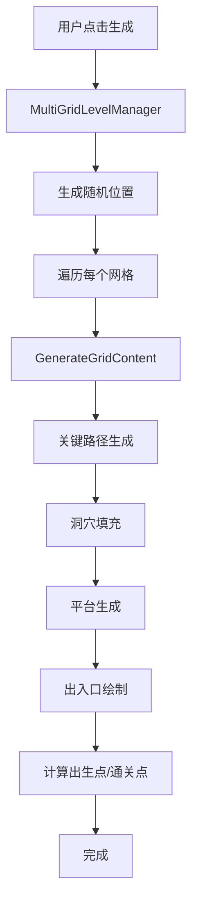

# 多网格关卡生成系统 - 技术文档

## 一、系统概述

### 1.1 项目背景
多网格关卡生成系统是CRYPTA GEOMETRICA RE项目的核心关卡生成模块，实现了基于Spelunky风格的程序化关卡生成，支持多个独立4×4网格的随机布局和连接。

### 1.2 核心特性
- **多网格布局**: 支持1-8个独立4×4房间网格的随机化蛇形布局
- **洞穴地形**: 基于细胞自动机的有机洞穴填充系统
- **智能平台**: 全局垂锚连接法确保所有平台可达
- **出生点计算**: 基于BFS的最远距离出生点/通关点算法
- **主题系统**: 支持规则瓦片和颜色主题的动态替换

### 1.3 技术栈
- Unity Tilemap System
- C# 程序化生成算法
- 细胞自动机 (Cellular Automata)
- 广度优先搜索 (BFS)
- Odin Inspector (编辑器增强)

---

## 二、系统架构

### 2.1 核心组件

```
MultiGridLevelManager (多网格管理器)
├── GrayboxLevelGenerator (单网格生成器)
│   ├── 关键路径生成 (醉汉游走)
│   ├── 洞穴填充生成 (细胞自动机)
│   ├── 平台系统 (垂锚连接)
│   └── 出入口绘制
└── SpawnExitPointCalculator (出生点计算器)
    └── BFS距离场算法
```

### 2.2 数据流



---

## 三、核心算法

### 3.1 醉汉游走算法 (Drunkard's Walk)

**用途**: 生成关键路径，确保关卡可通关

**算法流程**:
```csharp
1. 从顶排随机选择起点 (y=0)
2. 每层执行:
   a. 水平游走 1-3 步 (随机左右)
   b. 遇到边界则反向
   c. 向下移动到下一层
3. 标记路径上的房间为关键路径
4. 设置起点房间为 Start，终点房间为 Exit
```

**关键代码**:
```csharp
// 水平游走
int horizontalDirection = _rng.Next(2) == 0 ? -1 : 1;
int horizontalSteps = _rng.Next(1, 4);

// 向下移动
if (row < LevelShape.GridHeight - 1)
{
    Vector2Int next = new Vector2Int(current.x, current.y + 1);
    path.Add(next);
}
```

### 3.2 高斯堆积造山法 (Gaussian Accumulation)

**用途**: 生成自然的洞穴地形填充

**算法原理**:
```
最终概率 = 基础密度 × 边缘因子 + 重力堆积 + 水平聚拢 + 石笋注入
```

**概率梯度场**:
1. **边缘因子**: 边缘6格内概率×1.5
2. **重力堆积**: 底部概率高，顶部概率低 (系数0.35)
3. **水平聚拢**: 中心概率高，边缘概率低 (系数0.25)
4. **石笋注入**: 2-3根随机高度石笋从底部生长

**关键代码**:
```csharp
// 垂直梯度（重力堆积）
float heightRatio = (float)y / fillHeight;
float gravityBonus = (1.0f - heightRatio) * 0.35f;

// 水平中心梯度
float centerX = fillWidth / 2f;
float distToCenter = Mathf.Abs(x - centerX) / centerX;
float centerBonus = (1.0f - distToCenter) * 0.25f;

// 最终概率
float finalProbability = FillDensity * edgeFactor + gravityBonus + centerBonus;
cave[x, y] = _rng.NextDouble() < finalProbability;
```

### 3.3 细胞自动机平滑 (Cellular Automata Smoothing)

**用途**: 平滑洞穴边缘，创建有机形状

**规则**:
- 邻居数 ≥ 4: 变为墙壁
- 邻居数 < 4: 变为空气
- 邻居数 = 4: 保持不变

**迭代次数**: SmoothIterations + 3 (默认6次)

**关键代码**:
```csharp
private bool[,] SmoothCave(bool[,] cave, int width, int height)
{
    bool[,] newCave = new bool[width, height];
    
    for (int y = 0; y < height; y++)
    {
        for (int x = 0; x < width; x++)
        {
            int neighbors = CountNeighbors(cave, x, y, width, height);
            newCave[x, y] = neighbors >= 4;
        }
    }
    
    return newCave;
}
```

### 3.4 全局垂锚连接法 (Global Vertical Anchoring)

**用途**: 确保所有平台可达，解决断层问题

**算法流程**:
```
1. 获取所有平台聚类（按Y坐标分组）
2. 按Y从高到低排序
3. 对每个平台:
   a. 向下射线检测距离
   b. 如果距离 > 安全高度:
      - 检查水平可达性（左右是否有路径）
      - 如果无水平路径，生成中继平台
   c. 中继平台位置 = 当前Y - 安全高度
   d. 左右摆动偏移避免重叠
4. 迭代直到无新平台生成（最多10次）
```

**约束条件**:
- **安全高度**: 4格（玩家可跳跃高度）
- **禁飞区**: 出入口附近10格不生成平台
- **可站立性**: 平台上方3格无阻挡

**关键代码**:
```csharp
// 向下射线检测
int minGap = RaycastDown(checkPoint, platformTilemap, groundTilemap, 50);

// 判定是否需要修复
if (minGap > safeHeight && minGap < 50)
{
    // 水平可达性检查
    bool hasHorizontalPath = CheckHorizontalPath(cluster, ...);
    if (!hasHorizontalPath)
    {
        // 生成中继平台
        int anchorY = cluster.Y - safeHeight;
        FillRect(platformTilemap, tile, anchorX, anchorY, anchorWidth, 1);
    }
}
```

### 3.5 BFS最远距离算法 (BFS Farthest Point)

**用途**: 计算出生点和通关点，确保玩家从最远处开始

**算法流程**:
```
1. 从参考门位置开始BFS洪水填充
2. 构建距离场（每个可达位置的距离值）
3. 按距离降序排序，取前10个候选点
4. 物理环境验证（可站立性检查）:
   a. 脚下有地面或平台
   b. 当前位置为空
   c. 头顶3格无阻挡
   d. 左右至少一侧有空间
5. 返回第一个有效的可站立位置
```

**可站立性检测**:
```csharp
private bool IsStandablePosition(Vector3Int pos, Tilemap groundLayer, Tilemap platformLayer)
{
    // 1. 脚下检测
    Vector3Int below = new Vector3Int(pos.x, pos.y - 1, 0);
    bool hasFloor = groundLayer.GetTile(below) != null || 
                   platformLayer.GetTile(below) != null;
    if (!hasFloor) return false;
    
    // 2. 当前位置检测
    if (groundLayer.GetTile(pos) != null) return false;
    
    // 3. 跳跃净空检测（头顶3格）
    for (int dy = 1; dy <= 3; dy++)
    {
        Vector3Int checkPos = new Vector3Int(pos.x, pos.y + dy, 0);
        if (groundLayer.GetTile(checkPos) != null) return false;
        if (platformLayer.GetTile(checkPos) != null) return false;
    }
    
    // 4. 横向活动域检测
    Vector3Int left = new Vector3Int(pos.x - 1, pos.y, 0);
    Vector3Int right = new Vector3Int(pos.x + 1, pos.y, 0);
    bool leftClear = groundLayer.GetTile(left) == null;
    bool rightClear = groundLayer.GetTile(right) == null;
    
    return leftClear || rightClear;
}
```

---

## 四、多网格布局系统

### 4.1 随机化蛇形布局

**特点**:
- 每行房间数量随机 (1 到 maxRoomsPerRow)
- 偶数行从左到右，奇数行从右到左
- 随机间距和偏移，避免规则排列

**布局算法**:
```csharp
// 计算每行房间数量
List<int> rowRoomCounts = new List<int>();
int remainingRooms = GridCount;

while (remainingRooms > 0)
{
    int maxInThisRow = Mathf.Min(maxRoomsPerRow, remainingRooms);
    int minInThisRow = Mathf.Max(1, maxInThisRow - 1);
    int roomsInRow = _rng.Next(minInThisRow, maxInThisRow + 1);
    
    rowRoomCounts.Add(roomsInRow);
    remainingRooms -= roomsInRow;
}

// 蛇形布局
for (int row = 0; row < rowsNeeded; row++)
{
    bool leftToRight = (row % 2 == 0);
    
    for (int col = 0; col < roomsInThisRow; col++)
    {
        int actualCol = leftToRight ? col : (roomsInThisRow - 1 - col);
        // 计算位置...
    }
}
```

### 4.2 出入口方向选择

**规则**:
- **入口优先级**: 左 > 上 > 下 > 右
- **出口优先级**: 右 > 下 > 上 > 左
- 只在外围方向（无相邻房间）生成

**代码实现**:
```csharp
private Direction GetBestEntranceDirection(int gx, int gy, LevelShape shape)
{
    List<Direction> availableDirections = new List<Direction>();
    
    bool canNorth = (gy == 0) || !shape.IsValidCell(gx, gy - 1);
    bool canSouth = (gy == LevelShape.GridHeight - 1) || !shape.IsValidCell(gx, gy + 1);
    bool canWest = (gx == 0) || !shape.IsValidCell(gx - 1, gy);
    bool canEast = (gx == LevelShape.GridWidth - 1) || !shape.IsValidCell(gx + 1, gy);
    
    // 入口优先级：左 > 上 > 下 > 右
    if (canWest) availableDirections.Add(Direction.West);
    if (canNorth) availableDirections.Add(Direction.North);
    if (canSouth) availableDirections.Add(Direction.South);
    if (canEast) availableDirections.Add(Direction.East);
    
    return availableDirections.Count > 0 ? availableDirections[0] : Direction.North;
}
```

---

## 五、性能优化

### 5.1 批量瓦片操作
- 使用 `SetTile` 而非 `SetTilesBlock`（单瓦片操作更快）
- 集中刷新 `RefreshAllTiles()` 在最后执行

### 5.2 算法优化
- BFS使用 `HashSet` 避免重复访问
- 平台聚类使用单次扫描 O(n)
- 距离场缓存避免重复计算

### 5.3 内存优化
- 使用 `bool[,]` 而非 `List<Vector2Int>` 存储洞穴数据
- 及时清理临时数据结构

---

## 六、配置参数

### 6.1 MultiGridLevelManager 参数

| 参数 | 类型 | 默认值 | 说明 |
|------|------|--------|------|
| GridCount | int | 4 | 网格总数量 (1-8) |
| LayoutAreaWidth | int | 200 | 布局区域宽度（瓦片） |
| LayoutAreaHeight | int | 200 | 布局区域高度（瓦片） |
| MinGridSpacing | int | 16 | 网格最小间距（瓦片） |
| PositionRandomOffset | int | 16 | 位置随机偏移（瓦片） |
| BaseSeed | int | 0 | 基础随机种子（0=随机） |
| UseUniqueSeedPerGrid | bool | true | 每网格独立种子 |
| MedianGridSpecialChance | float | 0.8 | 中位数网格特殊区域概率 |
| OtherGridSpecialChance | float | 0.15 | 其他网格特殊区域概率 |

### 6.2 GrayboxLevelGenerator 参数

| 参数 | 类型 | 默认值 | 说明 |
|------|------|--------|------|
| RoomWidth | int | 16 | 单个房间宽度（瓦片） |
| RoomHeight | int | 16 | 单个房间高度（瓦片） |
| WallThickness | int | 2 | 外围墙壁厚度 |
| FillDensity | float | 0.50 | 填充密度 (0-0.6) |
| SmoothIterations | int | 3 | 平滑迭代次数 (0-5) |
| EntranceWidth | int | 3 | 出入口通道宽度 |
| EntranceHeight | int | 3 | 出入口通道高度 |
| MaxPlatformHeightDiff | int | 4 | 平台最大高度差 |
| MinPlatformGap | int | 3 | 平台最小间距 |
| StaircaseSafeHeight | int | 4 | 阶梯安全跳跃高度 |
| StaircasePlatformWidth | int | 4 | 阶梯平台宽度 |
| StaircaseHorizontalOffset | int | 4 | 阶梯水平偏移量 |

---

## 七、使用指南

### 7.1 基础使用

1. **创建场景对象**:
```
Hierarchy:
├── Grid
│   ├── GroundLayer (Tilemap)
│   ├── PlatformLayer (Tilemap)
│   └── WallLayer (Tilemap)
└── LevelManager (GameObject)
    ├── MultiGridLevelManager (Component)
    └── GrayboxLevelGenerator (Component)
```

2. **配置组件**:
- 在 `MultiGridLevelManager` 中引用 `GrayboxLevelGenerator`
- 在 `GrayboxLevelGenerator` 中配置 `TilemapLayers` 和 `TileSet`

3. **生成关卡**:
- 点击 Inspector 中的 "生成多网格关卡" 按钮
- 或调用 `MultiGridLevelManager.GenerateMultiGridLevel()`

### 7.2 高级配置

**启用主题系统**:
```csharp
LevelGenerator.UseTheme = true;
LevelGenerator.ThemeConfig = yourThemeConfig;
```

**启用规则瓦片**:
```csharp
LevelGenerator.UseRuleTile = true;
LevelGenerator.GroundRuleTile = yourGroundRuleTile;
LevelGenerator.PlatformRuleTile = yourPlatformRuleTile;
```

**自定义随机种子**:
```csharp
MultiGridLevelManager.BaseSeed = 12345;
MultiGridLevelManager.UseUniqueSeedPerGrid = true;
```

---

## 八、调试工具

### 8.1 Gizmos 可视化

**网格边界**:
- 绿色线框: 已生成的网格边界
- 黄色线框: 布局区域边界

**出入口标记**:
- 绿色线框+箭头: 入口（箭头指向内部）
- 黑色线框+箭头: 出口（箭头指向外部）
- 蓝色圆形: 玩家出生点
- 金色圆形: 通关点

### 8.2 日志输出

```
[垂锚连接] 开始检测平台可达性, 区域: (0,0) ~ (64,64)
[垂锚连接] 设置2个禁飞区
[垂锚连接] 迭代0: 在(32,20)生成中继平台, 距离上方平台4格
[垂锚连接] 完成, 共1次迭代, 生成3个中继平台
出生点计算完成: (10.5, 5.5, 0) (距离出口最远，已清理安全区)
通关点计算完成: (54.5, 58.5, 0) (距离入口最远，已清理安全区)
```

---

## 九、常见问题

### 9.1 平台无法到达

**原因**: 垂锚连接未生效或禁飞区过大

**解决方案**:
1. 检查 `StaircaseSafeHeight` 是否合理（推荐4）
2. 减小禁飞区半径（默认10格）
3. 增加 `MaxIterations`（默认10次）

### 9.2 出生点/通关点在墙里

**原因**: BFS未找到有效可站立位置

**解决方案**:
1. 检查 `IsStandablePosition` 逻辑
2. 增加候选点数量（默认10个）
3. 检查安全区清理是否生效

### 9.3 关卡生成失败

**原因**: 布局区域不足或网格数量过多

**解决方案**:
1. 增加 `LayoutAreaWidth` 和 `LayoutAreaHeight`
2. 减少 `GridCount`
3. 减小 `MinGridSpacing`

---

## 十、未来优化方向

### 10.1 性能优化
- [ ] 使用 Job System 并行化洞穴生成
- [ ] 使用 Burst Compiler 加速细胞自动机
- [ ] 使用 SetTilesBlock 批量设置瓦片

### 10.2 功能扩展
- [ ] 支持自定义房间形状（非4×4）
- [ ] 支持多层关卡（垂直堆叠）
- [ ] 支持动态难度调整

### 10.3 算法改进
- [ ] 使用 Voronoi 图优化房间布局
- [ ] 使用 A* 算法优化走廊生成
- [ ] 使用 WFC 算法生成微观细节

---

## 十一、参考资料

### 11.1 算法参考
- Spelunky 关卡生成算法
- Cellular Automata for Cave Generation
- BFS Pathfinding Algorithm

### 11.2 Unity 文档
- [Tilemap Scripting API](https://docs.unity3d.com/ScriptReference/Tilemaps.Tilemap.html)
- [Rule Tile](https://docs.unity3d.com/Packages/com.unity.2d.tilemap.extras@latest)

---

**文档版本**: v1.0  
**最后更新**: 2026-01-17  
**维护者**: CRYPTA GEOMETRICA RE Team
