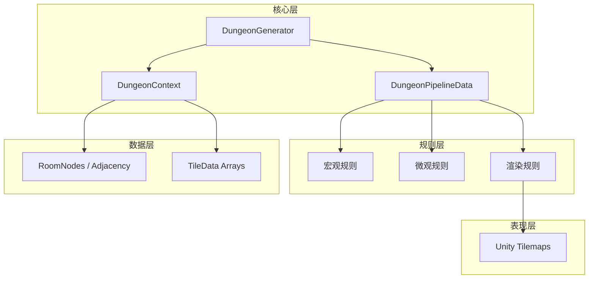
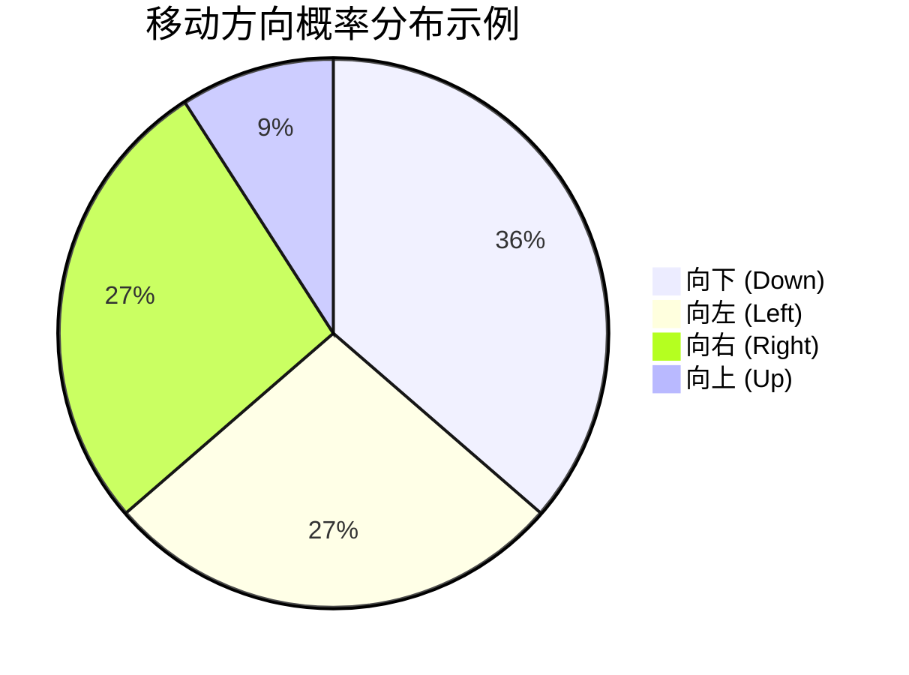
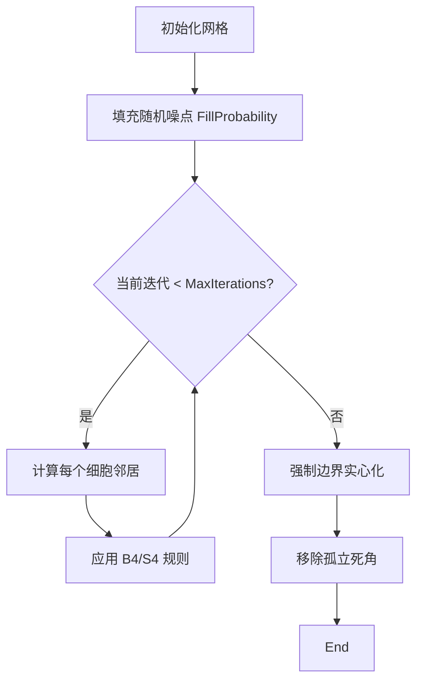
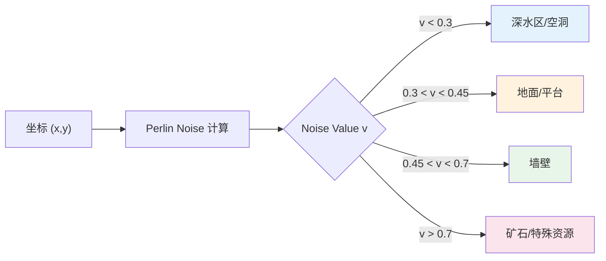
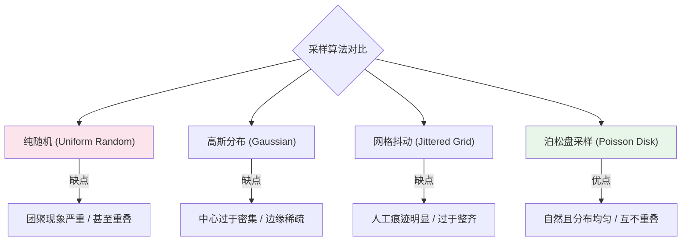
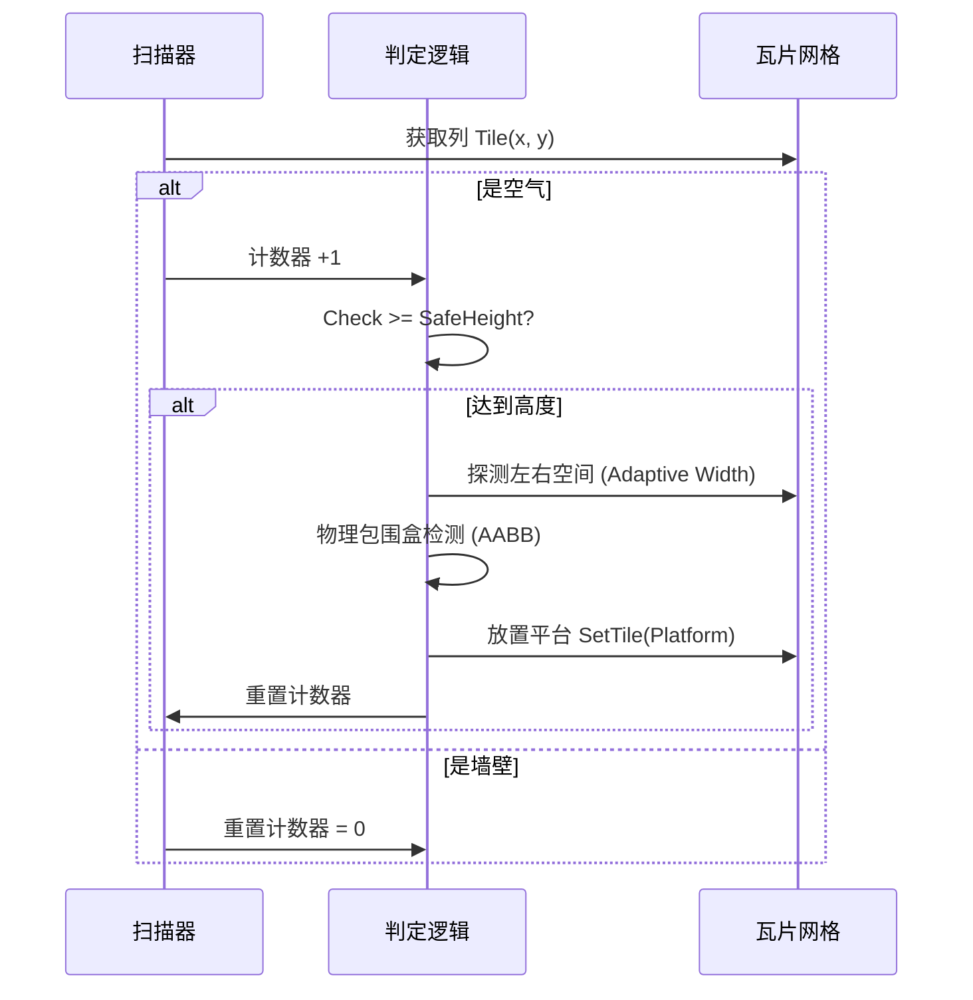

# 房间生成器 V4 技术文档

## 目录

1. [系统概述](#系统概述)
2. [架构设计](#架构设计)
3. [核心组件](#核心组件)
4. [规则管线](#规则管线)
5. [核心算法详解](#核心算法详解)
   - [约束醉汉游走](#1-约束醉汉游走-constrained-drunkard-walk)
   - [细胞自动机](#2-细胞自动机-cellular-automata)
   - [柏林噪声](#3-柏林噪声-perlin-noise)
   - [泊松盘采样](#4-泊松盘采样-poisson-disk-sampling)
   - [空气柱步进采样](#5-空气柱步进采样-air-column-interval-sampling)
   - [边界强制与门保护](#6-边界强制与门保护-border-enforcement)
6. [数据结构](#数据结构)
7. [配置指南](#配置指南)

---

## 系统概述

房间生成器V4（Dungeon Generator V4）是一个基于规则管线的多房间程序化内容生成（PCG）系统。它采用"数据-表现"分离架构，支持异步生成、模块化扩展和可视化配置。

### 核心特性

- **规则管线（Rule Pipeline）**：将生成过程分解为独立的原子规则，支持自定义执行顺序和热插拔。
- **数据与表现分离**：
  - **宏观层**：处理房间拓扑、连接关系和关键路径 (`RoomNode`)。
  - **微观层**：处理具体的瓦片数据 (`int[]`)，与Unity Tilemap解耦。
  - **渲染层**：独立的渲染规则负责将数据转换为 `Tile`。
- **异步架构**：基于 `UniTask` 的全异步流程，支持取消操作 (`CancellationToken`)，避免主线程卡顿。
- **可视化调试**：深度集成 `Odin Inspector`，支持并在Inspector中进行管线配置和单步调试。

---

## 架构设计

### 系统架构图



### 数据流向

1. **宏观阶段**：生成房间布局，确定房间位置、类型和连接关系。
2. **微观阶段**：在内存中生成瓦片数据（0=空，1=实心），执行CA、柏林噪声、泊松采样、挖掘、平台生成等算法。
3. **渲染阶段**：读取内存数据，批量设置到 Unity Tilemap。

---

## 核心算法详解

### 1. 约束醉汉游走 (Constrained Drunkard Walk)

用于生成房间的拓扑布局。此算法在经典随机游走的基础上增加了方向权重和约束，以生成更适合横版平台游戏（Platformer）的结构。

**规则类**: `ConstrainedLayoutRule` (`Rules/Macro`)

#### 权重逻辑

算法在选择下一步移动方向时，并非均匀随机，而是根据预设偏好进行加权：

- **向下偏好 (`_downwardBias`, 0.4)**: 鼓励地牢向深处延伸。
- **横向偏好 (`_sidewaysBias`, 0.3)**: 鼓励产生分支。
- **向上惩罚 (0.1)**: 极低概率向上回退，避免死循环和无意义堆叠。



#### 智能回溯 (Smart Backtracking)

当游走陷入死胡同（四周均有房间或越界）时，算法不会立即终止，而是触发 **FindUnvisitedNeighbor** 策略：

1. 从已访问的房间列表中随机选择一个房间。
2. 检查其四周是否有未被占用的空位。
3. 如果有，瞬移到该房间并向空位方向移动，开辟新路径。
4. 这保证了即使如果不小心走进死胡同，也能继续生成直到满足 `MinRooms` 数量。

---

### 2. 细胞自动机 (Cellular Automata)

用于生成自然的有机洞穴形状。

**规则类**: `CellularAutomataRule` (`Rules/Micro`)

#### 演化规则

采用经典的 **4-5 规则** (B45/S4)：

- **诞生 (Birth)**: 如果死细胞周围有 **>= 4** 个活墙壁，则复活变成墙。
- **存活 (Survival)**: 如果活细胞周围有 **>= 4** 个活墙壁，则保持存活；否则死亡变成空地（Death Limit = 3）。

$$
State_{t+1}(x,y) = \begin{cases}
1 & \text{if } Neighbors(x,y) \ge 4 \\
0 & \text{if } Neighbors(x,y) < 4
\end{cases}
$$

#### 流程图



---

### 3. 柏林噪声 (Perlin Noise)

用于生成地形的宏观起伏、生物群落分布以及背景墙壁的纹理变化。与完全随机的白噪声不同，柏林噪声具有 **平滑的梯度**，能够模拟自然界的山脉、云层和洞穴走势。

**规则类**: `PerlinNoiseRule` (`Rules/Advanced`)

#### 算法原理

柏林噪声通过在晶格顶点定义随机梯度向量，并对网格内的点进行插值计算，生成连续的伪随机数值。

- **输入**: 坐标 `(x, y)`，缩放因子 `Scale`，偏移量 `Offset`。
- **输出**: `[0, 1]` 范围内的浮点数。

#### 地形生成应用

我们使用 **分形布朗运动 (fBm)**，即叠加多个不同频率和振幅的噪声层（Octaves），来生成复杂的地形边缘。

$$
Noise(x, y) = \sum_{i=0}^{Octaves} \frac{1}{2^i} \cdot Perlin(2^i \cdot x, 2^i \cdot y)
$$

- **Persistence (持续度)**: 控制振幅衰减，决定地形的"粗糙度"。
- **Lacunarity (隙度)**: 控制频率增加，决定地形的"细节度"。

#### 噪声阈值映射图



---

### 4. 泊松盘采样 (Poisson Disk Sampling)

用于在生成的房间中布置 **敌人、宝箱和陷阱**。它可以生成 **紧密排列但互并不重叠** 的点集，比纯随机生成（Uniform Random）更自然，避免了对象堆叠或过度聚集的问题。

**规则类**: `PoissonDiskScatterRule` (`Rules/Content`)

#### 算法核心：Bridson 算法

该算法维护两个列表：

1.  **Grid**:用于快速查询邻居，网格大小为 $\frac{r}{\sqrt{2}}$。
2.  **Active List**: 当前待处理的活跃点列表。

#### 步骤流程

1.  **初始化**: 随机选择一个初始点 $P_0$，放入 Active List。
2.  **采样**: 从 Active List 中随机选取一点 $P$。
3.  **生成候选点**: 在 $P$ 周围的圆环区域 $[r, 2r]$ 内随机生成 $k$ 个候选点。
4.  **验证**: 检查每个候选点是否与已存在的点距离 $< r$。
    - 如果距离合法，将该点加入 Active List 和 Grid。
5.  **移除**: 如果 $k$ 次尝试都失败，将 $P$ 从 Active List 移除。
6.  **重复**: 直到 Active List 为空。

#### 分布对比图 (Mermaid Scatter Simulation)



> **注**: 泊松盘采样能有效平衡随机性与均匀性，是生成游戏内容的理想选择。

---

### 5. 空气柱步进采样 (Air Column Interval Sampling)

用于在垂直空旷区域智能生成跳跃平台。

**规则类**: `PlatformRule` (`Rules/Micro`)

#### 算法原理

传统的概率生成会导致平台无法跳跃或过于密集。本算法模拟重力感知，通过扫描垂直空间的"空气柱"长度来决定放置时机。

1.  **Bottom-Up 扫描**: 对每一列 x，从下往上扫描 y。
2.  **空气计数**: 遇到空瓦片时 `cnt++`，遇到实心瓦片时 `cnt = 0`。
3.  **触发阈值**: 当 `cnt >= SafeHeight` 时，尝试生成平台。
    - `SafeHeight = JumpHeight * (DoubleJump ? 2 : 1) - SafetyMargin`

#### 自适应宽度与包围盒检测

在放置平台前，算法会进行自适应探测：

1.  **向左/右延伸**: 从中心点向两边探测，直到遇到墙壁或达到 `MaxWidth`。
2.  **边界避让**: 强制平台两端与墙壁保持 **1格间距**，防止生成贴墙的尴尬平台。
3.  **AABB 碰撞**: 将拟生成的平台包围盒与已放置平台列表进行比较，如果有交集则放弃，防止平台重叠。



---

### 6. 边界强制与门保护 (Border Enforcement)

**规则类**: `BorderEnforcementRule` (`Rules/Micro`)

为了防止玩家掉出地图世界，必须强制房间边缘为实心墙壁，但又不能封死房间的入口和出口。

#### 逻辑流程

1.  **计算门位置**: 读取宏观层的 `RoomNode` 连接信息，计算出所有门在微观网格中的坐标。
2.  **遍历边界**: 扫描房间矩形的四条边。
3.  **选择性填充**:
    - 如果当前边界点在 **门列表** 中 -> 跳过（保留通道）。
    - 否则 -> 设置为实心墙壁。

---

## 数据结构

### RoomNode

```csharp
public struct RoomNode
{
    public Vector2Int GridPosition;      // 网格坐标
    public RoomType Type;                // Normal, Start, End
    public LevelDoorType DoorType;       // None, Entrance, Exit
    public WallDirection RestrictedDoorSide; // 限制门的方向
    public bool IsCritical;              // 是否在关键路径上
    public BoundsInt WorldBounds;        // 世界空间边界
    public List<Vector2Int> ConnectedNeighbors; // 连接的邻居坐标
}
```

### TilemapLayer 枚举

```csharp
public enum TilemapLayer
{
    Background = 0,
    Ground = 1,
    Platform = 2,
    Decoration = 3
}
```

---

## 扩展性

### 自定义规则

只需继承 `GeneratorRuleBase` 并实现 `ExecuteAsync` 方法：

```csharp
[Serializable]
public class MyCustomRule : GeneratorRuleBase
{
    public MyCustomRule()
    {
        _ruleName = "My Custom Rule";
        _executionOrder = 55; // 插入到平台生成之后
    }

    public override async UniTask<bool> ExecuteAsync(DungeonContext context, CancellationToken token)
    {
        // 实现自定义逻辑
        // context.SetTile(...)
        return true;
    }
}
```
