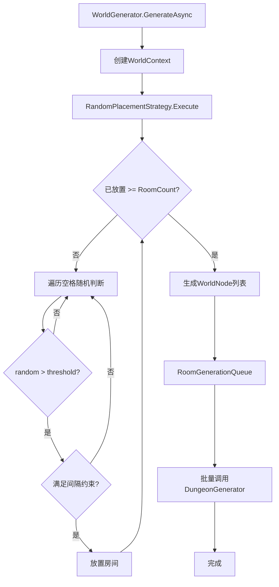

# 世界生成器 V4 - 方案共识与可行性分析

> **任务名称**: WorldGenerator  
> **创建日期**: 2026-01-19  
> **阶段**: Phase 1 - Align (待审批)

---

## 📐 最终需求规格

### 核心参数

| 参数 | 类型 | 默认值 | 说明 |
|------|------|--------|------|
| `RoomCount` | int | 6 | 目标房间数量X，决定网格大小X×X |
| `SpawnThreshold` | float | 0.5 | 随机阈值Y，超过此值才生成 |
| `MinRoomSpacing` | int | 1 | 最小间隔（允许对角线相邻，禁止正交相邻） |
| `RoomPixelSize` | Vector2Int | (64,64) | 单房间像素尺寸 |
| `Seed` | int | -1 | 随机种子，-1使用系统时间 |

### 生成规则

1. **网格初始化**: 创建X×X的布尔网格（false=空，true=有房间）
2. **随机填充循环**: 
   - 遍历所有空格，生成随机数[0,1)
   - 若 > SpawnThreshold 且满足间隔约束 → 标记生成
   - 已生成数量达到X → 停止
3. **坐标转换**: 为每个房间计算世界像素坐标偏移

> **注**: 连通性将由后续走廊单位模块负责

---

## 🏗️ 系统架构设计

### 模块化规则管线架构（仿照房间生成器V4）

```
┌─────────────────────────────────────────────────────────────────────┐
│                     WorldGenerator (世界控制器)                      │
├─────────────────────────────────────────────────────────────────────┤
│  ┌────────────────────────────────────────────────────────────────┐ │
│  │              WorldPipelineData (SO配置)                         │ │
│  │  RoomCount | SpawnThreshold | RoomPixelSize                    │ │
│  │  DungeonPipeline (ref) | EnableLogging                         │ │
│  │  ┌────────────────────────────────────────────────────────┐ │ │
│  │  │  List<IWorldRule> Rules  [模块化规则列表]              │ │ │
│  │  │    ├─ RandomPlacementRule   (Order=10)                │ │ │
│  │  │    ├─ CoordinateCalcRule    (Order=20)                │ │ │
│  │  │    └─ RoomGenerationRule    (Order=100)               │ │ │
│  │  └────────────────────────────────────────────────────────┘ │ │
│  └────────────────────────────────────────────────────────────────┘ │
│                              ↓                                       │
│  ┌────────────────────────────────────────────────────────────────┐ │
│  │                   WorldContext (世界黑板)                       │ │
│  │  GridSize | OccupancyGrid | List<WorldNode> Nodes              │ │
│  │  RNG | Seed | CancellationToken                                 │ │
│  └────────────────────────────────────────────────────────────────┘ │
│                              ↓ 规则顺序执行                           │
│  ┌────────────────────────────────────────────────────────────────┐ │
│  │  Rule Pipeline Execution                                       │ │
│  │  foreach (rule in SortedRules) rule.ExecuteAsync(context)      │ │
│  └────────────────────────────────────────────────────────────────┘ │
└─────────────────────────────────────────────────────────────────────┘
                              ↓ RoomGenerationRule 调用
┌─────────────────────────────────────────────────────────────────────┐
│                DungeonGenerator (现有房间控制器)                     │
│  WorldOffset = WorldNode.GridPosition × RoomPixelSize               │
└─────────────────────────────────────────────────────────────────────┘
```

### 规则执行顺序

| Order | 规则名称 | 类型 | 说明 |
|-------|----------|------|------|
| 10 | RandomPlacementRule | Layout | 随机阈值放置房间节点 |
| 20 | CoordinateCalcRule | Layout | 计算世界像素坐标偏移 |
| 100 | RoomGenerationRule | Generation | 串行调用DungeonGenerator |

### 数据流向



---

## 📁 文件结构设计（模块化规则管线架构）

```
LevelGenerationV4/
├── RoomGeneraton/                    # 房间生成器 (V4 原有)
│   └── ...
│
└── WorldGeneration/                  # 【新增】世界生成器
    ├── Core/
    │   ├── WorldGenerator.cs         # 世界主控制器
    │   ├── WorldContext.cs           # 世界黑板
    │   └── WorldPipelineData.cs      # 世界配置SO (含规则列表)
    │
    ├── Data/
    │   └── WorldNode.cs              # 世界节点数据
    │
    ├── Rules/                        # 【新增】模块化规则
    │   ├── Abstractions/
    │   │   ├── IWorldRule.cs         # 世界规则接口
    │   │   └── WorldRuleBase.cs      # 世界规则基类
    │   ├── Layout/
    │   │   ├── RandomPlacementRule.cs  # 随机放置规则
    │   │   └── CoordinateCalcRule.cs   # 坐标计算规则
    │   └── Generation/
    │       └── RoomGenerationRule.cs   # 房间生成规则
    │
    ├── Utilities/
    │   └── WorldCoordinateConverter.cs # 坐标转换工具
    │
    └── docs/
        ├── ALIGNMENT_WorldGenerator.md
        ├── CONSENSUS_WorldGenerator.md
        └── TASK_WorldGenerator.md
```

---

## 🔧 核心类设计

### WorldNode (世界节点)

```csharp
public class WorldNode
{
    public Vector2Int GridPosition;    // 网格坐标 (0~X-1, 0~X-1)
    public Vector2Int WorldPosition;   // 世界像素坐标
    public int Seed;                   // 房间生成种子
    public bool IsGenerated;           // 是否已生成
}
```

### WorldContext (世界黑板)

```csharp
public class WorldContext : IDisposable
{
    public int GridSize;               // X×X
    public bool[,] OccupancyGrid;      // 占用网格
    public List<WorldNode> Nodes;      // 房间节点列表
    public System.Random RNG;          // 随机生成器
    public int Seed;
}
```

### WorldPipelineData (配置SO)

```csharp
[CreateAssetMenu]
public class WorldPipelineData : ScriptableObject
{
    public int RoomCount = 6;
    public float SpawnThreshold = 0.5f;
    public int MinRoomSpacing = 2;
    public Vector2Int RoomPixelSize = new(64, 64);
    public DungeonPipelineData DungeonPipeline; // 引用房间管线
}
```

### IWorldRule 接口（仿照 IGeneratorRule）

```csharp
public interface IWorldRule
{
    string RuleName { get; }
    bool Enabled { get; set; }
    int ExecutionOrder { get; }
    UniTask<bool> ExecuteAsync(WorldContext context, CancellationToken token);
    bool Validate(out string errorMessage);
}
```

### WorldRuleBase 基类

```csharp
[Serializable]
public abstract class WorldRuleBase : IWorldRule
{
    [SerializeField] protected string _ruleName = "Unnamed Rule";
    [SerializeField] protected bool _enabled = true;
    [SerializeField] protected int _executionOrder = 100;
    [SerializeField] protected bool _enableLogging = true;
    
    public virtual string RuleName => _ruleName;
    public virtual bool Enabled { get => _enabled; set => _enabled = value; }
    public virtual int ExecutionOrder => _executionOrder;
    
    public abstract UniTask<bool> ExecuteAsync(WorldContext context, CancellationToken token);
    public virtual bool Validate(out string errorMessage) { errorMessage = ""; return true; }
    
    protected void LogInfo(string msg) => Debug.Log($"[{RuleName}] {msg}");
}
```

### RandomPlacementRule (放置规则)

```csharp
[Serializable]
public class RandomPlacementRule : WorldRuleBase
{
    [SerializeField] private float _spawnThreshold = 0.5f;
    
    public override async UniTask<bool> ExecuteAsync(WorldContext context, CancellationToken token)
    {
        // 1. 初始化 X×X 网格
        // 2. 随机填充循环
        //    - 生成随机数，判断阈值
        //    - 检查正交方向约束（允许对角线）
        //    - 放置房间节点
        return true;
    }
    
    private bool CheckOrthogonalSpacing(bool[,] grid, Vector2Int pos)
    {
        // 检查上下左右四个正交方向是否有房间
    }
}
```

### RoomGenerationRule (房间生成规则)

```csharp
[Serializable]
public class RoomGenerationRule : WorldRuleBase
{
    public override async UniTask<bool> ExecuteAsync(WorldContext context, CancellationToken token)
    {
        // 串行调用 DungeonGenerator
        foreach (var node in context.Nodes)
        {
            // 设置 WorldOffset
            // 调用 GenerateDungeonAsync
        }
        return true;
    }
}
```
## ✅ 可行性分析

### 技术可行性 ✅

| 方面 | 评估 | 说明 |
|------|------|------|
| **架构复用** | ✅ 高 | 完全复用DungeonGenerator，仅新增外层调度 |
| **代码改动** | ✅ 低 | 不修改现有房间生成器代码 |
| **复杂度** | ✅ 中 | 算法简单明确，无复杂路径生成 |
| **依赖** | ✅ 无 | 仅依赖UniTask（已有）和现有V4系统 |

### 风险评估

| 风险 | 等级 | 缓解措施 |
|------|------|----------|
| 房间放置失败 | 低 | 重试机制，刷新种子 |
| 生成超时 | 低 | 复用现有取消机制 |
| 内存占用 | 低 | 串行生成，完成一个再生成下一个 |

### 工作量估算

| 模块 | 估算时间 | 复杂度 |
|------|----------|--------|
| WorldGenerator核心 | 1小时 | 中 |
| WorldContext/WorldNode | 0.5小时 | 低 |
| RandomPlacementStrategy | 1小时 | 中 |
| RoomGenerationQueue | 0.5小时 | 低 |
| 坐标转换工具 | 0.5小时 | 低 |
| **总计** | **~3.5小时** | - |

---

## 🎯 验收标准

1. **功能**: 给定RoomCount=6，生成6×6网格，放置6个房间
2. **约束**: 所有房间满足MinRoomSpacing≥2的曼哈顿距离
3. **连通**: BFS验证所有房间可达（或通过桥接可达）
4. **渲染**: 每个房间正确渲染在世界坐标位置
5. **稳定**: 支持取消/重试机制

---

## 📝 待确认决策点

> **请审核以下设计决策，确认后进入开发阶段**

### 决策1: 间隔约束
- **方案**: 允许对角线相邻，禁止正交相邻
- **效果**: 房间可以对角线紧邻，但上下左右必须隔1格

### 决策2: 连通性保障
- **方案**: **暂不实现** - 后续走廊单位负责连通
- **效果**: 当前版本仅放置房间，走廊单位将在后续版本配合出入口坐标实现连通

### 决策3: 生成模式
- **方案**: 异步串行生成，加载期间完成全部房间
- **理由**: 稳定性优先，确保场景加载时所有房间已就绪

### 决策4: 不实现门约束
- **方案**: 暂不实现房间间门连接
- **理由**: 用户明确"无多余房间定义"，保持简化

---

## 🚀 请求审批

**以上方案已完成需求对齐和可行性分析。**

请审核以下内容：
1. 架构设计是否符合预期？
2. 参数设定是否合理？
3. 待确认决策点是否同意？

**输入 `Y` 或 `Proceed` 继续进入 Phase 2 (Architect详细设计) 和 Phase 3 (Task分解)**

---

> **文档版本**: 1.0  
> **状态**: 等待审批
