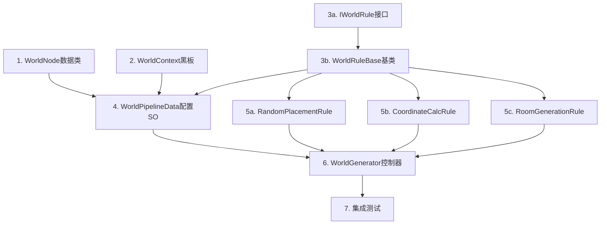

# 世界生成器 V4 - 任务分解（模块化规则管线架构）

> **任务名称**: WorldGenerator  
> **创建日期**: 2026-01-19  
> **阶段**: Phase 3 - Atomize  
> **架构**: 模块化规则管线（仿照房间生成器V4）

---

## 📊 任务依赖图



---

## 📋 任务清单

### Task 1: WorldNode 数据类
**文件**: `Data/WorldNode.cs`

| 项目 | 内容 |
|------|------|
| **输入** | 无 |
| **输出** | WorldNode.cs |
| **约束** | 命名空间: CryptaGeometrica.LevelGeneration.V4.World |

```csharp
[Serializable]
public class WorldNode
{
    public Vector2Int GridPosition;     // 网格坐标
    public Vector2Int WorldPixelOffset; // 世界像素偏移
    public int RoomSeed;                // 房间种子
    public bool IsGenerated;            // 是否已生成
}
```

**验收**: 类可编译

---

### Task 2: WorldContext 黑板
**文件**: `Core/WorldContext.cs`

| 项目 | 内容 |
|------|------|
| **依赖** | Task 1 |

```csharp
public class WorldContext : IDisposable
{
    public int GridSize;
    public int RoomCount;
    public Vector2Int RoomPixelSize;
    public bool[,] OccupancyGrid;
    public List<WorldNode> Nodes;
    public System.Random RNG;
    public int Seed;
    public CancellationToken Token;
    public DungeonGenerator DungeonGenerator; // 房间生成器引用
}
```

**验收**: IDisposable正确实现

---

### Task 3a: IWorldRule 接口
**文件**: `Rules/Abstractions/IWorldRule.cs`

```csharp
public interface IWorldRule
{
    string RuleName { get; }
    bool Enabled { get; set; }
    int ExecutionOrder { get; }
    UniTask<bool> ExecuteAsync(WorldContext context, CancellationToken token);
    bool Validate(out string errorMessage);
}
```

**验收**: 接口定义完整

---

### Task 3b: WorldRuleBase 基类
**文件**: `Rules/Abstractions/WorldRuleBase.cs`

| 项目 | 内容 |
|------|------|
| **依赖** | Task 3a |

```csharp
[Serializable]
public abstract class WorldRuleBase : IWorldRule
{
    [SerializeField] protected string _ruleName;
    [SerializeField] protected bool _enabled = true;
    [SerializeField] protected int _executionOrder = 100;
    [SerializeField] protected bool _enableLogging = true;
    
    // 实现接口 + 日志辅助方法
}
```

**验收**: 基类可继承

---

### Task 4: WorldPipelineData 配置SO
**文件**: `Core/WorldPipelineData.cs`

| 项目 | 内容 |
|------|------|
| **依赖** | Task 3a, 3b |

```csharp
[CreateAssetMenu(fileName = "WorldPipeline", 
    menuName = "Crypta Geometrica:RE/PCG程序化关卡/V4/World Pipeline")]
public class WorldPipelineData : ScriptableObject
{
    public int RoomCount = 6;
    public Vector2Int RoomPixelSize = new(64, 64);
    public DungeonPipelineData DungeonPipeline;
    public bool EnableLogging = true;
    
    [SerializeReference]
    public List<IWorldRule> Rules = new();
    
    public List<IWorldRule> GetEnabledRules();
    public bool ValidateAll(out List<string> errors);
}
```

**验收**: Inspector可配置规则列表

---

### Task 5a: RandomPlacementRule 放置规则
**文件**: `Rules/Layout/RandomPlacementRule.cs`

| 项目 | 内容 |
|------|------|
| **依赖** | Task 3b |
| **Order** | 10 |

```csharp
[Serializable]
public class RandomPlacementRule : WorldRuleBase
{
    [SerializeField] private float _spawnThreshold = 0.5f;
    
    // 随机放置房间节点
    // 正交方向禁止相邻，对角线允许
}
```

**验收**: 放置数量=RoomCount，间隔约束正确

---

### Task 5b: CoordinateCalcRule 坐标计算规则
**文件**: `Rules/Layout/CoordinateCalcRule.cs`

| 项目 | 内容 |
|------|------|
| **依赖** | Task 3b |
| **Order** | 20 |

```csharp
[Serializable]
public class CoordinateCalcRule : WorldRuleBase
{
    // 为每个WorldNode计算WorldPixelOffset
    // WorldPixelOffset = GridPosition × RoomPixelSize
}
```

**验收**: 所有节点WorldPixelOffset正确

---

### Task 5c: RoomGenerationRule 房间生成规则
**文件**: `Rules/Generation/RoomGenerationRule.cs`

| 项目 | 内容 |
|------|------|
| **依赖** | Task 3b |
| **Order** | 100 |

```csharp
[Serializable]
public class RoomGenerationRule : WorldRuleBase
{
    // 串行调用DungeonGenerator
    // 设置Context.WorldOffset后调用GenerateDungeonAsync
}
```

**验收**: 所有房间按顺序生成

---

### Task 6: WorldGenerator 控制器
**文件**: `Core/WorldGenerator.cs`

| 项目 | 内容 |
|------|------|
| **依赖** | Task 2, 4, 5a-c |

```csharp
public class WorldGenerator : MonoBehaviour
{
    [SerializeField] private WorldPipelineData _pipeline;
    [SerializeField] private DungeonGenerator _dungeonGenerator;
    [SerializeField] private int _seed = -1;
    
    public async UniTask<bool> GenerateWorldAsync(int seed = -1);
    public void CancelGeneration();
    public void ClearGeneration();
}
```

**验收**: 
- 编辑器按钮可触发
- 规则按Order顺序执行
- 支持取消

---

### Task 7: 集成测试
**文件**: 无新文件

| 测试用例 | 预期结果 |
|----------|----------|
| RoomCount=4 | 4×4网格，放置4个房间 |
| RoomCount=6 | 6×6网格，放置6个房间 |
| 间隔约束 | 正交方向无相邻房间 |
| 坐标偏移 | 房间渲染位置正确 |

---

## ⏱️ 时间估算

| Task | 估算时间 |
|------|----------|
| Task 1 | 10分钟 |
| Task 2 | 20分钟 |
| Task 3a | 10分钟 |
| Task 3b | 20分钟 |
| Task 4 | 25分钟 |
| Task 5a | 40分钟 |
| Task 5b | 15分钟 |
| Task 5c | 30分钟 |
| Task 6 | 45分钟 |
| Task 7 | 25分钟 |
| **总计** | **~4小时** |

---

## 🚀 请求审批

**模块化规则管线架构任务分解已完成。**

**输入 `Y` 或 `Proceed` 开始 Phase 5 (编码实现)**

---

> **文档版本**: 2.0  
> **状态**: 等待审批
