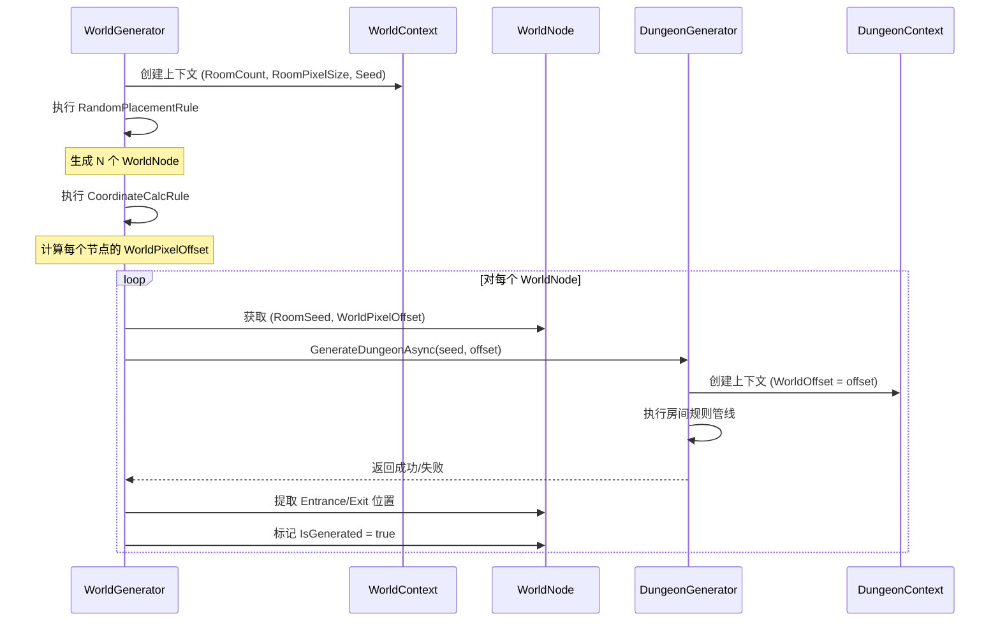

# 世界生成器 V4 技术文档

## 目录

1. [系统概述](#系统概述)
2. [架构设计](#架构设计)
3. [核心组件](#核心组件)
4. [规则管线](#规则管线)
5. [算法详解](#算法详解)
6. [数据流](#数据流)
7. [使用指南](#使用指南)

---

## 系统概述

世界生成器V4是一个基于规则管线的程序化世界生成系统，用于在2D网格中随机布局房间并调用房间生成器V4生成具体房间内容。

### 设计理念

- **规则管线（Rule Pipeline）**：将生成过程分解为独立的规则，按顺序串行执行
- **黑板模式（Blackboard Pattern）**：通过 `WorldContext` 共享数据，解耦规则之间的依赖
- **异步执行**：基于 UniTask 的异步架构，支持取消和中断

### 技术栈

| 技术           | 用途       |
| -------------- | ---------- |
| UniTask        | 异步编程   |
| Odin Inspector | 编辑器扩展 |
| Unity Tilemap  | 地图渲染   |

---

## 架构设计

### 系统架构图


### 类关系图


---

## 核心组件

### 1. WorldGenerator（世界生成器）

**位置**: `Core/WorldGenerator.cs`

世界生成的主控制器，负责：

- 初始化生成上下文
- 按顺序执行规则管线
- 管理生成生命周期（开始/取消/清除）

**关键字段**:

| 字段                | 类型              | 描述           |
| ------------------- | ----------------- | -------------- |
| `_pipelineData`     | WorldPipelineData | 管线配置资产   |
| `_dungeonGenerator` | DungeonGenerator  | 房间生成器引用 |
| `_context`          | WorldContext      | 运行时上下文   |
| `_seed`             | int               | 随机种子       |

### 2. WorldContext（世界上下文）

**位置**: `Core/WorldContext.cs`

基于黑板模式的共享数据容器，在规则执行过程中传递数据。

**核心属性**:

| 属性            | 类型              | 描述                      |
| --------------- | ----------------- | ------------------------- |
| `GridSize`      | int               | 网格尺寸（RoomCount - 1） |
| `RoomCount`     | int               | 目标房间数量              |
| `RoomPixelSize` | Vector2Int        | 单房间像素尺寸            |
| `OccupancyGrid` | bool[,]           | 占用网格                  |
| `Nodes`         | List\<WorldNode\> | 世界节点列表              |
| `RNG`           | System.Random     | 随机数生成器              |
| `Seed`          | int               | 随机种子                  |

---

## 规则管线

### 规则执行顺序


---

## 算法详解

### 1. 稀疏随机放置算法 (Sparse Random Placement)

**规则类**: `RandomPlacementRule`  
**位置**: `Rules/Layout/RandomPlacementRule.cs`

该算法通过多轮随机尝试和严格的邻居约束，在网格中生成分布稀疏、互不相邻的房间布局。

#### 核心逻辑

1.  **初始化可用池**: 收集网格内所有坐标 `(x, y)`。
2.  **多轮尝试**:
    - 每轮打乱可用池顺序 (`ShuffleList`)。
    - 遍历每个位置，尝试放置房间。
3.  **约束检查**:
    - **随机阈值**: `Random.value > _spawnThreshold` 才允许放置（增加随机稀疏性）。
    - **隔离约束**: 目标位置周围 **8个方向**（正交+对角）必须全部为空。

#### 隔离约束图解


> **注意**: 红色区域必须全部为空，中心位置才能放置房间。

#### 强制填充机制

如果经过 `_maxRounds` 轮次后仍未达到目标 `RoomCount`，算法进入**强制模式**：忽略随机阈值，仅保留隔离约束，按顺序遍历网格填补空位，确保总是尽可能生成房间。

---

### 2. 坐标映射计算

**规则类**: `CoordinateCalcRule`

将抽象的网格坐标 `GridPosition` 转换为实际的像素坐标 `WorldPixelOffset`。此偏移量将传递给房间生成器，用于决定Tilemap绘制的基准点。

$$
\begin{cases}
WorldX = GridX \times RoomPixelWidth \\
WorldY = GridY \times RoomPixelHeight
\end{cases}
$$

---

### 3. 带重试的房间生成管线

**规则类**: `RoomGenerationRule`

负责协调从抽象节点到具体Tilemap内容的生成。

#### 算法流程


**关键点**:

- **串行执行**: 目前版本为了稳定性，采用逐个房间生成的方式。
- **独立上下文**: 每个房间有自己的 `DungeonContext`，互不干扰。
- **偏移绘制**: `DungeonGenerator` 接收 `worldOffset` 参数，直接在正确的Tilemap位置绘制瓦片。

---

## 配置指南

### 1. 创建管线配置

1. 右键 Project 窗口
2. Create → **Crypta Geometrica:RE/PCG程序化关卡/V4/World Pipeline**
3. 配置参数：
   - Room Count: 目标房间数量
   - Room Pixel Size: 单房间像素尺寸
   - Dungeon Pipeline: 引用房间生成管线

### 2. 添加生成规则

在规则列表中按顺序添加：

| 顺序 | 规则类型            | 作用     |
| ---- | ------------------- | -------- |
| 1    | RandomPlacementRule | 随机布局 |
| 2    | CoordinateCalcRule  | 坐标计算 |
| 3    | RoomGenerationRule  | 房间生成 |

### 3. 场景设置

1. 创建空对象，添加 `WorldGenerator` 组件
2. 拖拽管线配置到 Pipeline Data 字段
3. 拖拽 DungeonGenerator 引用
4. 点击 "生成世界" 按钮

### 4. 参数调优建议

| 参数            | 推荐值    | 说明                                   |
| --------------- | --------- | -------------------------------------- |
| 目标房间数量    | 4-8       | 决定网格大小为 (N-1)×(N-1)             |
| 生成阈值        | 0.4-0.6   | 越低房间越分散，越高越密集             |
| 最大尝试次数    | 100       | 单轮放置的最大尝试次数                 |
| 最大轮次        | 50        | 整体放置的最大轮次                     |
| 生成失败重试    | 开启      | 建议开启以提高生成成功率               |
| 最大重试次数    | 3         | 单个房间生成失败时的重试次数           |
| 生成间隔帧数    | 1         | 每个房间生成后等待帧数，避免UI卡顿     |

---

## 核心组件详解

### WorldGenerator 事件系统

| 事件                    | 签名                     | 描述                           |
| ----------------------- | ------------------------ | ------------------------------ |
| `OnGenerationStarted`   | `Action`                 | 生成开始时触发                 |
| `OnGenerationCompleted` | `Action<bool>`           | 生成完成时触发（参数为是否成功） |
| `OnGenerationProgress`  | `Action<int, int>`       | 规则执行进度（当前索引，总数） |

### WorldContext 关键方法

| 方法              | 签名                                      | 描述                      |
| ----------------- | ----------------------------------------- | ------------------------- |
| `IsInBounds`      | `bool IsInBounds(Vector2Int pos)`         | 检查坐标是否在网格边界内  |
| `IsOccupied`      | `bool IsOccupied(Vector2Int pos)`         | 检查网格位置是否被占用    |
| `SetOccupied`     | `void SetOccupied(Vector2Int pos, bool)`  | 设置网格位置占用状态      |
| `AddNode`         | `void AddNode(WorldNode node)`            | 添加世界节点并标记占用    |
| `NextRandomFloat` | `float NextRandomFloat()`                 | 获取 [0,1) 随机浮点数     |
| `NextRandomInt`   | `int NextRandomInt(int max)`              | 获取 [0,max) 随机整数     |
| `Reset`           | `void Reset(int newSeed = -1)`            | 重置上下文状态            |
| `Dispose`         | `void Dispose()`                          | 释放资源                  |

### WorldNode 数据结构

**位置**: `Data/WorldNode.cs`

表示世界网格中的一个房间节点。

| 属性                 | 类型         | 描述                           |
| -------------------- | ------------ | ------------------------------ |
| `GridPosition`       | Vector2Int   | 网格坐标 (0~GridSize-1)        |
| `WorldPixelOffset`   | Vector2Int   | 世界像素偏移量                 |
| `RoomSeed`           | int          | 房间生成种子                   |
| `IsGenerated`        | bool         | 是否已生成房间                 |
| `EntrancePosition`   | Vector2Int   | 入口像素位置（世界坐标）       |
| `ExitPosition`       | Vector2Int   | 出口像素位置（世界坐标）       |
| `HasEntranceExitData`| bool         | 是否有有效的出入口数据         |

**坐标计算公式**:

$$WorldPixelOffset = GridPosition \times RoomPixelSize$$

---

## 与房间生成器的集成

世界生成器V4与房间生成器V4采用**嵌套调用**模式：



### 集成要点

1. **WorldOffset 传递**: `RoomGenerationRule` 将 `WorldNode.WorldPixelOffset` 传递给 `DungeonGenerator.GenerateDungeonAsync(seed, offset)`
2. **种子隔离**: 每个房间使用独立的 `RoomSeed`，确保可复现性
3. **出入口提取**: 生成完成后，从 `DungeonContext.RoomNodes` 中提取起点/终点房间的门位置，转换为世界坐标存储
4. **重试机制**: 单个房间生成失败时，更换种子重试

---

## 调试功能

### Gizmos 可视化

`WorldGenerator` 提供 Scene 视图的 Gizmos 绘制功能：

| 元素     | 颜色（默认） | 描述               |
| -------- | ------------ | ------------------ |
| 网格线   | 绿色半透明   | 显示网格边界       |
| 房间块   | 蓝色半透明   | 已放置的房间位置   |
| 房间序号 | 白色         | 房间生成顺序       |
| 入口标记 | 绿色         | 十字准星 + "IN"    |
| 出口标记 | 黄色         | 十字准星 + "OUT"   |

**配置项**:

| 字段            | 类型  | 描述           |
| --------------- | ----- | -------------- |
| `_drawGizmos`   | bool  | 是否绘制Gizmos |
| `_gridColor`    | Color | 网格颜色       |
| `_roomColor`    | Color | 房间块颜色     |
| `_entranceColor`| Color | 入口标记颜色   |
| `_exitColor`    | Color | 出口标记颜色   |

### 日志输出

启用 `_enableLogging` 后，控制台将输出详细的生成日志：

```
[WorldGenerator] 开始生成世界 (种子: 12345)
[WorldGenerator] 执行 3 条规则
[WorldGenerator] 执行规则 [1/3]: 随机放置规则
[随机放置规则] 放置房间 [1/6] @ (2, 3)
...
[WorldGenerator] 世界生成完成 (6 个房间, 耗时: 1250ms)
```

---

## 附录

### 文件结构

```
WorldGeneration/
├── Core/
│   ├── WorldGenerator.cs      # 主控制器
│   ├── WorldContext.cs        # 上下文（黑板）
│   └── WorldPipelineData.cs   # 管线配置
├── Data/
│   └── WorldNode.cs           # 节点数据
└── Rules/
    ├── Abstractions/
    │   ├── IWorldRule.cs      # 规则接口
    │   └── WorldRuleBase.cs   # 规则基类
    ├── Layout/
    │   ├── RandomPlacementRule.cs  # 随机放置
    │   └── CoordinateCalcRule.cs   # 坐标计算
    └── Generation/
        └── RoomGenerationRule.cs   # 房间生成
```
