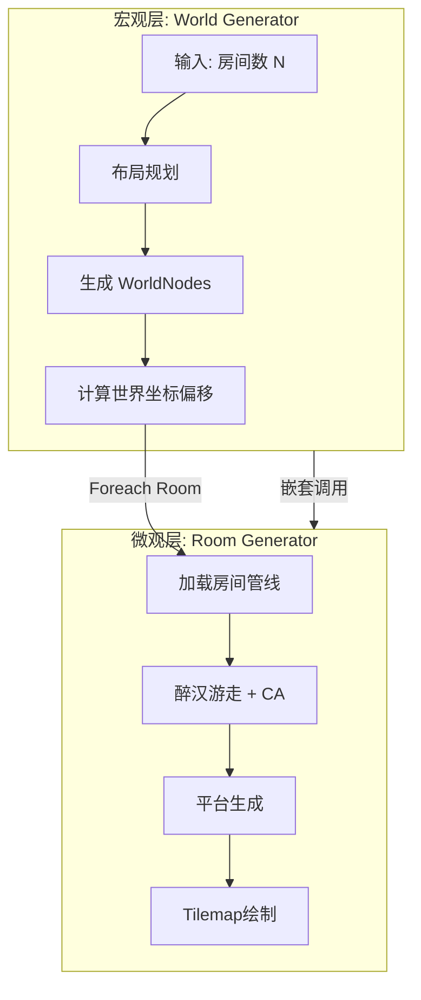
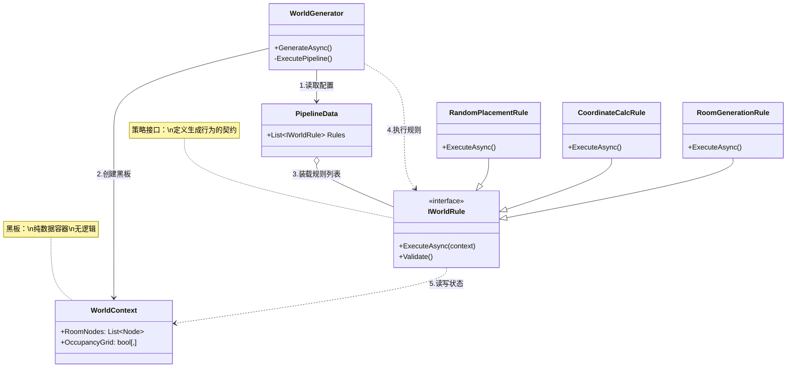
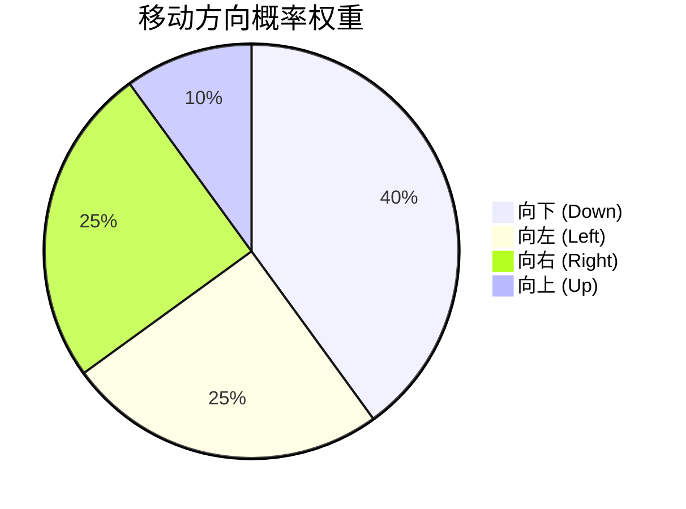
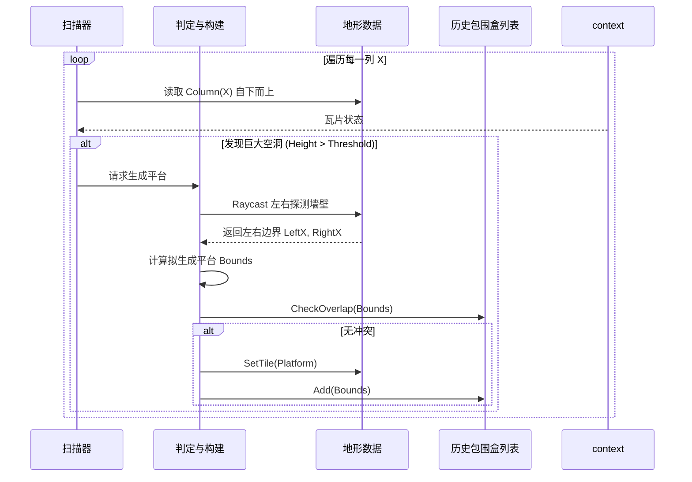

# 嵌套式程序化关卡生成系统 (PCG) V4 - 最终技术白皮书

> **文档版本**: 5.0 (Final Comprehensive)  
> **更新日期**: 2026-01-20  
> **核心架构**: Nested PCG + Loading Pipeline Pattern  
> **技术栈**: Unity 2022 LTS / UniTask / Odin Inspector

---

## 1. 绪论：嵌套式 PCG 的设计哲学

**Level Generation V4** 并不是一个简单的随机地图生成器，而是一套工业级的、基于 **分形设计思想** 的程序化内容生成框架。该系统致力于解决传统 PCG 开发中的核心矛盾：**随机性与可控性的对立**、**逻辑复杂性与可维护性的对立**。

### 1.1 核心概念：嵌套式生成 (Nested Generation)

系统将"关卡生成"这一宏大命题拆解为两个维度的抽象：

1.  **宏观维度 (World Generation)**: 关注拓扑结构、房间布局、非线性流程规划。
2.  **微观维度 (Room Generation)**: 关注瓦片绘制、地形演化、跳跃平台与敌人配置。

这种**分治策略 (Divide and Conquer)** 使得每一层的逻辑都保持高度内聚，互不干扰。



---

## 2. 软件工程架构：装载模式与可扩展性

V4 系统采用了基于 **策略模式 (Strategy Pattern)** 和 **命令模式 (Command Pattern)** 的 **装载模式架构 (Loading Pipeline Architecture)**。这是本系统在软件工程层面的核心创新。

### 2.1 架构原理分析

传统的生成器往往是一个几千行的 `God Class`，包含所有逻辑。V4 将生成的每一个步骤（布局、地形、渲染）都抽象为一个独立的 **规则 (Rule)**，这些规则通过 **管线数据 (Pipeline Data)** 动态装载到执行器中。

#### 分离式开发 (Decoupled Development)

- **逻辑与数据分离**: `Generator` (执行器) 不包含任何业务逻辑，只负责调度。业务逻辑全部封装在 `IGeneratorRule` 的实现类中。
- **配置与代码分离**: 策划人员通过 `ScriptableObject` 修改参数，程序员通过 C# 编写规则，两者通过 Unity Inspector 接口交互，互不阻塞。

#### 高内聚低耦合 (High Cohesion, Low Coupling)

通过 **黑板模式 (Blackboard Pattern)** 实现解耦：

- **耦合度**: 规则之间 **互不引用**。规则 A 生成的数据写入 `Context`，规则 B 从 `Context` 读取数据。A 和 B 不需要知道对方的存在。
- **内聚度**: 每个 `Rule` 类只负责一个极小的功能点（例如只负责"生成平台"），代码量通常控制在 200 行以内。

### 2.2 架构图解



### 2.3 装载模式优缺点深度分析

| 特性             | 详细描述                                              | 架构权衡 (Trade-off)                                                                                                                                 |
| :--------------- | :---------------------------------------------------- | :--------------------------------------------------------------------------------------------------------------------------------------------------- |
| **热插拔能力**   | 可以随时在 Inspector 中禁用某个规则，或调整执行顺序。 | **优势**: 极强的调试能力，可快速定位问题规则。<br>**劣势**: 极其依赖配置的正确性。                                                                   |
| **状态隐式依赖** | 规则之间通过 Context 隐式传递数据。                   | **优势**: 彻底的代码解耦。<br>**劣势**: 需要严格的文档或 Validate 检查来保证数据流的完整性（如：渲染规则必须在地形规则之后）。                       |
| **保护性开发**   | 基于接口的契约式设计。                                | **优势**: 单个规则的崩溃会被 Generator 捕获，不会导致编辑器崩溃；Validate 接口在运行前拦截非法参数。<br>**劣势**: 开发新规则需要编写额外的样板代码。 |

---

## 3. 世界生成器 (World Generator) 算法解析

**目标**: 在无限的2D平面上规划出一组互不重叠、分布合理的房间节点。

### 3.1 稀疏随机放置算法 (Sparse Random Placement)

为了避免生成过于规整的网格状地图，V4 采用了一种带有 **隔离约束 (Isolation Constraints)** 的随机采样算法。

#### 核心逻辑

1.  **坐标池构建**: 初始化所有可能的网格坐标 $(x, y)$。
2.  **随机洗牌**: Fisher-Yates 洗牌算法打乱坐标池。
3.  **约束检查**: 对于每一个候选坐标 $P$，检查其周围 8 邻域（Moore Neighborhood）:
    $$ \mathcal{N}(P) = \{ P + \Delta \mid \Delta \in \{-1,0,1\}^2, \Delta \neq (0,0) \} $$
    约束条件：$\forall N \in \mathcal{N}(P), \ IsOccupied(N) = \text{false}$。

#### 算法图示

```mermaid
graph TD
    Start([开始生成]) --> Init[初始化网格 & 随机池]
    Init --> Pick[从池中取出一个坐标 P]
    Pick --> CheckConstraints{检查所有 8 邻居\n是否均为空?}

    CheckConstraints -->|是| Place[<b>放置房间</b>]
    Place --> UpdateGrid[标记 Grid(P) = Occupied]
    UpdateGrid --> Count{房间数达标?}

    CheckConstraints -->|否| Discard[丢弃该坐标]
    Discard --> Retry{池中有剩余?}

    Retry -->|是| Pick
    Retry -->|否| Force[进入强制生成模式\n(忽略随机阈值)]

    Count -->|是| Done([生成完成])
    Count -->|否| Retry
```

### 3.2 坐标转换与数据流

世界生成器的最终产物是 `WorldNode` 列表，其中包含计算好的 **世界像素偏移 (World Pixel Offset)**：

$$
\begin{cases}
Offset_X = Grid_X \times RoomWidth_{pixel} \\
Offset_Y = Grid_Y \times RoomHeight_{pixel}
\end{cases}
$$

这一步至关重要，它充当了宏观层与微观层的 **桥梁**。房间生成器后续将基于这个 Offset 直接在 Tilemap 的正确位置绘制瓦片，实现无缝拼接。

---

## 4. 房间生成器 (Room Generator) 算法解析

**目标**: 在给定的矩形区域内，生成符合横版动作游戏体验的关卡内容（地形、平台、敌人）。

### 4.1 核心算法 A：约束醉汉游走 (Constrained Drunkard Walk)

用于生成房间的"骨架"（主要通路）。

- **设计目的**: 模拟重力。标准醉汉游走是各向同性的，而 Platformer 游戏通常需要"向下深入"或"横向探索"。
- **权重向量**: $W = \{ P_{down}=0.4, P_{side}=0.3, P_{up}=0.1 \}$。
- **智能回溯**: 当游走走进死胡同时，算法会从已生成的路径中随机选择一个点作为新起点（Branching），保证填满率。



### 4.2 核心算法 B：细胞自动机 (Cellular Automata)

用于将随机的骨架"腐蚀"成自然的洞穴。

- **规则变体**: B45/S4 (Born 4-5, Survive 4)。
- **边界保护**: 无论 CA 如何演化，算法会在最后强制将房间边界设为实心墙壁（门位置除外），防止玩家掉出地图。

### 4.3 核心算法 C：感知型空气柱采样 (Platform Generation)

这是 V4 系统中最复杂的算法，用于生成跳跃平台。传统的随机生成会导致平台位置不可达或重叠，本算法引入了 **环境感知 (Environment Awareness)**。

#### 算法步骤

1.  **垂直扫描 (Vertical Scan)**: 检测每一列的连续空气高度 $H_{air}$。
2.  **跳跃判定**: 若 $H_{air} \ge (H_{jump} \times 2 - Margin)$（二段跳高度），则触发生成。
3.  **自适应宽度 (Adaptive Width)**: 从触发点向左右射线检测，直到碰到墙壁，计算出最大可用宽度 $W_{avail}$。
4.  **AABB 冲突检测**: 维护一个 `PlacedBounds` 列表，使用 AABB 算法检测新平台是否与现有平台重叠。

#### 平台生成逻辑交互图



---

## 5. 性能优化与工程实践

### 5.1 异步时间切片 (Async Time-Slicing)

PCG 是计算密集型任务。为了防止主线程卡顿（导致 Loading 动画冻结），V4 全面使用了 `UniTask` 进行时间切片。

```csharp
// 代码片段：在繁重循环中主动让出 CPU
foreach (var room in context.RoomNodes) {
    await GenerateSingleRoom(room);

    // 每生成一个房间，暂停一帧，让 Unity 渲染 UI
    await UniTask.Yield(token);
}
```

- **效果**: 使得生成过程在用户眼中是流畅的进度条加载，而非程序假死。

### 5.2 内存布局优化

- **Tilemap 数据**: 放弃 `TileBase[,]` 对象数组，使用 `int[]` 原生一维数组。
  - **GC 优化**: 零 GC Alloc。
  - **缓存友好**: 连续内存极大提高了 CPU 缓存命中率。

### 5.3 保护性开发框架总结

| 机制                  | 描述                          | 目的                            |
| :-------------------- | :---------------------------- | :------------------------------ |
| **Validate 接口**     | 运行前自检参数有效性          | 防止非法参数导致死循环          |
| **Try-Catch 沙盒**    | 每个 Rule 包裹在 Try-Catch 中 | 防止单个规则 bug 崩溃整个生成器 |
| **CancellationToken** | 传递并将 Token 注入所有循环   | 允许用户随时安全取消生成        |

---

## 6. 总结

**Level Generation V4** 是一套集成了现代软件工程思想（SOLID、设计模式）与经典 PCG 算法（CA、RW、AABB）的综合解决方案。

通过 **嵌套式架构**，我们解决了"世界-房间"的尺度跨越问题；通过 **装载模式**，我们实现了逻辑与数据的完美解耦；通过 **保护性开发框架**，我们确保了工具的工业级稳定性。这也是目前针对横版动作游戏最成熟的程序化生成范式之一。
