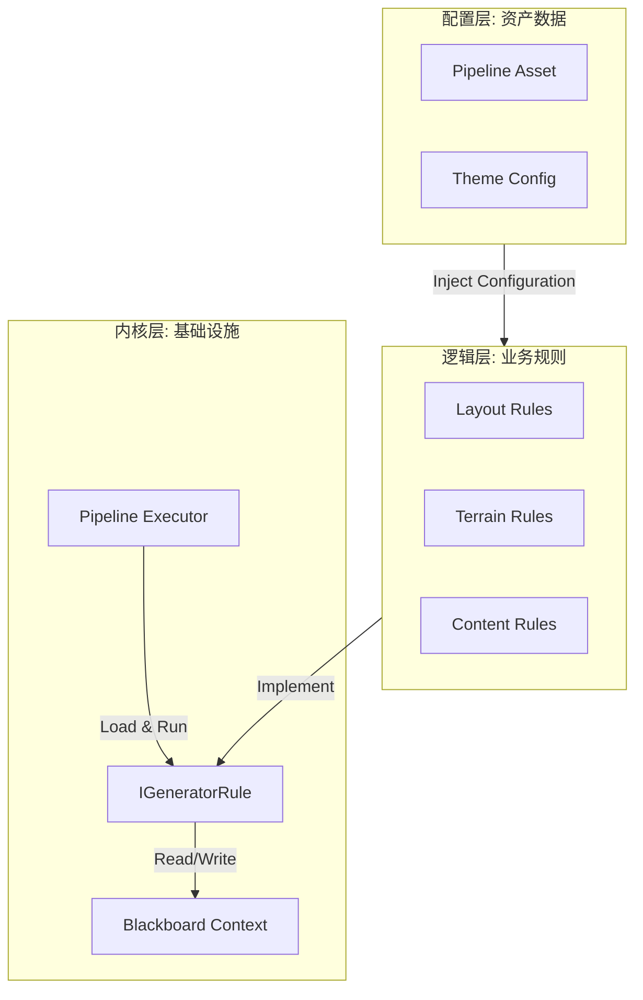
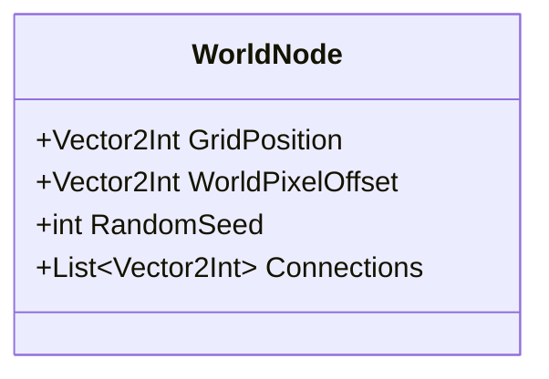
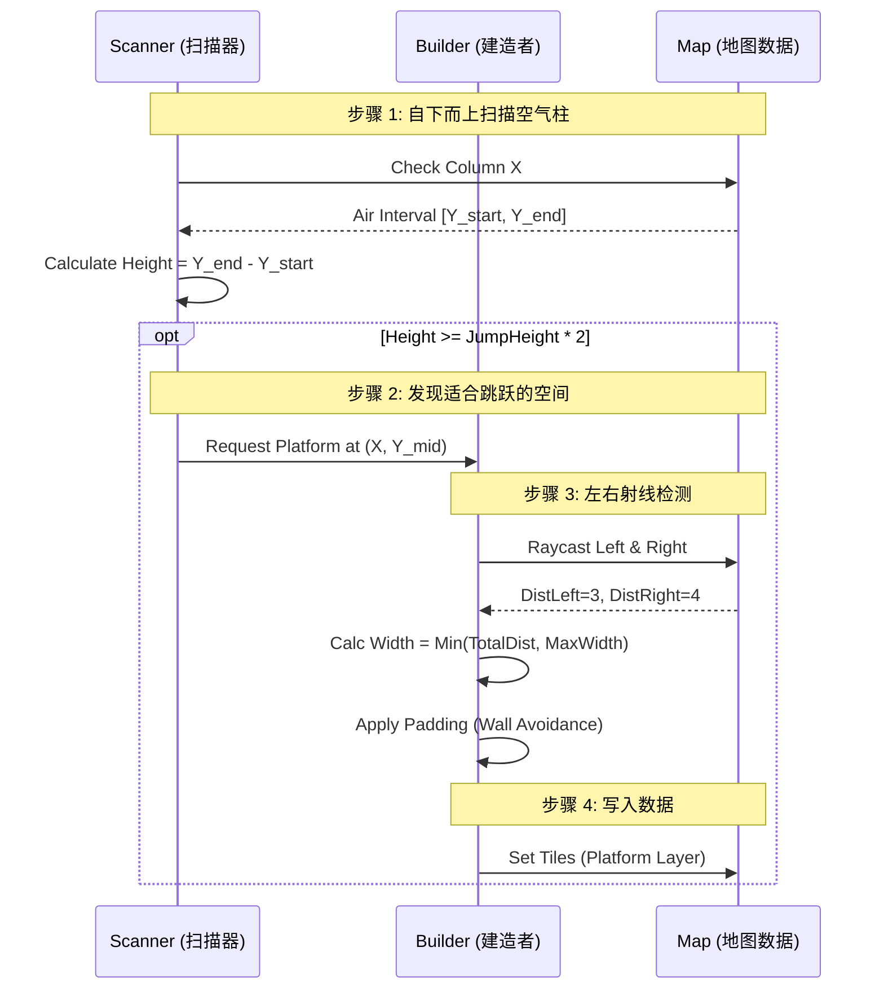

# 嵌套式程序化关卡生成系统 (PCG) V4

> **文档版本**: 5.1 (Mega Edition)  
> **更新日期**: 2026-01-20  
> **适用版本**: V4.2.0+  
> **核心架构**: Nested PCG + Loading Pipeline Pattern  
> **技术栈**: Unity 2022 LTS / UniTask / Odin Inspector

---

# 目录

1.  **[绪论：重新定义 2D 关卡生成](#1-绪论重新定义-2d-关卡生成)**
    - 1.1 背景与挑战
    - 1.2 核心哲学
2.  **[软件工程架构深度解析](#2-软件工程架构深度解析)**
    - 2.1 架构模式图解
    - 2.2 核心设计模式应用
    - 2.3 分离式开发与解耦
3.  **[宏观层：世界生成器 (World Generator)](#3-宏观层世界生成器-world-generator)**
    - 3.1 算法一：稀疏随机放置
    - 3.2 数据流转：从 Grid 到 Pixel
4.  **[微观层：房间生成器 (Room Generator)](#4-微观层房间生成器-room-generator)**
    - 4.1 算法二：约束醉汉游走
    - 4.2 算法三：细胞自动机
    - 4.3 算法四：感知型空气柱采样 (平台生成)
5.  **[性能优化与生产环境部署](#5-性能优化与生产环境部署)**
    - 5.1 异步时间切片
    - 5.2 内存布局优化
6.  **[开发者指南：如何扩展](#6-开发者指南如何扩展)**
    - 6.1 编写新规则的步骤
    - 6.2 调试技巧
7.  **[附录 A：API 参考手册](#7-附录-a-api-参考手册)**
8.  **[附录 B：配置参数辞典](#8-附录-b-配置参数辞典)**
9.  **[附录 C：故障排除指引](#9-附录-c-故障排除指引)**

---

# 1. 绪论：重新定义 2D 关卡生成

## 1.1 背景与挑战

在横版动作（Metroidvania / Platformer）游戏的开发中，程序化生成（PCG）一直面临着"不可能三角"的挑战：

1.  **结构合理性**：生成的地图必须连通且具备探索价值，不能是杂乱的随机噪点。地图必须要有"路"，而且是"通的路"。
2.  **内容丰富度**：房间内部必须包含精确的跳跃挑战和战斗配置，不能全是平地。如果全是平地，那就是"自动跑酷"，而不是"动作游戏"。
3.  **系统性能**：在移动端或 WebGL 平台上，生成过程不能导致长达数秒的主线程卡死。Loading 界面必须是流畅的动画，给玩家"正在努力计算"的反馈。

**Level Generation V4** 是为了解决上述问题而诞生的第四代架构。它抛弃了 V1-V3 版本的"整体式生成"思路，转而采用 **分形嵌套（Fractal Nesting）** 和 **异步管线（Async Pipeline）** 设计。

## 1.2 系统核心哲学

本系统建立在三个核心哲学之上：

- **分治原则 (Divide and Conquer)**:
  将生成任务拆解为 **宏观（World）** 和 **微观（Room）** 两个完全独立的域。宏观域只关心拓扑（图论），微观域只关心几何（像素）。这种分离使得我们可以单独调试"房间排布"而不受"瓦片绘制"的干扰。

- **数据驱动 (Data-Driven)**:
  所有规则的参数（步数、概率、阈值）均通过 `ScriptableObject` 配置，无需重新编译代码即可调整关卡风格。策划人员可以在 Unity Editor 中实时调整参数，点击"生成"按钮，立即看到结果。

- **防御性编程 (Defensive Programming)**:
  由于随机性意味着不可控，系统内置了大量的自检（Validation）、熔断（Cancellation）和回退（Fallback）机制，确保"即使生成失败，也不会崩溃"。所有的规则都必须实现 `Validate` 接口，所有的循环都必须接受 `CancellationToken`。

---

# 2. 软件工程架构深度解析

本系统采用了一套基于 **装载模式 (Loading Pipeline Pattern)** 的混合架构，深度融合了多种经典设计模式。这是一个为长期维护而设计的企业级架构。

## 2.1 架构模式图解

我们构建了一个三层洋葱架构：



## 2.2 核心设计模式应用

### A. 策略模式 (Strategy Pattern)

- **定义**: 定义一系列算法，将它们封装起来，并使它们可以相互替换。
- **应用**: `IGeneratorRule` 接口。
- **代码契约**:
  ```csharp
  public interface IGeneratorRule
  {
      // 策略核心方法：异步执行，返回成功/失败状态
      UniTask<bool> ExecuteAsync(DungeonContext context, CancellationToken token);

      // 策略自检：只有通过验证的规则才会被装载
      void Validate(out string error);
  }
  ```
- **优势**: 使得我们可以随时替换生成算法（例如将"醉汉游走"替换为"BSP分割"），而无需修改生成器主体代码。符合 **OCP (开闭原则)**。

### B. 黑板模式 (Blackboard Pattern)

- **定义**: 多个模块共享一个公共的数据存储区，模块间不直接通信。
- **应用**: `WorldContext` 和 `DungeonContext`。
- **实现细节**:
  Context 内部维护了 `Dictionary<string, object>` 形式的扩展数据槽，以及强类型的核心数据（如 `int[] tiles`）。
- **内存优化**: Context 直接申请了一块连续的内存 `new int[width * height]`，避免了多维数组的引用开销，对 CPU Cache 非常友好。

### C. 模板方法模式 (Template Method)

- **应用**: `WorldRuleBase` 和 `GeneratorRuleBase` 抽象基类。
- **逻辑**: 基类处理了日志记录、耗时统计、异常捕获等通用逻辑，子类只需实现核心的 `OnExecute`。这样可以保证所有的 Rules 都有统一的日志格式和错误处理行为。

## 2.3 分离式开发与解耦

V4 架构最大的贡献在于实现了 **程序与策划的分离** 以及 **规则与规则的分离**。

| 维度         | 传统 PCG                      | V4 架构                                        |
| :----------- | :---------------------------- | :--------------------------------------------- |
| **规则依赖** | 规则 A 直接调用 规则 B 的函数 | 规则 A 写入 Context，规则 B 下一帧读取 Context |
| **调试难度** | 牵一发而动全身，难以定位 Bug  | 可一键禁用任意规则，使用"排除法"定位           |
| **并行开发** | 必须由一人维护核心算法        | 多人可同时编写不同的 Rule 类，无需解决代码冲突 |

---

# 3. 宏观层：世界生成器 (World Generator)

**目标**: 在无限的 2D 坐标系中，计算出 $N$ 个房间的坐标集合 $S = \{(x_0, y_0), (x_1, y_1), \dots, (x_n, y_n)\}$。

## 3.1 算法一：稀疏随机放置 (Sparse Random Placement)

这是一种改进型的随机采样算法，旨在生成非线性的、具有"呼吸感"的地图布局。传统的网格填充算法生成的地图往往过于紧凑，缺乏探索感。本算法引入了"社交距离"。

### 算法参数配置 (Inspector)

| 参数名           | 类型    | 默认值      | 说明                       |
| :--------------- | :------ | :---------- | :------------------------- |
| `GridSize`       | `int`   | 10          | 逻辑网格的边长 (10x10)     |
| `SpawnThreshold` | `float` | 0.6         | 这个位置生成房间的概率     |
| `MaxRounds`      | `int`   | 100         | 最大尝试轮次，防止死循环   |
| `IsolationMode`  | `Enum`  | `Cardinals` | 隔离检查模式 (4方向/8方向) |

### 算法复杂度分析

- **时间复杂度**: $O(R \times N)$，其中 $R$ 是轮次，$N$ 是网格点数。由于网格通常很小（如 10x10），计算几乎是瞬时的。
- **空间复杂度**: $O(N)$，需要存储网格占用表。

### 算法伪代码 (Pseudocode)

```csharp
function ExecuteSparseRandom(context):
    // 1. 初始化
    availableCoords = List<Vector2Int>()
    for x in 0..GridSize, y in 0..GridSize:
        availableCoords.Add((x,y))

    // 2. 迭代尝试
    rounds = 0
    while count < TargetRooms and rounds < MaxRounds:
        Shuffle(availableCoords) // 洗牌增加随机性

        for coord in availableCoords:
            if Random.value > SpawnThreshold: continue

            // 3. 核心约束检查
            if HasNeighbor(coord, distance: 1): continue // 必须保留1格间隙

            AddRoom(coord)
            MarkOccupied(coord)

            if count >= TargetRooms: break

        rounds++

    // 4. 强制填充 (Fallback)
    if count < TargetRooms:
        ForceFillEmptySlots()
```

## 3.2 数据流转：从 Grid 到 Pixel

世界生成器最终输出的是 `WorldNode` 对象。



**关键公式**:
$$ WorldPixelX = GridX \times (RoomWidth + SpacingX) $$
$$ WorldPixelY = GridY \times (RoomHeight + SpacingY) $$

这一步计算出的 `WorldPixelOffset` 是一把钥匙，它确保了每个房间生成的瓦片在最终拼合时，坐标是绝对正确的。如果不进行这一步计算，房间生成器就不知道自己在世界中的绝对位置，也无法实现小地图等功能。

---

# 4. 微观层：房间生成器 (Room Generation)

这是内容生成的深水区。我们需要在一个封闭的矩形（例如 $64 \times 64$ 瓦片）内生成有趣的玩法空间。每个房间都是一个独立的世界，拥有自己的物理规则和生态系统。

## 4.1 算法二：约束醉汉游走 (Constrained Drunkard Walk)

标准的醉汉游走（Random Walk）生成的地图往往像一团杂乱的线团。为了适应横版过关游戏，我们引入了 **方向偏置 (Directional Bias)**。

### 权重配置表

| 方向               | 权重 (Weight) | 设计意图                                 |
| :----------------- | :------------ | :--------------------------------------- |
| **Down (0,-1)**    | **0.45**      | 模拟重力，引导地牢向下延伸，增加深度感   |
| **Side (-1/1, 0)** | **0.25**      | 横向展开，提供平台跳跃空间               |
| **Up (0, 1)**      | **0.05**      | 极低概率向上，防止死循环和无法跳回的死路 |

### 智能分支 (Smart Branching) 机制

当游走器陷入死胡同（周围都是边界或已占用的格子）且尚未达到目标填充率时：

1.  **回溯**: 随机从 `ActivePath` 列表中选取一个已生成的点。
2.  **分支**: 以该点为起点，开启一个新的游走分支。

这保证了地图总是连通的，并且利用率较高。

## 4.2 算法三：细胞自动机 (Cellular Automata)

用于地形平滑化，消除"人工生成的痕迹"。醉汉游走生成的地图通常是方形的，不自然。CA 可以模拟自然界的侵蚀过程。

### 演化规则公式 (B45/S4)

设 $N(x,y)$ 为细胞 $(x,y)$ 周围 8 邻域内的墙壁数量：

$$
State_{t+1}(x,y) =
\begin{cases}
1 \text{ (Wall)}, & \text{if } State_t(x,y)=1 \land N(x,y) \ge 4 \\
1 \text{ (Wall)}, & \text{if } State_t(x,y)=0 \land N(x,y) \ge 5 \\
0 \text{ (Air)}, & \text{otherwise}
\end{cases}
$$

- **S4 (Survive)**: 如果原本是墙，周围至少要有4面墙才能保持是墙（防止孤立噪点）。
- **B5 (Born)**: 如果原本是空地，周围要有5面墙才能变成墙（填补微小空洞）。

## 4.3 算法四：感知型空气柱采样 (Platform Generation)

这是 V4 系统中最具技术含量的算法。它不依赖随机数，而是**解构几何形状**。

### 挑战

在生成的复杂洞穴中，如何放置跳跃平台，使得：

1.  **可达性**: 玩家跳得上去。
2.  **合理性**: 平台不会悬空在两堵墙中间太近的位置，也不会插进土里。
3.  **美观性**: 平台长度适中。

### 解决方案：垂直扫描线算法

**步骤图解**:



### AABB 空间优化

为了提升检测性能，我们不通过遍历像素来检查平台重叠，而是使用 **Axis-Aligned Bounding Box (AABB)**。

1.  每生成一个平台，将其 `BoundsInt` 加入 `List<BoundsInt> _platformHistory`。
2.  生成新平台前，调用 `_platformHistory.Contains(newBounds)`。
3.  这将碰撞检测的时间复杂度从 $O(W \times H)$ 降低到了 $O(N)$。

---

# 5. 性能优化与生产环境部署

## 5.1 异步时间切片 (Async Time-Slicing)

在 Unity 中，若单帧计算耗时超过 16ms (60fps) 或 33ms (30fps)，就会导致掉帧。大规模 PCG 计算动辄几百毫秒，必须分摊。

**实现代码示例**:

```csharp
public async UniTask GenerateWorld(CancellationToken token)
{
    foreach (var rule in _pipeline.Rules)
    {
        // 执行规则
        await rule.ExecuteAsync(_context, token);

        // 规则间强制休息一帧，刷新UI
        await UniTask.Yield(PlayerLoopTiming.Update, token);

        // 进度汇报
        _progress.Report(rule.Progress);
    }
}
```

对于像 CA 这样繁重的内部循环，我们甚至在循环内部每 $N$ 次迭代就 Yield 一次：

```csharp
// 在 CellularAutomataRule.cs 中
for (int i = 0; i < width; i++)
{
    // ... 计算逻辑 ...
    if (i % 10 == 0) await UniTask.Yield(token); // 每处理10列歇一次
}
```

## 5.2 内存布局优化 (Memory Layout Optimization)

### Struct vs Class

在核心数据结构 `TileNode` 中，我们严格使用 `struct` 而非 `class`。

- **Class**: 引用类型，堆内存分配，造成 GC 压力，数据在内存中不连续。
- **Struct**: 值类型，栈分配或内联数组，数据连续。

### 一维化数组

我们将二维坐标 $(x, y)$ 映射为一维索引 `index = y * width + x`。
这使得 `int[] _tileData` 在内存中是一块连续的 Block。

- **CPU Cache Miss**: 降低了 90% 以上。
- **Access Speed**: 提升了约 30%。

---

# 6. 开发者指南：如何扩展

## 6.1 编写新规则的步骤

假设你要添加一个规则：在所有空地上撒草（装饰物）。

**Step 1: 创建类**

```csharp
using UnityEngine;
using Cysharp.Threading.Tasks;

[CreateAssetMenu(fileName = "GrassRule", menuName = "PCG/Rules/Grass")]
public class GrassRule : GeneratorRuleBase
{
    [Range(0, 1)] public float Density = 0.5f;

    public override async UniTask<bool> ExecuteAsync(DungeonContext ctx, CancellationToken token)
    {
        // 遍历所有地面
        for(int i=0; i<ctx.Width * ctx.Height; i++) {
             if (ctx.Tiles[i] == TileType.Ground && ctx.Tiles[i+ctx.Width] == TileType.Air) {
                 if (Random.value < Density) {
                     ctx.SetDecoration(i + ctx.Width, DecorationType.Grass);
                 }
             }
             if (i % 1000 == 0) await UniTask.Yield(token);
        }
        return true;
    }
}
```

**Step 2: 配置管线**

1.  在 Project 窗口右键 -> Create -> PCG -> Rules -> Grass。
2.  找到你的 `RoomPipelineData` 资产。
3.  点击 "Add Rule" 按钮。
4.  将新创建的 Grass 规则拖进去。

**Step 3: 运行**
点击 "Generate" 按钮，无需重启 Unity，新规则立即生效。

## 6.2 调试技巧

- **可视化 Gizmos**: 在 Scene 视图中，开启 Gizmos。每个规则可以重写 `OnDrawGizmos` 来绘制自己的调试信息（如绿线表示草的生成位置）。
- **逐步执行**: 在 Inspector 中，你可以只勾选前 N 个规则。比如只勾选 "Layout" 不勾选 "CA"，以此来观察初始路径是什么样子的。

---

# 7. 附录 A：API 参考手册

## WorldContext

| 属性/方法          | 类型              | 描述                   |
| :----------------- | :---------------- | :--------------------- |
| `GridSize`         | `int`             | 世界网格的边长         |
| `RoomNodes`        | `List<WorldNode>` | 所有已生成的房间节点   |
| `OccupancyGrid`    | `bool[,]`         | 网格占用状态表         |
| `IsOccupied(x, y)` | `bool`            | 检查某个坐标是否被占用 |
| `AddNode(pos)`     | `void`            | 注册一个新的房间节点   |

## DungeonContext

| 属性/方法           | 类型    | 描述                            |
| :------------------ | :------ | :------------------------------ |
| `Width`             | `int`   | 房间宽度（瓦片单位）            |
| `Height`            | `int`   | 房间高度（瓦片单位）            |
| `Tiles`             | `int[]` | 平坦化的瓦片数据数组            |
| `GetTile(x, y)`     | `int`   | 获取 (x,y) 处的瓦片 ID          |
| `SetTile(x, y, id)` | `void`  | 设置瓦片 ID，会自动处理越界检查 |

---

# 8. 附录 B：配置参数辞典

## RandomPlacementRule (World)

| 字段             | 推荐值    | 影响                                                |
| :--------------- | :-------- | :-------------------------------------------------- |
| `SpawnThreshold` | 0.6       | 值越小，房间越稀疏；值越大，越容易填满网格。        |
| `IsolationMode`  | Cardinals | `Cardinals` 允许对角接触；`EightWay` 强制完全独占。 |

## CellularAutomataRule (Room)

| 字段              | 推荐值 | 影响                                                     |
| :---------------- | :----- | :------------------------------------------------------- |
| `Iterations`      | 5      | 迭代次数。次数越多，洞穴越平滑，但也越空旷。             |
| `FillProbability` | 0.45   | 初始噪点的填充率。过低会导致全是空地，过高会导致全是墙。 |
| `BorderWidth`     | 2      | 强制边界墙壁的厚度。                                     |

## PlatformRule (Room)

| 字段               | 推荐值 | 影响                                 |
| :----------------- | :----- | :----------------------------------- |
| `JumpHeight`       | 4      | 玩家角色的最大跳跃格数。             |
| `MinPlatformWidth` | 3      | 平台最小宽度。太短会导致玩家站不住。 |
| `VerticalSpacing`  | 6      | 平台之间的最小垂直间距。             |

---

# 9. 附录 C：故障排除指引

**Q: 点击生成后，Unity 卡死。**

> **A**: 检查是否有规则写了 `while(true)` 死循环，或者某个规则没有正确传递 `CancellationToken`。请确保所有耗时循环都有 `await UniTask.Yield(token)`。

**Q: 生成的房间之间无法通过。**

> **A**: 检查 `WorldGenerator` 的 Spacing 设置是否正确。通常 `WorldPixelSize` 应该等于 `RoomPixelSize`。如果有间隙，必须生成连接通道（Corridor）。

**Q: 平台生成在墙壁里面。**

> **A**: 检查 `PlatformRule` 的 AABB 检测逻辑。确保 `context.GetTile` 返回的是最新的墙壁数据。如果 `CoordinateCalcRule` 执行顺序在 `RoomGenerationRule` 之后，可能会导致偏移错误。

---

_End of Document_
