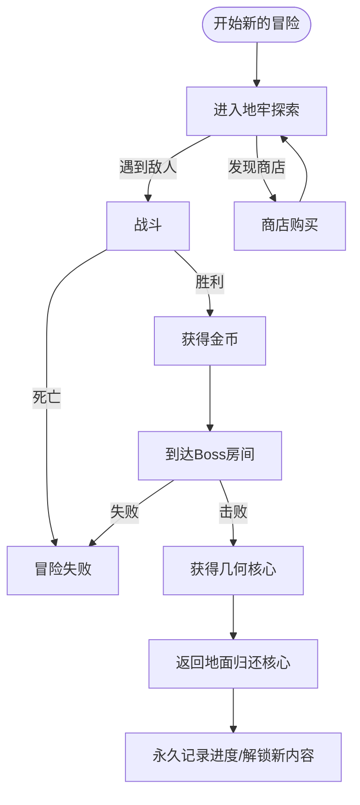

# CRYPTA GEOMETRICA | 几何地窖

<p align="center">
  
  
  
  
</p>

<p align="center">
  <b>一款由单人独立开发的横板动作类 Roguelite 游戏</b>
</p>

---

## 📖 目录

- [游戏简介](#-游戏简介)
- [灵感来源](#-灵感来源)
- [游戏玩法](#-游戏玩法)
- [技术架构](#-技术架构)
- [技术栈](#-技术栈)
- [项目结构](#-项目结构)
- [许可证](#-许可证)

---

## 🎮 游戏简介

《**CRYPTA GEOMETRICA**》是一款极具辨识度的横板动作类 Roguelite 游戏。游戏采用**矢量几何线框美术风格**，搭配冷峻科幻的视觉基调，构建出一个充满未知与危险的几何地下城世界。

### 核心特性

| 特性 | 描述 |
|------|------|
| 🎲 **随机生成** | 每次冒险的地牢结构都是程序化生成的，保证新鲜感 |
| ⚔️ **精准战斗** | 参考《空洞骑士》的战斗系统，强调读招预判与风险回报 |
| 🔄 **Roguelite 循环** | 局内重置 + 局外永久解锁的双轨机制 |
| 🎨 **几何美学** | 矢量线框 + 科幻光影，极简而富有辨识度 |

### 故事背景

在几何矩阵世界中，矩形、三角形、圆形三大几何生命体族群各自建立国度。三角形君王的野心打破了平衡，他企图融合其他几何生命体的核心力量，却导致实验失控。你作为**矩形勇者**，肩负着消灭失控的复合怪物、夺回核心几何件、重建世界秩序的使命。

---

## 💡 灵感来源

### 1. 美术风格：《几何冲刺》(Geometry Dash)

借鉴极简纯粹的几何体构成逻辑。角色与怪物均以 1-3 个基础几何体为核心搭建，Boss 则通过多个几何体的组合拼接呈现复杂的视觉形象。融入科幻线框光影效果，搭配高对比度的霓虹色彩与冷峻暗色调背景。

### 2. 关卡设计：《死亡细胞》× 《洞穴冒险》

核心继承《死亡细胞》"局内随机生成 + 局外永久解锁"的双轨循环机制。关卡生成采用**随机游走算法规划主路径**的宏观框架，嵌套《洞穴冒险》式的房间种子库设计，实现"低成本高多样性"的关卡体验。

### 3. 操作与战斗：《空洞骑士》

参考经典横板战斗动作系统，构建"接近 → 输出 → 撤离/防御 → 追击"的简洁战斗循环。战斗核心强调**风险-回报**与**读招预判**，鼓励玩家在谨慎判断与果断操作之间寻找平衡。

---

## 🕹️ 游戏玩法

### 核心循环



### 战斗系统

采用四阶段战斗循环：

1. **接近** - 观察敌人站位与攻击前摇，灵活使用跳跃接近目标
2. **输出** - 在敌人攻击间隙进行近距离输出（1.5x 伤害加成）
3. **撤离/防御** - 通过跳跃或二段跳规避伤害
4. **追击** - 利用敌人硬直继续输出或重新调整位置

### 房间类型

| 房间类型 | 功能 | 敌人配置 |
|----------|------|----------|
| 🗡️ **战斗房** | 基础战斗与资源获取 | 2-4 个敌人 |
| ⚔️ **精英房** | 中短时高压挑战 | 精英组合 |
| 🏕️ **休息房** | 恢复与节奏缓冲 | 无敌人 |
| 👑 **Boss 房** | 两阶段 Boss 战 | Boss |

---

## 🔧 技术架构

### 🎲 程序化关卡生成系统 (PCG V4)

采用**嵌套式程序化生成 (Nested PCG)** 和**异步管线 (Async Pipeline)** 设计。

| 层级 | 描述 |
|------|------|
| **宏观层 (World)** | 计算房间坐标，处理拓扑关系 |
| **微观层 (Room)** | 生成地形细节，处理几何像素 |

#### 核心算法

| 算法 | 用途 |
|------|------|
| 稀疏随机放置 | 世界布局生成 |
| 约束醉汉游走 | 房间内部布局 |
| 细胞自动机 | 地形平滑化 |
| 空气柱采样 | 平台智能放置 |

### 🎛️ 游戏管理器架构

采用**容器化服务架构**，避免大量单例导致的初始化顺序混乱。

```
[GameManager] (DontDestroyOnLoad)
  ├── [AsyncSceneManager]
  ├── [SaveManager]
  └── [FutureSystem...]
```

- 所有模块遵循 `IGameModule` 接口
- 统一生命周期管理：Init → Update → Dispose
- 开发阶段任何场景自动初始化

### 📡 全局消息系统

基于**发布-订阅模式（Pub/Sub）**的低耦合通信系统。

| 特性 | 描述 |
|------|------|
| 泛型支持 | 支持 0-3 个参数的消息传递 |
| 类型安全 | 编译期检查参数类型 |
| 自动清理 | 场景切换时自动清理非永久事件 |
| Event Monitor | 编辑器窗口实时监控消息流 |

---

## 🛠️ 技术栈

| 类别 | 技术 | 用途 |
|------|------|------|
| **引擎** | Unity 2022.3 LTS | 游戏引擎 |
| **异步编程** | [UniTask](https://github.com/Cysharp/UniTask) | 替代协程的异步框架 |
| **编辑器扩展** | [Odin Inspector](https://odininspector.com/) | Inspector UI 增强 |
| **动画系统** | DOTween Pro | 代码驱动动画 |
| **版本控制** | Git + GitHub | 源码管理 |

---

## 📁 项目结构

```
Assets/
├── 0_Documents/              # 设计文档
│   └── 0_Planning/           # 策划文档与参考图
├── 1_Scripts/                # 脚本代码
│   ├── 0_GameManager/        # 游戏管理器模块
│   ├── 0_MessageSystem/      # 消息系统
│   ├── 1_Player/             # 玩家控制
│   ├── 2_Enemy/              # 敌人 AI
│   └── 3_LevelGeneration/    # 关卡生成系统
│       ├── LevelGenerationV3/  # V3 版本
│       └── LevelGenerationV4/  # V4 版本（当前）
├── 2_Prefabs/                # 预制体
├── 3_Scenes/                 # 场景文件
└── 4_Art/                    # 美术资源
```

---

## 📄 许可证

本项目采用 MIT 许可证 - 详见 [LICENSE](LICENSE) 文件。

---

<p align="center">
  <b>CRYPTA GEOMETRICA</b> - 探索几何地窖的深处<br>
  <b>由一位努力学习的独立开发大学生自己完成</b>
</p>
