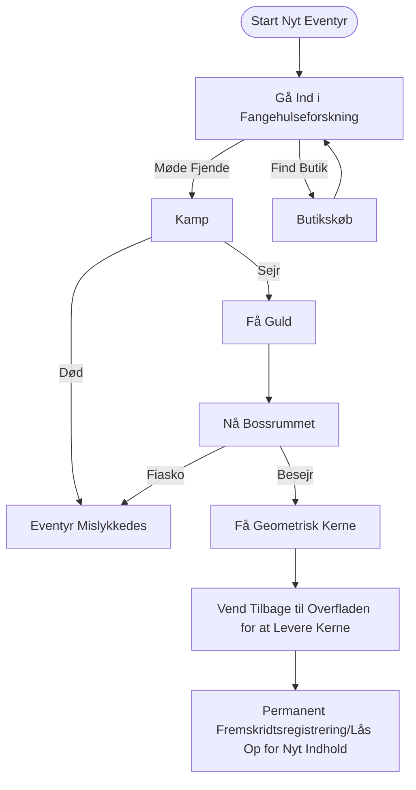

# CRYPTA GEOMETRICA | Geometrisk Krypt

<p align="center">
  
  
  
  
</p>

<p align="center">
  <b>Et sidescrollende action Roguelite-spil udviklet af en solo indie-udvikler</b>
</p>

---

## 📖 Indholdsfortegnelse

- [Spiloversigt](#-spiloversigt)
- [Inspirationer](#-inspirationer)
- [Gameplay](#-gameplay)
- [Teknisk Arkitektur](#-teknisk-arkitektur)
- [Teknologistak](#-teknologistak)
- [Projektstruktur](#-projektstruktur)
- [Licens](#-licens)

---

## 🎮 Spiloversigt

**CRYPTA GEOMETRICA** er et meget distinkt sidescrollende action Roguelite-spil. Spillet har en **vektor geometrisk wireframe kunststil**, parret med en kold, sci-fi visuel tone, der konstruerer en geometrisk fangehulsverden fuld af det ukendte og farer.

### Kernefunktioner

| Funktion | Beskrivelse |
|----------|-------------|
| 🎲 **Procedural Generering** | Hver fangehulsstruktur er procedurelt genereret, hvilket sikrer friske oplevelser |
| ⚔️ **Præcisionskamp** | Kampsystem inspireret af *Hollow Knight*, med vægt på at læse angreb og risiko-belønning |
| 🔄 **Roguelite Loop** | Nulstilling inden for kørsel + permanente oplåsninger mellem kørsler dobbeltsporsmekanisme |
| 🎨 **Geometrisk Æstetik** | Vektor-wireframes + sci-fi belysning, minimalistisk men meget genkendelig |

### Baggrundshistorie

I den Geometriske Matrixverden etablerede tre geometriske livsformfraktioner—rektangler, trekanter og cirkler—hver deres egne kongeriger. Trekantskongens ambition forstyrrede balancen, da han forsøgte at fusionere kernekræfter fra andre geometriske livsformer, hvilket fik eksperimentet til at løbe løbsk. Som **Rektangelhelten** bærer du missionen om at eliminere de oprørske sammensatte monstre, generobre de geometriske kernestykker og genoprette verdensordenen.

---

## 💡 Inspirationer

### 1. Kunststil: *Geometry Dash*

Trækker inspiration fra dens minimalistiske og rene geometriske kompositionslogik. Karakterer og fjender er bygget omkring 1-3 grundlæggende geometriske former, mens Bosser præsenterer komplekse visuelle former gennem kombinationen af flere geometriske kroppe. Inkorporerer sci-fi wireframe lyseffekter, parret med højkontrastfarver i neon og kolde, mørke baggrunde.

### 2. Banedesign: *Dead Cells* × *Spelunky*

Kernemekanik arver *Dead Cells'* "procedural generering inden for kørsel + permanent metaprogression" dobbeltsporsloop. Banegenerering bruger **tilfældig gangalgoritme til hovedstieplanlægning** som makroramme, indlejret med *Spelunky*-stil rumsfrødatabasedesign, hvilket opnår "lav-omkostning, høj-variation" baneoplevelser.

### 3. Kontroller & Kamp: *Hollow Knight*

Refererer til det klassiske sidescrollende kampaktionssystem, bygger en kortfattet kamploop af "nærme sig → angribe → trække sig tilbage/forsvare → forfølge". Kampkernen lægger vægt på **risiko-belønning** og **læse angreb**, opmuntrer spillere til at finde balance mellem forsigtig vurdering og beslutsom handling.

---

## 🕹️ Gameplay

### Kerneloop



### Kampsystem

Anvender en firefase kamploop:

1. **Nærme sig** - Observer fjendens positionering og angrebsoptakt, brug hopp fleksibelt for at lukke afstanden
2. **Angribe** - Påfør skade under fjendens angrebshuller (1.5x skadebonus på tæt hold)
3. **Trække sig tilbage/Forsvare** - Undvig skade gennem hopp eller dobbelthopp
4. **Forfølge** - Fortsæt med at angribe under fjendens stagger eller reposition

### Rumtyper

| Rumtype | Funktion | Fjendekonfiguration |
|---------|----------|---------------------|
| 🗡️ **Kamprum** | Grundlæggende kamp og ressourceanskaffelse | 2-4 fjender |
| ⚔️ **Eliterum** | Højtryksmøder | Elitekombinationer |
| 🏕️ **Hvilerum** | Genopretning og tempobuffer | Ingen fjender |
| 👑 **Bossrum** | Tofase Bosskamp | Boss |

---

## 🔧 Teknisk Arkitektur

### 🎲 Procedurelt Banegenereringssystem (PCG V4)

Bruger **Indlejret Procedural Generering (Nested PCG)** og **Async Pipeline**-design.

| Lag | Beskrivelse |
|-----|-------------|
| **Makrolag (Verden)** | Beregner rumskoordinater, håndterer topologiske relationer |
| **Mikrolag (Rum)** | Genererer terrændetaljer, behandler geometriske pixels |

#### Kernealgoritmer

| Algoritme | Formål |
|-----------|--------|
| Sparsom Tilfældig Placering | Verdenslayoutgenerering |
| Begrænset Tilfældig Gang | Rumindvendigt layout |
| Cellulær Automat | Terrænjævning |
| Luftsøjleprøvetagning | Intelligent platformplacering |

### 🎛️ Spilmanagerarkitektur

Anvender **Containeriseret Servicearkitektur** for at undgå initialiseringsordningskaos forårsaget af mange singletons.

```
[GameManager] (DontDestroyOnLoad)
  ├── [AsyncSceneManager]
  ├── [SaveManager]
  └── [FutureSystem...]
```

- Alle moduler følger `IGameModule`-grænsefladen
- Ensartet livscyklusstyring: Init → Update → Dispose
- Autoinitalisering fra enhver scene under udvikling

### 📡 Globalt Beskedsystem

Lavkoblet kommunikationssystem baseret på **Publicer-Abonner-mønster (Pub/Sub)**.

| Funktion | Beskrivelse |
|----------|-------------|
| Generisk Support | Understøtter beskedoverførsel med 0-3 parametre |
| Typesikkerhed | Kompileringstids parametertypekontrol |
| Automatisk Oprydning | Rydder automatisk ikke-permanente begivenheder ved sceneovergange |
| Begivenhedsmonitor | Redigeringsvindue til realtidsovervågning af beskedflow |

---

## 🛠️ Teknologistak

| Kategori | Teknologi | Formål |
|----------|-----------|--------|
| **Motor** | Unity 2022.3 LTS | Spilmotor |
| **Asynkron Programmering** | [UniTask](https://github.com/Cysharp/UniTask) | Asynkront framework der erstatter coroutines |
| **Redigeringsudvidelser** | [Odin Inspector](https://odininspector.com/) | Inspector UI-forbedring |
| **Animationssystem** | DOTween Pro | Kodedrevne animationer |
| **Versionskontrol** | Git + GitHub | Kildekodehåndtering |

---

## 📁 Projektstruktur

```
Assets/
├── 0_Documents/              # Designdokumenter
│   └── 0_Planning/           # Planlægningsdokumenter og referencebilleder
├── 1_Scripts/                # Scriptkode
│   ├── 0_GameManager/        # Spilmanagermodul
│   ├── 0_MessageSystem/      # Beskedsystem
│   ├── 1_Player/             # Spillerkontroller
│   ├── 2_Enemy/              # Fjende-AI
│   └── 3_LevelGeneration/    # Banegenereringssystem
│       ├── LevelGenerationV3/  # V3-version
│       └── LevelGenerationV4/  # V4-version (nuværende)
├── 2_Prefabs/                # Prefabs
├── 3_Scenes/                 # Scenefiler
└── 4_Art/                    # Kunstressourcer
```

---

## 📄 Licens

Dette projekt er licenseret under MIT-licensen - se [LICENSE](LICENSE)-filen for detaljer.

---

<p align="center">
  <b>CRYPTA GEOMETRICA</b> - Udforsk Dybderne af den Geometriske Krypt<br>
  <b>Skabt af en dedikeret indie solo-dev universitetsstuderende</b>
</p>
