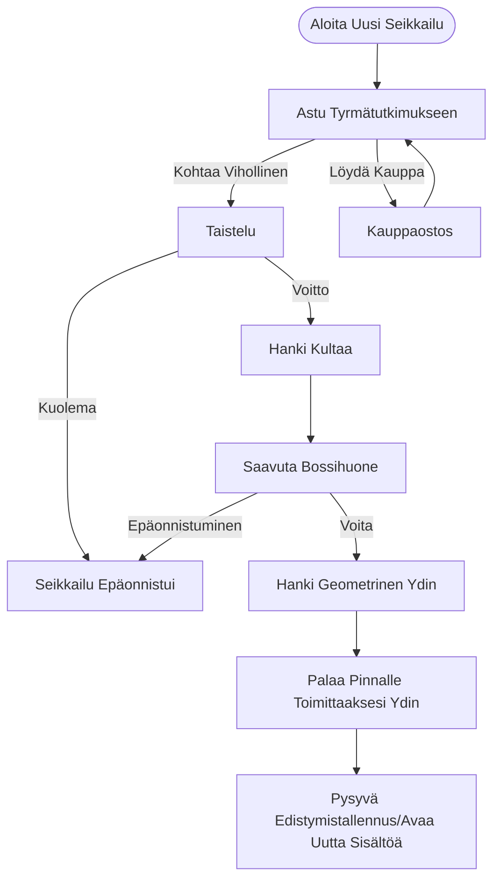

# CRYPTA GEOMETRICA | Geometrinen Krypta

<p align="center">
  
  
  
  
</p>

<p align="center">
  <b>Sivuttaisvieritteinen toiminta-Roguelite-peli, jonka on kehittänyt yksin toimiva indie-kehittäjä</b>
</p>

---

## 📖 Sisällysluettelo

- [Pelin Yleiskatsaus](#-pelin-yleiskatsaus)
- [Inspiraatiot](#-inspiraatiot)
- [Pelimekaniikka](#-pelimekaniikka)
- [Tekninen Arkkitehtuuri](#-tekninen-arkkitehtuuri)
- [Teknologiapino](#-teknologiapino)
- [Projektirakenne](#-projektirakenne)
- [Lisenssi](#-lisenssi)

---

## 🎮 Pelin Yleiskatsaus

**CRYPTA GEOMETRICA** on erittäin erottuva sivuttaisvieritteinen toiminta-Roguelite-peli. Pelissä on **vektori-geometrinen rautalankataidestyle**, yhdistettynä kylmään, scifi-visuaaliseen sävyyn, rakentaen geometrisen tyrmämaailman täynnä tuntemattomia ja vaaroja.

### Ydinominaisuudet

| Ominaisuus | Kuvaus |
|------------|--------|
| 🎲 **Proseduraalinen Generointi** | Jokainen tyrmärakenne on proseduraalisesti generoitu, varmistaen tuoreet kokemukset |
| ⚔️ **Tarkkuustaistelu** | Taistelujärjestelmä inspiroituna *Hollow Knightista*, painottaen hyökkäysten lukemista ja riski-palkkio -mekanismia |
| 🔄 **Roguelite-silmukka** | Nollaus kierroksen sisällä + pysyvät avaukset kierrosten välillä kaksiraitainen mekanismi |
| 🎨 **Geometrinen Estetiikka** | Vektori-rautalangat + scifi-valaistus, minimalistinen mutta erittäin tunnistettava |

### Taustatarina

Geometrisessa Matriisimaailmassa kolme geometrista elämänmuotofaktiota—suorakulmiot, kolmiot ja ympyrät—perustivat omat valtakuntansa. Kolmiokuninkaan kunnianhimo häiritsi tasapainoa, kun hän yritti yhdistää ydinvoimia muilta geometrisilta elämänmuodoilta, aiheuttaen kokeen riistäytymisen hallinnasta. **Suorakulmiosankarina** kannat tehtävää eliminoida kapinalliset yhdistelmähirviöt, vallata takaisin geometriset ydinkäpalat ja palauttaa maailmanjärjestys.

---

## 💡 Inspiraatiot

### 1. Taidestyle: *Geometry Dash*

Ammentaa inspiraatiota sen minimalistisesta ja puhtaasta geometrisesta kompositiologiikasta. Hahmot ja viholliset on rakennettu 1-3 perusgeometrisen muodon ympärille, kun taas Bossit esittävät monimutkaisia visuaalisia muotoja useiden geometristen kappaleiden yhdistelmällä. Sisältää scifi-rautalankavaloefektejä, yhdistettynä korkean kontrastin neonväreihin ja kylmiin, tummiin taustoihin.

### 2. Tasonsuunnittelu: *Dead Cells* × *Spelunky*

Ydinmekaniikka perii *Dead Cellsin* "proseduraalinen generointi kierroksen sisällä + pysyvä metaprogressio" kaksiraitaisen silmukan. Tasongenerointi käyttää **satunnaiskävelyalgoritmia pääpolun suunnitteluun** makroraamina, sisäkkäisenä *Spelunky*-tyylinen huoneensiemenkirjastosuunnittelu, saavuttaen "matalakustanteisen, korkeavaihtelun" tasokokemukset.

### 3. Kontrollit & Taistelu: *Hollow Knight*

Viittaa klassiseen sivuttaisvieritteiseen taistelutoimintajärjestelmään, rakentaen tiiviin taistelusilmukan: "lähesty → hyökkää → vetäydy/puolusta → jahda". Taistelun ydin painottaa **riski-palkkio** ja **hyökkäysten lukeminen**, kannustaen pelaajia löytämään tasapainon varovaisen arvioinnin ja päättäväisen toiminnan välillä.

---

## 🕹️ Pelimekaniikka

### Ydinsilmukka



### Taistelujärjestelmä

Käyttää nelivaiheista taistelusilmukkaa:

1. **Lähesty** - Tarkkaile vihollisen asemoitumista ja hyökkäyksen valmistelua, käytä hyppyjä joustavasti etäisyyden sulkemiseen
2. **Hyökkää** - Aiheuta vahinkoa vihollisen hyökkäysten välisenä aikana (1.5x vahinkobonus lähietäisyydellä)
3. **Vetäydy/Puolusta** - Väistä vahinkoa hyppyjen tai kaksoisyppyjen kautta
4. **Jahda** - Jatka hyökkäämistä vihollisen horjuessa tai uudelleenasemoi

### Huonetyypit

| Huonetyyppi | Toiminto | Vihollliskonfiguraatio |
|-------------|----------|------------------------|
| 🗡️ **Taisteluhuone** | Perustaistelu ja resurssienhankinta | 2-4 vihollista |
| ⚔️ **Eliittihuone** | Korkean paineen kohtaamiset | Eliittiyhdistelmät |
| 🏕️ **Lepohuone** | Palautuminen ja tahtipuskuri | Ei vihollisia |
| 👑 **Bossihuone** | Kaksivaiheinen Bossitaistelu | Boss |

---

## 🔧 Tekninen Arkkitehtuuri

### 🎲 Proseduraalinen Tasongenerointijärjestelmä (PCG V4)

Käyttää **Sisäkkäistä Proseduraalista Generointia (Nested PCG)** ja **Async Pipeline** -suunnittelua.

| Kerros | Kuvaus |
|--------|--------|
| **Makrokerros (Maailma)** | Laskee huonekoordinaatit, käsittelee topologiset suhteet |
| **Mikrokerros (Huone)** | Generoi maastoyksityiskohdat, käsittelee geometriset pikselit |

#### Ydinalgoritmit

| Algoritmi | Tarkoitus |
|-----------|-----------|
| Harva Satunnainen Sijoitus | Maailman asettelun generointi |
| Rajoitettu Satunnaiskävely | Huoneen sisäinen asettelu |
| Solulinen Automaatti | Maaston tasoitus |
| Ilmapilvinäytteenotto | Älykäs alustojen sijoitus |

### 🎛️ Pelimanageriarkkitehtuuri

Käyttää **Kontitettua Palveluarkkitehtuuria** välttääkseen lukuisten singletonien aiheuttaman alustamisjärjestyskaaoksen.

```
[GameManager] (DontDestroyOnLoad)
  ├── [AsyncSceneManager]
  ├── [SaveManager]
  └── [FutureSystem...]
```

- Kaikki moduulit noudattavat `IGameModule`-rajapintaa
- Yhtenäinen elinkaaren hallinta: Init → Update → Dispose
- Automaattinen alustus mistä tahansa kohtauksesta kehityksen aikana

### 📡 Globaali Viestijärjestelmä

Matalan kytkennän viestintäjärjestelmä perustuen **Julkaise-Tilaa-malliin (Pub/Sub)**.

| Ominaisuus | Kuvaus |
|------------|--------|
| Geneerinen Tuki | Tukee viestinvälitystä 0-3 parametrilla |
| Tyypiturvallisuus | Käännösaikainen parametrityyppitarkistus |
| Automaattinen Siivous | Tyhjentää automaattisesti ei-pysyvät tapahtumat kohtauksen vaihtuessa |
| Tapahtumamonitori | Editori-ikkuna reaaliaikaiseen viestivirran seurantaan |

---

## 🛠️ Teknologiapino

| Kategoria | Teknologia | Tarkoitus |
|-----------|------------|-----------|
| **Moottori** | Unity 2022.3 LTS | Pelimoottori |
| **Asynkroninen Ohjelmointi** | [UniTask](https://github.com/Cysharp/UniTask) | Asynkroninen kehys korvaamaan coroutinet |
| **Editorilaajenukset** | [Odin Inspector](https://odininspector.com/) | Inspector UI -parannus |
| **Animaatiojärjestelmä** | DOTween Pro | Koodilla ohjatut animaatiot |
| **Versionhallinta** | Git + GitHub | Lähdekoodin hallinta |

---

## 📁 Projektirakenne

```
Assets/
├── 0_Documents/              # Suunnitteludokumentit
│   └── 0_Planning/           # Suunnitteludokumentit ja referenssikuvat
├── 1_Scripts/                # Skriptikoodi
│   ├── 0_GameManager/        # Pelimanagerimoduuli
│   ├── 0_MessageSystem/      # Viestijärjestelmä
│   ├── 1_Player/             # Pelaajan kontrollit
│   ├── 2_Enemy/              # Vihollisen tekoäly
│   └── 3_LevelGeneration/    # Tasongenerojärjestelmä
│       ├── LevelGenerationV3/  # V3-versio
│       └── LevelGenerationV4/  # V4-versio (nykyinen)
├── 2_Prefabs/                # Prefabit
├── 3_Scenes/                 # Kohtaustiedostot
└── 4_Art/                    # Taideresurssit
```

---

## 📄 Lisenssi

Tämä projekti on lisensoitu MIT-lisenssillä - katso [LICENSE](LICENSE)-tiedosto lisätietoja varten.

---

<p align="center">
  <b>CRYPTA GEOMETRICA</b> - Tutustu Geometrisen Kryptan Syvyyksiin<br>
  <b>Luonut omistautunut indie-soolokehittäjä yliopisto-opiskelija</b>
</p>
