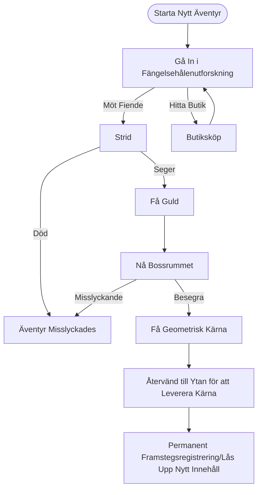

# CRYPTA GEOMETRICA | Geometrisk Krypta

<p align="center">
  
  
  
  
</p>

<p align="center">
  <b>Ett sidoscrollande action Roguelite-spel utvecklat av en ensam indieutvecklare</b>
</p>

---

## 📖 Innehållsförteckning

- [Spelöversikt](#-spelöversikt)
- [Inspirationer](#-inspirationer)
- [Spelmekanik](#-spelmekanik)
- [Teknisk Arkitektur](#-teknisk-arkitektur)
- [Teknikstack](#-teknikstack)
- [Projektstruktur](#-projektstruktur)
- [Licens](#-licens)

---

## 🎮 Spelöversikt

**CRYPTA GEOMETRICA** är ett distinkt sidoscrollande action Roguelite-spel. Spelet har en **vektor-geometrisk wireframe-konststil**, parat med en kall, sci-fi visuell ton, som konstruerar en geometrisk fängelsehålevärld full av okända och faror.

### Kärnfunktioner

| Funktion | Beskrivning |
|----------|-------------|
| 🎲 **Procedurgenerering** | Varje fängelsehålestruktur är procedurellt genererad, vilket säkerställer fräscha upplevelser |
| ⚔️ **Precisionsstrid** | Stridssystem inspirerat av *Hollow Knight*, med betoning på att läsa attacker och risk-belöning |
| 🔄 **Roguelite-loop** | Återställning inom körning + permanenta upplåsningar mellan körningar dubbelspårsmekanism |
| 🎨 **Geometrisk Estetik** | Vektor-wireframes + sci-fi-belysning, minimalistisk men mycket igenkännbar |

### Bakgrundshistoria

I den Geometriska Matrisvärlden etablerade tre geometriska livsformsfraktioner—rektanglar, trianglar och cirklar—sina egna kungadömen. Triangelkungens ambition störde balansen när han försökte sammanfoga kärnkrafter från andra geometriska livsformer, vilket fick experimentet att spåra ur. Som **Rektangelhjälten** bär du uppdraget att eliminera de rebelliska sammansatta monstren, återta de geometriska kärndelarna och återställa världsordningen.

---

## 💡 Inspirationer

### 1. Konststil: *Geometry Dash*

Hämtar inspiration från dess minimalistiska och rena geometriska kompositionslogik. Karaktärer och fiender är byggda kring 1-3 grundläggande geometriska former, medan Bossar presenterar komplexa visuella former genom kombinationen av flera geometriska kroppar. Inkorporerar sci-fi wireframe-ljuseffekter, parat med högkontrastiga neonfärger och kalla, mörka bakgrunder.

### 2. Bandesign: *Dead Cells* × *Spelunky*

Kärnmekanik ärver *Dead Cells* "procedurgenerering inom körning + permanent metaprogression" dubbelspårsloop. Bangenerering använder **slumpmässig gångalgoritm för huvudvägsplanering** som makroramverk, inkapslat med *Spelunky*-stil rumsfrödatabasdesign, vilket uppnår "lågkostnads, hög-variation" banupplevelser.

### 3. Kontroller & Strid: *Hollow Knight*

Refererar till det klassiska sidoscrollande stridsaktionssystemet, bygger en koncis stridsloop av "närma sig → attackera → retirera/försvara → jaga". Stridskärnan betonar **risk-belöning** och **läsa attacker**, uppmuntrar spelare att hitta balans mellan försiktig bedömning och beslutsam handling.

---

## 🕹️ Spelmekanik

### Kärnloop



### Stridssystem

Använder en fyrfas stridsloop:

1. **Närma sig** - Observera fiendens positionering och attackuppvärming, använd hopp flexibelt för att minska avståndet
2. **Attackera** - Orsaka skada under fiendens attackluckor (1.5x skadebonus på nära håll)
3. **Retirera/Försvara** - Undvik skada genom hopp eller dubbelhopp
4. **Jaga** - Fortsätt attackera under fiendens stagger eller ompositionera

### Rumstyper

| Rumstyp | Funktion | Fiendekonfiguration |
|---------|----------|---------------------|
| 🗡️ **Stridsrum** | Grundläggande strid och resursanskaffning | 2-4 fiender |
| ⚔️ **Elitrum** | Högtrycksmöten | Elitkombinationer |
| 🏕️ **Vilorum** | Återhämtning och tempobuffert | Inga fiender |
| 👑 **Bossrum** | Tvåfas Bossstrid | Boss |

---

## 🔧 Teknisk Arkitektur

### 🎲 Procedurellt Bangenereringssystem (PCG V4)

Använder **Inkapslade Procedurgenerering (Nested PCG)** och **Async Pipeline**-design.

| Lager | Beskrivning |
|-------|-------------|
| **Makrolager (Värld)** | Beräknar rumskoordinater, hanterar topologiska relationer |
| **Mikrolager (Rum)** | Genererar terrängdetaljer, bearbetar geometriska pixlar |

#### Kärnalgoritmer

| Algoritm | Syfte |
|----------|-------|
| Gles Slumpmässig Placering | Världslayoutgenerering |
| Begränsad Slumpmässig Gång | Rumsinnerlig layout |
| Cellulär Automat | Terrängutjämning |
| Luftkolumnprovtagning | Intelligent plattformsplacering |

### 🎛️ Spelhanterararkitektur

Använder **Containeriserad Tjänstearkitektur** för att undvika kaos i initialiseringsordning orsakad av många singletons.

```
[GameManager] (DontDestroyOnLoad)
  ├── [AsyncSceneManager]
  ├── [SaveManager]
  └── [FutureSystem...]
```

- Alla moduler följer `IGameModule`-gränssnittet
- Enhetlig livscykelhantering: Init → Update → Dispose
- Autoinitialisering från vilken scen som helst under utveckling

### 📡 Globalt Meddelandesystem

Lågkopplat kommunikationssystem baserat på **Publicera-Prenumerera-mönster (Pub/Sub)**.

| Funktion | Beskrivning |
|----------|-------------|
| Generiskt Stöd | Stöder meddelandeöverföring med 0-3 parametrar |
| Typsäkerhet | Kompileringstid parametertypkontroll |
| Automatisk Rensning | Rensar automatiskt icke-permanenta händelser vid scenövergångar |
| Händelsemonitor | Redigeringsfönster för realtidsövervakning av meddelandeflöde |

---

## 🛠️ Teknikstack

| Kategori | Teknologi | Syfte |
|----------|-----------|-------|
| **Motor** | Unity 2022.3 LTS | Spelmotor |
| **Asynkron Programmering** | [UniTask](https://github.com/Cysharp/UniTask) | Asynkront ramverk som ersätter coroutines |
| **Redigeringstillägg** | [Odin Inspector](https://odininspector.com/) | Inspector UI-förbättring |
| **Animationssystem** | DOTween Pro | Koddriven animationer |
| **Versionskontroll** | Git + GitHub | Källkodshantering |

---

## 📁 Projektstruktur

```
Assets/
├── 0_Documents/              # Designdokument
│   └── 0_Planning/           # Planeringsdokument och referensbilder
├── 1_Scripts/                # Skriptkod
│   ├── 0_GameManager/        # Spelhanterarmodul
│   ├── 0_MessageSystem/      # Meddelandesystem
│   ├── 1_Player/             # Spelarkontroller
│   ├── 2_Enemy/              # Fiende-AI
│   └── 3_LevelGeneration/    # Bangenereringssystem
│       ├── LevelGenerationV3/  # V3-version
│       └── LevelGenerationV4/  # V4-version (aktuell)
├── 2_Prefabs/                # Prefabs
├── 3_Scenes/                 # Scenfiler
└── 4_Art/                    # Konstresurser
```

---

## 📄 Licens

Detta projekt är licensierat under MIT-licensen - se [LICENSE](LICENSE)-filen för detaljer.

---

<p align="center">
  <b>CRYPTA GEOMETRICA</b> - Utforska Djupen av den Geometriska Kryptan<br>
  <b>Skapad av en engagerad indie solo-dev universitetsstudent</b>
</p>
