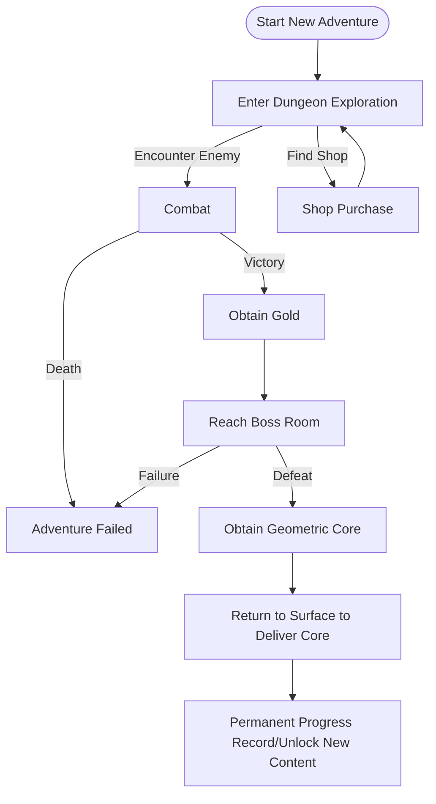

# CRYPTA GEOMETRICA | Geometric Crypt

<p align="center">
  <strong>English</strong> | <a href="README_Main_ZH.md">简体中文</a> | <a href="README_Main_SV.md">Svenska</a> | <a href="README_Main_FI.md">Suomi</a> | <a href="README_Main_DA.md">Dansk</a>
</p>

<p align="center">
  
  
  
  
</p>

<p align="center">
  <b>A side-scrolling action Roguelite game developed by a solo indie developer</b>
</p>

---

## 📖 Table of Contents

- [Game Overview](#-game-overview)
- [Inspirations](#-inspirations)
- [Gameplay](#-gameplay)
- [Technical Architecture](#-technical-architecture)
- [Tech Stack](#-tech-stack)
- [Project Structure](#-project-structure)
- [License](#-license)

---

## 🎮 Game Overview

**CRYPTA GEOMETRICA** is a highly distinctive side-scrolling action Roguelite game. The game features a **vector geometric wireframe art style**, paired with a cold, sci-fi visual tone, constructing a geometric dungeon world full of unknowns and dangers.

### Core Features

| Feature | Description |
|---------|-------------|
| 🎲 **Procedural Generation** | Every dungeon structure is procedurally generated, ensuring fresh experiences |
| ⚔️ **Precision Combat** | Combat system inspired by *Hollow Knight*, emphasizing reading attacks and risk-reward |
| 🔄 **Roguelite Loop** | In-run reset + permanent unlocks between runs dual-track mechanism |
| 🎨 **Geometric Aesthetics** | Vector wireframes + sci-fi lighting, minimalist yet highly recognizable |

### Story Background

In the Geometric Matrix World, three geometric lifeform factions—rectangles, triangles, and circles—each established their own kingdoms. The Triangle King's ambition disrupted the balance when he attempted to merge core powers from other geometric lifeforms, causing the experiment to spiral out of control. As the **Rectangle Hero**, you bear the mission to eliminate the rogue composite monsters, reclaim the core geometric pieces, and restore world order.

---

## 💡 Inspirations

### 1. Art Style: *Geometry Dash*

Drawing inspiration from its minimalist and pure geometric composition logic. Characters and enemies are built around 1-3 basic geometric shapes, while Bosses present complex visual forms through the combination of multiple geometric bodies. Incorporating sci-fi wireframe lighting effects, paired with high-contrast neon colors and cold, dark backgrounds.

### 2. Level Design: *Dead Cells* × *Spelunky*

Core mechanics inherit *Dead Cells'* "in-run procedural generation + permanent meta-progression" dual-track loop. Level generation uses **random walk algorithm for main path planning** as the macro framework, nested with *Spelunky*-style room seed library design, achieving "low-cost, high-variety" level experiences.

### 3. Controls & Combat: *Hollow Knight*

Referencing the classic side-scrolling combat action system, building a concise combat loop of "approach → attack → retreat/defend → chase". Combat core emphasizes **risk-reward** and **reading attacks**, encouraging players to find balance between cautious judgment and decisive action.

---

## 🕹️ Gameplay

### Core Loop



### Combat System

Employs a four-phase combat loop:

1. **Approach** - Observe enemy positioning and attack wind-up, flexibly use jumps to close distance
2. **Attack** - Deal damage during enemy attack gaps (1.5x damage bonus at close range)
3. **Retreat/Defend** - Evade damage through jumps or double jumps
4. **Chase** - Continue attacking during enemy stagger or reposition

### Room Types

| Room Type | Function | Enemy Configuration |
|-----------|----------|---------------------|
| 🗡️ **Combat Room** | Basic combat and resource acquisition | 2-4 enemies |
| ⚔️ **Elite Room** | High-pressure short encounters | Elite combinations |
| 🏕️ **Rest Room** | Recovery and pacing buffer | No enemies |
| 👑 **Boss Room** | Two-phase Boss battle | Boss |

---

## 🔧 Technical Architecture

### 🎲 Procedural Level Generation System (PCG V4)

Utilizes **Nested Procedural Generation (Nested PCG)** and **Async Pipeline** design.

| Layer | Description |
|-------|-------------|
| **Macro Layer (World)** | Calculates room coordinates, handles topological relationships |
| **Micro Layer (Room)** | Generates terrain details, processes geometric pixels |

#### Core Algorithms

| Algorithm | Purpose |
|-----------|---------|
| Sparse Random Placement | World layout generation |
| Constrained Drunk Walk | Room interior layout |
| Cellular Automata | Terrain smoothing |
| Air Column Sampling | Intelligent platform placement |

### 🎛️ Game Manager Architecture

Employs **Containerized Service Architecture** to avoid initialization order chaos caused by numerous singletons.

```
[GameManager] (DontDestroyOnLoad)
  ├── [AsyncSceneManager]
  ├── [SaveManager]
  └── [FutureSystem...]
```

- All modules follow the `IGameModule` interface
- Unified lifecycle management: Init → Update → Dispose
- Auto-initialization from any scene during development

### 📡 Global Message System

Low-coupling communication system based on **Publish-Subscribe Pattern (Pub/Sub)**.

| Feature | Description |
|---------|-------------|
| Generic Support | Supports message passing with 0-3 parameters |
| Type Safety | Compile-time parameter type checking |
| Auto Cleanup | Automatically clears non-permanent events on scene transitions |
| Event Monitor | Editor window for real-time message flow monitoring |

---

## 🛠️ Tech Stack

| Category | Technology | Purpose |
|----------|------------|---------|
| **Engine** | Unity 2022.3 LTS | Game Engine |
| **Async Programming** | [UniTask](https://github.com/Cysharp/UniTask) | Async framework replacing coroutines |
| **Editor Extensions** | [Odin Inspector](https://odininspector.com/) | Inspector UI enhancement |
| **Animation System** | DOTween Pro | Code-driven animations |
| **Version Control** | Git + GitHub | Source code management |

---

## 📁 Project Structure

```
Assets/
├── 0_Documents/              # Design documents
│   └── 0_Planning/           # Planning docs and reference images
├── 1_Scripts/                # Script code
│   ├── 0_GameManager/        # Game manager module
│   ├── 0_MessageSystem/      # Message system
│   ├── 1_Player/             # Player controls
│   ├── 2_Enemy/              # Enemy AI
│   └── 3_LevelGeneration/    # Level generation system
│       ├── LevelGenerationV3/  # V3 version
│       └── LevelGenerationV4/  # V4 version (current)
├── 2_Prefabs/                # Prefabs
├── 3_Scenes/                 # Scene files
└── 4_Art/                    # Art resources
```

---

## 📄 License

This project is licensed under the MIT License - see the [LICENSE](LICENSE) file for details.

---

<p align="center">
  <b>CRYPTA GEOMETRICA</b> - Explore the Depths of the Geometric Crypt<br>
  <b>Created by a dedicated indie solo-dev university student</b>
</p>
