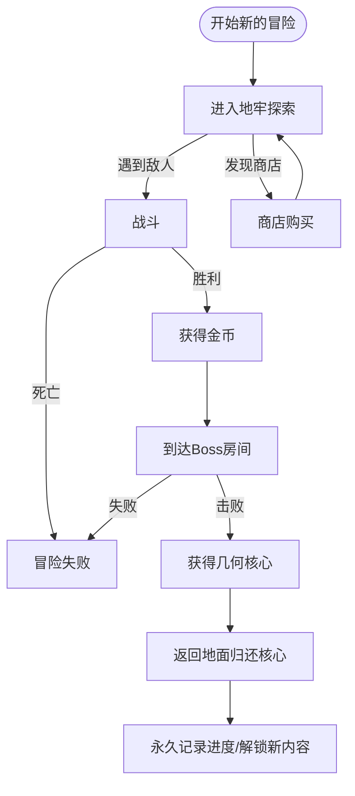
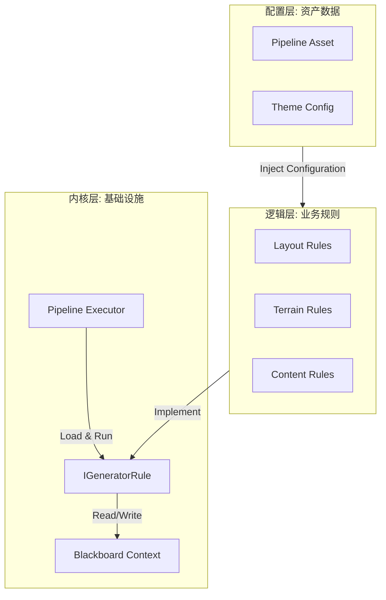
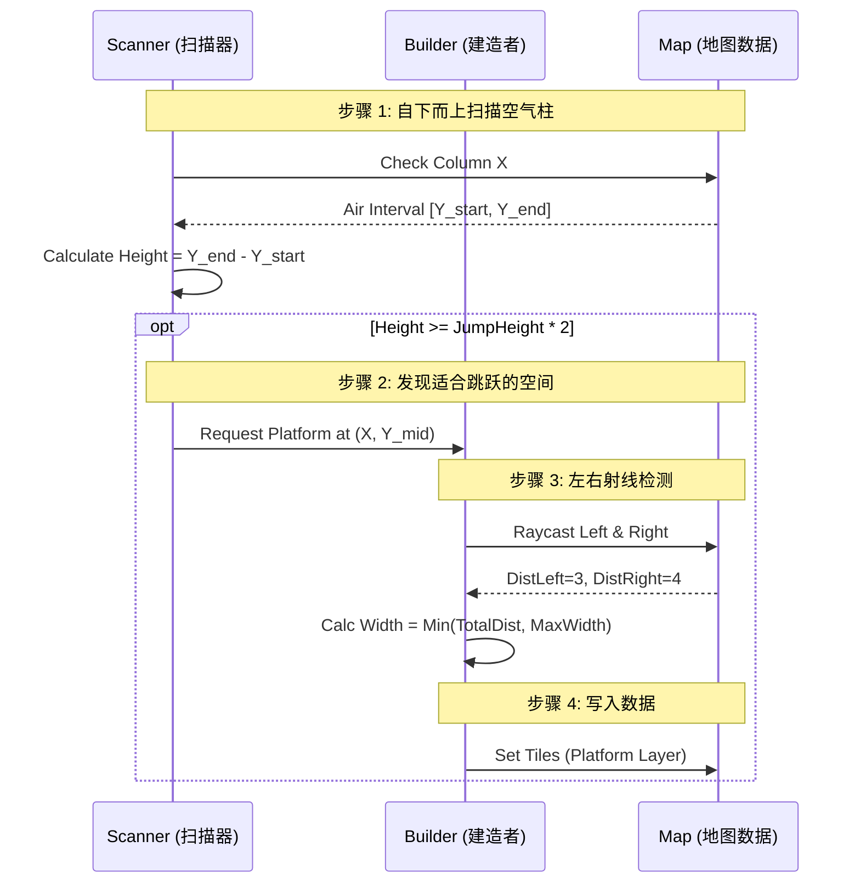

# CRYPTA GEOMETRICA | 几何地窖

<p align="center">
  
  
  
  
</p>

<p align="center">
  <b>一款由单人独立开发的横板动作类 Roguelite 游戏</b>
</p>

---

## 📖 目录

- [游戏简介](#-游戏简介)
- [灵感来源](#-灵感来源)
- [游戏玩法](#-游戏玩法)
- [技术架构](#-技术架构)
  - [程序化关卡生成系统 (PCG V4)](#-程序化关卡生成系统-pcg-v4)
  - [游戏管理器架构](#-游戏管理器架构)
  - [全局消息系统](#-全局消息系统)
- [技术栈](#-技术栈)
- [项目结构](#-项目结构)
- [许可证](#-许可证)

---

## 🎮 游戏简介

《**CRYPTA GEOMETRICA**》是一款极具辨识度的横板动作类 Roguelite 游戏。游戏采用**矢量几何线框美术风格**，搭配冷峻科幻的视觉基调，构建出一个充满未知与危险的几何地下城世界。

### 核心特性

| 特性                  | 描述                                               |
| --------------------- | -------------------------------------------------- |
| 🎲 **随机生成**       | 每次冒险的地牢结构都是程序化生成的，保证新鲜感     |
| ⚔️ **精准战斗**       | 参考《空洞骑士》的战斗系统，强调读招预判与风险回报 |
| 🔄 **Roguelite 循环** | 局内重置 + 局外永久解锁的双轨机制                  |
| 🎨 **几何美学**       | 矢量线框 + 科幻光影，极简而富有辨识度              |

### 故事背景

在几何矩阵世界中，矩形、三角形、圆形三大几何生命体族群各自建立国度。三角形君王的野心打破了平衡，他企图融合其他几何生命体的核心力量，却导致实验失控。你作为**矩形勇者**，肩负着消灭失控的复合怪物、夺回核心几何件、重建世界秩序的使命。

---

## 💡 灵感来源

### 1. 美术风格：《几何冲刺》(Geometry Dash)


借鉴极简纯粹的几何体构成逻辑。角色与怪物均以 1-3 个基础几何体为核心搭建，Boss 则通过多个几何体的组合拼接呈现复杂的视觉形象。融入科幻线框光影效果，搭配高对比度的霓虹色彩与冷峻暗色调背景。

### 2. 关卡设计：《死亡细胞》× 《洞穴冒险》


核心继承《死亡细胞》"局内随机生成 + 局外永久解锁"的双轨循环机制。关卡生成采用 **随机游走算法规划主路径** 的宏观框架，嵌套《洞穴冒险》式的房间种子库设计，实现"低成本高多样性"的关卡体验。

### 3. 操作与战斗：《空洞骑士》


参考经典横板战斗动作系统，构建"接近 → 输出 → 撤离/防御 → 追击"的简洁战斗循环。战斗核心强调**风险-回报**与**读招预判**，鼓励玩家在谨慎判断与果断操作之间寻找平衡。

---

## 🕹️ 游戏玩法

### 核心循环



### 战斗系统

采用四阶段战斗循环：

1. **接近** - 观察敌人站位与攻击前摇，灵活使用跳跃接近目标
2. **输出** - 在敌人攻击间隙进行近距离输出（1.5x 伤害加成）
3. **撤离/防御** - 通过跳跃或二段跳规避伤害
4. **追击** - 利用敌人硬直继续输出或重新调整位置

### 房间类型

| 房间类型       | 功能               | 敌人配置   |
| -------------- | ------------------ | ---------- |
| 🗡️ **战斗房**  | 基础战斗与资源获取 | 2-4 个敌人 |
| ⚔️ **精英房**  | 中短时高压挑战     | 精英组合   |
| 🏕️ **休息房**  | 恢复与节奏缓冲     | 无敌人     |
| 👑 **Boss 房** | 两阶段 Boss 战     | Boss       |

---

## 🔧 技术架构

本项目在技术实现上采用了多种先进的软件工程设计模式和算法。

### 🎲 程序化关卡生成系统 (PCG V4)

**Level Generation V4** 是本项目的核心技术亮点，采用**嵌套式程序化生成 (Nested PCG)** 和**异步管线 (Async Pipeline)** 设计。

#### 核心设计理念

| 原则              | 描述                                                  |
| ----------------- | ----------------------------------------------------- |
| 🔀 **分治原则**   | 将生成任务拆解为宏观（World）和微观（Room）两个独立域 |
| 📊 **数据驱动**   | 所有规则参数通过 ScriptableObject 配置，无需重编译    |
| 🛡️ **防御性编程** | 内置自检、熔断和回退机制，确保生成失败不会崩溃        |

#### 架构概览



#### 核心算法

##### 1. 稀疏随机放置 (Sparse Random Placement) - 世界生成

在 2D 坐标系中计算房间坐标集合，引入"社交距离"约束生成非线性、具有"呼吸感"的地图布局。

- **时间复杂度**: O(R × N)
- **空间复杂度**: O(N)

##### 2. 约束醉汉游走 (Constrained Drunkard Walk) - 房间布局

引入**方向偏置 (Directional Bias)** 适应横版过关游戏：

| 方向    | 权重 | 设计意图                   |
| ------- | ---- | -------------------------- |
| ⬇️ Down | 0.45 | 模拟重力，引导地牢向下延伸 |
| ↔️ Side | 0.25 | 横向展开，提供平台跳跃空间 |
| ⬆️ Up   | 0.05 | 极低概率向上，防止死循环   |

##### 3. 细胞自动机 (Cellular Automata) - 地形平滑化

使用 **B45/S4** 规则演化地形，消除人工痕迹：

$$
State_{t+1}(x,y) =
\begin{cases}
1 \text{ (Wall)}, & \text{if } State_t(x,y)=1 \land N(x,y) \ge 4 \\
1 \text{ (Wall)}, & \text{if } State_t(x,y)=0 \land N(x,y) \ge 5 \\
0 \text{ (Air)}, & \text{otherwise}
\end{cases}
$$

##### 4. 感知型空气柱采样 (Perceptive Air Column Sampling) - 平台生成

最具技术含量的算法，通过**垂直扫描线**解构几何形状，智能放置跳跃平台：



#### 规则执行顺序

| 顺序 | 规则                    | 类型   | 描述             |
| ---- | ----------------------- | ------ | ---------------- |
| 10   | `ConstrainedLayoutRule` | Macro  | 醉汉游走房间布局 |
| 20   | `BFSValidationRule`     | Macro  | 连通性验证       |
| 30   | `CellularAutomataRule`  | Micro  | 洞穴地形生成     |
| 35   | `EntranceExitRule`      | Micro  | 入口/出口雕刻    |
| 36   | `PathValidationRule`    | Micro  | 2x2 玩家路径验证 |
| 40   | `PlatformRule`          | Micro  | 空气柱平台采样   |
| 100+ | `RenderRules`           | Render | Tilemap 渲染     |

#### 性能优化

- **异步时间切片**: 使用 UniTask 分摊计算，避免主线程卡死
- **一维化数组**: 将 2D 坐标映射为 1D 索引 `index = y * width + x`，降低 90%+ Cache Miss
- **AABB 碰撞检测**: 平台生成使用 Axis-Aligned Bounding Box，复杂度从 O(W×H) 降到 O(N)

---

### 🎛️ 游戏管理器架构

采用**容器化服务架构**，避免大量单例导致的初始化顺序混乱。

#### 核心特性

- **唯一性**: 整个游戏只有一个 GameManager 挂载 `DontDestroyOnLoad`
- **模块化**: 所有子系统作为"模块"挂载在其子节点下
- **统一接口**: 所有模块遵循 `IGameModule` 接口
- **有序生命周期**: Init → Update → Dispose 统一管理
- **自动初始化**: 开发阶段任何场景运行时自动创建

#### 架构层级

```
[GameManager] (DontDestroyOnLoad)
  ├── [AsyncSceneManager] (implements IGameModule)
  ├── [SaveManager] (implements IGameModule)
  └── [FutureSystem...] (可扩展)
```

#### IGameModule 接口

```csharp
public interface IGameModule
{
    void OnInit();                  // 初始化
    void OnUpdate(float deltaTime); // 轮询（可选）
    void OnDispose();               // 销毁清理
}
```

#### 使用方式

```csharp
// 方式1：通过GameManager获取（推荐）
var sceneManager = GameManager.Get<AsyncSceneManager>();
sceneManager.LoadScene("GameScene");

// 方式2：通过Instance访问（兼容按钮事件）
AsyncSceneManager.Instance.LoadScene("GameScene");
```

---

### 📡 全局消息系统

基于**发布-订阅模式（Pub/Sub）**实现的低耦合通信系统。

#### 核心特性

| 特性            | 描述                         |
| --------------- | ---------------------------- |
| 🎯 **泛型支持** | 支持 0-3 个参数的消息传递    |
| ✅ **类型安全** | 编译期检查参数类型           |
| 🧹 **自动清理** | 场景切换时自动清理非永久事件 |
| 🔍 **调试友好** | 可选日志输出，支持事件表打印 |

#### 架构图

```
┌─────────────────────────────────────────────────────────┐
│                    MessageManager (静态类)               │
├─────────────────────────────────────────────────────────┤
│  Dictionary<MessageType, Delegate> eventTable           │
│  List<MessageType> permanentEvents                      │
├─────────────────────────────────────────────────────────┤
│  + AddListener<T>(type, callback)    // 注册监听         │
│  + RemoveListener<T>(type, callback) // 移除监听         │
│  + Broadcast<T>(type, data)          // 广播消息         │
│  + MarkAsPermanent(type)             // 标记永久         │
└─────────────────────────────────────────────────────────┘
```

#### 使用示例

```csharp
public class ExampleComponent : MonoBehaviour
{
    void OnEnable()
    {
        // 注册监听
        MessageManager.AddListener(MessageType.GAME_START, OnGameStart);
        MessageManager.AddListener<int>(MessageType.PLAYER_HURT, OnPlayerHurt);
    }

    void OnDisable()
    {
        // 移除监听（必须！）
        MessageManager.RemoveListener(MessageType.GAME_START, OnGameStart);
        MessageManager.RemoveListener<int>(MessageType.PLAYER_HURT, OnPlayerHurt);
    }

    void OnGameStart() => Debug.Log("游戏开始");
    void OnPlayerHurt(int damage) => Debug.Log($"玩家受到 {damage} 点伤害");
}
```

#### Event Monitor 监控器

提供 Editor 窗口实时监控消息流：

| 功能          | 说明                     |
| ------------- | ------------------------ |
| 动态/静态模式 | 动态模式实时刷新         |
| 暂停          | 暂停消息记录             |
| 过滤          | 按文本、操作类型过滤     |
| 颜色标签      | 不同事件类型显示不同颜色 |

---

## 🛠️ 技术栈

| 类别           | 技术                                          | 用途               |
| -------------- | --------------------------------------------- | ------------------ |
| **引擎**       | Unity 2022.3 LTS                              | 游戏引擎           |
| **异步编程**   | [UniTask](https://github.com/Cysharp/UniTask) | 替代协程的异步框架 |
| **编辑器扩展** | [Odin Inspector](https://odininspector.com/)  | Inspector UI 增强  |
| **动画系统**   | DOTween Pro                                   | 代码驱动动画       |
| **版本控制**   | Git + GitHub                                  | 源码管理           |

---

## 📁 项目结构

```
Assets/
├── 0_Documents/              # 设计文档
│   └── 0_Planning/           # 策划文档与参考图
├── 1_Scripts/                # 脚本代码
│   ├── 0_GameManager/        # 游戏管理器模块
│   ├── 0_MessageSystem/      # 消息系统
│   ├── 1_Player/             # 玩家控制
│   ├── 2_Enemy/              # 敌人 AI
│   └── 3_LevelGeneration/    # 关卡生成系统
│       ├── LevelGenerationV3/  # V3 版本（遗留）
│       └── LevelGenerationV4/  # V4 版本（当前）
│           ├── WorldGeneration/  # 世界生成器
│           ├── RoomGeneraton/    # 房间生成器
│           └── docs/             # 技术文档
├── 2_Prefabs/                # 预制体
├── 3_Scenes/                 # 场景文件
└── 4_Art/                    # 美术资源
```

---

## 📄 许可证

本项目采用 MIT 许可证 - 详见 [LICENSE](LICENSE) 文件。

---

<p align="center">
  <b>CRYPTA GEOMETRICA</b> - 探索几何地窖的深处<br>
  <b>由一位努力学习的独立开发大学生自己完成的小作品</b>
</p>
